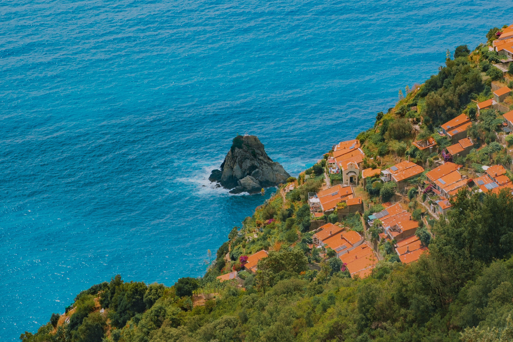

### As vezes nossa mente pode ser bem criativa.

> Para uma melhor experiência de leitura, leia a publicação no navegador.

Estou muito feliz que em apenas uma semana já somos mais de **60** pessoas na **Stoa**! Adorei os comentários que vocês deixaram e como agradecimento trago uma nova seção para a publicação.

A seção “**Consciente Coletivo**” é uma forma de conhecermos um pouco sobre quem apoia a publicação. Toda semana um apoiador novo será destacado!

Nessa publicação também conto a aventura que a [Gaia](https://www.instagram.com/gaia.tattooart/) e eu vivenciamos em **Campiglia Tramonti** e como quase tivemos que lidar com **ursos selvagens** na trilha.

∰

### Da minha mente para a sua 🧠

1. Cientistas estão intrigados por um _hack_ que faz com que [células cancerígenas se auto-destruam](https://futurism.com/neoscope/clever-trick-cancer-cells-self-destruct). Os estudos foram feitos em ratos e ainda há uma longa jornada pela frente. Mas isso é muito animador!
2. Ter bom gosto para Design não é subjetivo e nem exclusivo de certas pessoas. Na verdade, gosto é uma prática deliberada de experimentação que é feita objetivamente. [Neste artigo](https://www.doc.cc/articles/taste), o pessoal do Doc explora algumas ideias interessantes sobre o assunto.
3. Outro dia estava conversando com minha parceira e outro colega de que os humanos não podem ser os únicos seres inteligentes na Terra. Outros animais também possuem inteligência, como os golfinhos, corvos e até as abelhas com sua capacidade de repassar coordenadas exatas para outras [abelhas por meio de uma dança](https://www.youtube.com/watch?v=2CMMEaWP7Y0) bem elaborada. E [este vídeo](https://www.youtube.com/watch?v=0a3xg4M9Oa8) aborda esse assunto e mostra que a inteligência é fundamentalmente coletiva, das nossas células até a sociedade. Cada uma tem um papel fundamental na resolução de problemas e obtenção de algum objetivo no todo.
4. O universo está imbuído de algum significado objetivo, meta ou propósito?[ Deus está atrás da cortina ou o Templo do Cosmos está vazio?](https://www.templeton.org/news/whats-the-point-of-it-all-the-teleological-quest-for-a-purposeful-god)

∰

### Gaia Zanellato

Hoje vamos mergulhar no consciente da minha parceira maravilhosa [Gaia Zanellato](https://www.instagram.com/gaia.tattooart/). Ela é tatuadora e está estudando para ser UX Researcher.

Tecnologia agrícola. No futuro tenho a intenção de investir na área e mudar positivamente como a agricultura acontece no Brasil.

**Nosso Planeta.** Além de uma estética incrível traz bastante reflexões sobre a vida na terra.

Minha volta ao Brasil no começo da vida adulta que foi o começo de uma nova fase de reconhecimento da minha própria identidade.

Praia com concentração de corais (não é apenas um lugar específico).

UX Research para ter mais conforto financeiro e disponibilidade de deslocamento.

∰

Em breve. 👀

∰

### Aventura em Campiglia Tramonti

A ideia inicial nunca foi ir a este lugar. Queríamos, na verdade, ter visitado uma cachoeira há alguns quilômetros de onde estamos morando temporariamente. No entanto, o serviço de aluguel de bicicletas falhou e decidimos em cima da hora mudar nossos planos.

Para chegar em **Campiglia**, é necessário pegar a van de número 20 🚌 que sai da parada de ônibus da estação central de trem de **La Spezia**. Chegamos em cima da hora e em poucos minutos a van parou ao nosso lado. Que sorte! Pensamos. Esperamos o motorista abrir a porta para entrarmos. O motorista provavelmente esperava que nós abríssemos a porta. Trocamos olhares na esperança de que ele entendesse nossa intenção, mas ele arrancou e seguiu seu itinerário, nos deixando parados sem entender o que tinha acontecido. Com um misto de frustração e tristeza, decidimos andar por La Spezia.

Depois de um tempo andando, bebendo energético e pensando se deveríamos ou não tentar novamente, encontramos outra parada que estava na rota da van de número 20. Avistamos a van chegando. A tensão aumentou. Será que conseguiríamos dessa vez? Fizemos gestos 🤌 de que queríamos entrar e... entramos. Subimos uma serra estreita que só tinha duas opções: ou você sobe ou você desce. Não havia muitas oportunidades para que dois veículos coexistissem na mesma estrada.

Chegando lá, pegamos uma trilha para encontrar a famosa **escada dos 1100 degraus**. Ficamos surpresos com a forma como - e principalmente POR QUE - alguém construiria casas em que o único acesso é descendo uma montanha enorme. Aparentemente, isso parece ser algo bem normal na Itália.

Bom, é óbvio que eventualmente nos perderíamos. E fomos gentilmente ajudados por um casal que nos indicou a rota certa e também nos avisou para fecharmos o portão à nossa frente para evitar que os “wild bears” (ursos selvagens) passassem. Sorrimos como quem tinha anos de experiência em lidar com ursos selvagens 🐻, agradecemos e seguimos o caminho. Horas depois, no meio da trilha, já planejando como nocautearíamos um urso se ele aparecesse, vimos uma placa dizendo para ter cuidado com os javalis. Nesse momento, tudo fez sentido e entendi que na verdade o que o senhor tentou dizer foi “wild boars” (javalis selvagens). Contra javalis, nossas chances já melhoravam bastante. 🐗🥊

Depois de subir e descer, passar por matas para cá e matas para lá, nos perdemos de novo e não encontramos o restante dos degraus que nos levariam até o pé da montanha. Sendo otimista, acredito que devemos ter descido pelo menos uns 500 degraus. Bem, na volta, mantendo nossa consistência impecável, não encontramos o mesmo caminho que usamos para chegar. Apesar de nos perdermos novamente, esse novo caminho era 100 vezes mais fácil do que o outro.

Chegando na vila, comemos e nos hidratamos com cerveja 🍻 (e água também), tomamos sorvete 🍨 e esperamos a van chegar para irmos embora. A partir desse ponto, o universo não tentou arruinar mais nada. Talvez por piedade, ou talvez por entender que os brasileiros não desistem nunca.

Você todas as fotos em alta qualidade no meu [Unsplash](https://unsplash.com/@willianmatiola/).

∰

### Ficou com dúvida? Pergunte.

Não permita que ideias mal entendidas causem ansiedades desnecessárias. Em caso de dúvida, confirme se foi isso mesmo que ouviu. Não permita que nenhum javali se disfarce de urso para te assustar. E se você se perder, não entre em desespero. Sente-se, descanse, aproveite a vista e pense racionalmente em como encontrar a direção certa.

Ainda não é inscrito? Considere se inscrever para não perder as próximas edições.

Se você gostou dessa publicação tenho dois pedidos para você:

1. Deixe um comentário
2. Compartilhe o link com apenas 1 amigo (ou mais, caso queira).

[Subscribe now](https://www.stoa.news/subscribe?)
