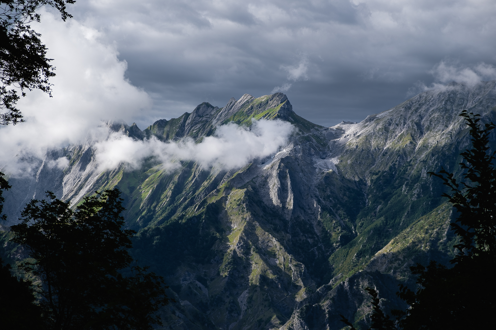

### Carros são barulhentos, frutas e verduras da temporada, terceiro paradigma de UI, e outros assuntos igualmente interessantes.

Olá, eu sou o **Willian Matiola** e essa publicação é uma pequena parte do conteúdo que consumo semanalmente. Se você gostar, deixe um like ❤️. Se você gostar muito, deixe um comentário 💬.

∰

### Da minha mente para a sua 🧠

1. **[Cidades não são barulhentas: carros são barulhentos.](https://www.youtube.com/watch?v=CTV-wwszGw8)** Não é atoa que o mercado de fones de ouvido com cancelamento de ruído tem previsão de crescimento de até $45.4 billion até 2031. 🚗
2. **[En Temporada](https://www.entemporada.es/)** é um projeto do estúdio **Gusto** que mostra as frutas e verduras de cada temporada. 🥕🍓 Por ser um projeto espanhol, ele não vai refletir o que temos no Brasil. Ainda assim, é um projeto visualmente muito bem executado e inspirador.
3. **Jakob Nielsen** escreveu um artigo em Junho sobre como as inteligências artificiais 🤖 trouxeram **[o terceiro paradigma de UI](https://www.nngroup.com/articles/ai-paradigm/)**na história da computação. Sua visão é de que ainda há muitas oportunidades para criar melhores experiências em IA e que no futuro o 2º e o 3º paradigma coexistirão. Como você enxerga esse futuro?
4. **[Morte ao Double Diamond!](https://uxdesign.cc/death-to-the-double-diamond-296b1c4e51c4)** ☠️ Um processo que oferece passos específicos para você tomar, independente dos desafios imprevisíveis que você pode encontrar, não é a melhor maneira de solucionar problemas complexos da vida real. Talvez a melhor abordagem, como o autor sugere, seja um **processo de design emergente**.

∰

### Welliton Matiola

Hoje vamos mergulhar no consciente do meu irmão gêmeo e Product Designer [Welliton Matiola](https://www.linkedin.com/in/wellitonmatiola/).

Estudo muitas coisas relacionadas a espiritualidade, principalmente ligadas a energia com as mãos e plantas. Isso me fez ir atrás de aprender Reiki e parece que é algo natural pra mim, sempre senti uma conexão forte com esses temas.

Recentemente eu dei uma chance para o filme *Tudo em Todo Lugar ao Mesmo Tempo* e descobri que ele é uma obra prima! Para a maioria ele apenas vai ser um filme doido e difícil de entender, trás muitas mensagens “ocultas”. Ele mostra o poder que as emoções exercem na vida das pessoas e o impacto que elas podem causar.

Final de 2022 foi um momento bem marcante na minha vida, passei por uma mudança radical de personalidade que nem sei como explicar. Foi o encerramento de vários ciclos e início de outros. Digamos que eu renasci uma pessoa muito melhor, feliz consigo mesma e muito mais aberta ao lado positivo da vida.

Recife é um lugar que eu recomendo uma visita. Além das belas praias (cuidado com os tubarões), há muita história para aprender, coisas que não foram contadas nos livros escolares.

Se eu não trabalhasse com design provavelmente teria estudado psicologia. Entender o comportamento humano e ajudar a lidar com problemas sempre ganhou minha atenção.

∰

### Peter Voth [↗︎](https://dribbble.com/petervoth)

Cartas de baralho e rótulos de produtos fazem parte do trabalho fantástico do ilustrador alemão Peter Voth.

❦

### Bricolage Grotesk [↗︎](https://ateliertriay.github.io/bricolage)

Uma fonte variável e gratuita com muita personalidade. Foi desenvolvida pelo designer e engenheiro de software francês Mathieu Triay.

∰

### Alpi Apuane

As montanhas mais imponentes que vi até agora. Fiquei dias sem abrir as fotografias porque estava com medo de editá-las e acabar estragando com tudo. O que você está vendo é o resultado final da edição de uma foto que foi tirada aos 5 minutos antes da partida da nossa van. Correria e excitação acontecendo tudo ao mesmo tempo.

Em breve vou postar todas as fotos no meu [Unsplash](https://unsplash.com/@willianmatiola/) e [Pexels](https://www.pexels.com/@willianmatiola/).

∰

### Um novo capítulo

Essa semana estamos de mudança da Itália para a Alemanha. Não tenho a mínima noção do que esse novo capítulo nos reserva.

Se essa mudança tivesse acontecido há alguns anos, provavelmente estaria surtando pela falta de controle dos próximos passos. Hoje, com mais maturidade, entendo que não somos capazes de controlar tudo o que queremos, somente controlamos aquilo que somos capazes de controlar.

Ainda não é inscrito? Considere se inscrever para não perder as próximas edições.

[Subscribe now](https://www.stoa.news/subscribe?)
