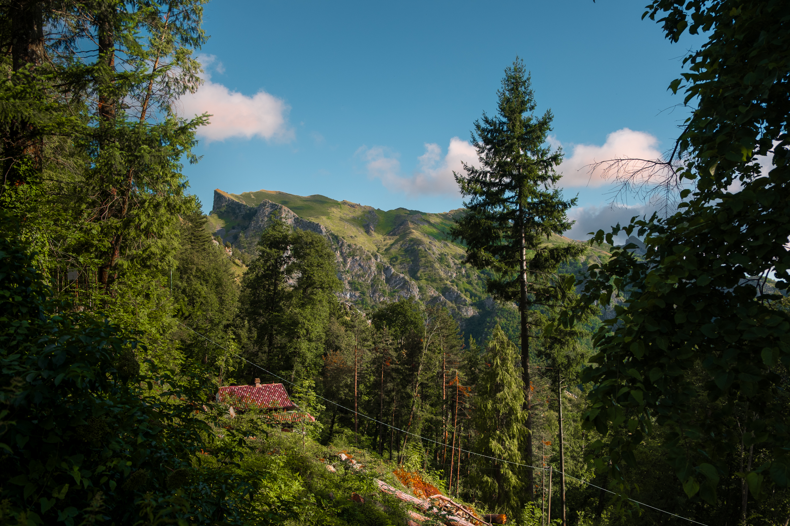

### A publicação de hoje está bem apimentada! Do jeito que eu gosto. O prato principal é a crítica sobre designers que mais parecem marketeiros vendendo como o Design pode te deixar rico.

Olá, eu sou o **Willian Matiola** e essa publicação é uma pequena parte do conteúdo que consumo semanalmente. Se você gostar, deixe um like ❤️. Se você gostar muito, deixe um comentário 💬.

Você pode me seguir nas [redes sociais](https://bento.me/willianmatiola) também.

∰

### Da minha mente para a sua 🧠

1. Um estudo de caso de como a [Amazon teve que mudar seu fluxo de cancelamento de assinatura](https://www.coglode.com/cure/cancelling-amazon-prime) na Europa para se enquadrar nas leis da GDPR. O conteúdo também propõe como a Amazon poderia ter feito isso de uma maneira ainda melhor. Se você gosta de **behavioral design**, leia.
2. [Esse site](https://empreinte.castoretpollux.com/en/) mostra alguns princípios para criar sites que tenham uma pegada de carbono pequena. Você também pode testar se seu site está emitindo muito CO2 ou não.
3. Um e-book ensinando como [desenhar Dashboards](https://dataschool.com/how-to-design-a-dashboard/).
4. Se depois desse [vídeo com o Eduardo Moreira e o André Roncaglia](https://www.youtube.com/watch?v=hnaws5iijwA) no Flow você ainda ficar lambendo bola de bilionário, eu sinceramente não tenho esperanças em você. O nível de desigualdade na distribuição de renda é tão absurdo que não existe qualquer justificativa plausível para a existência de pessoas **muito ricas**.
5. **Claudio Guglieri** escreveu um texto chamado “[Compre meu curso e faça 6 dígitos](https://claudioguglieri.substack.com/p/269f1808-9430-412d-8203-1210afb44457)” como uma crítica bem lúcida aos designers criadores de conteúdo que se tranformaram em marketeiros de curso ao invés de designers. Eu estive nesse cenário por 10 anos e saí dele exatamente por enxergar que a comunidade de educadores de design havia se transformado em uma coisa que eu não admiro mais. Como o autor cita: “_É literalmente como vender pás durante a corrida do ouro e promover um curso de mineração de ouro enquanto você não faz nada disso._”

∰

### Mateus Generoso

Hoje vamos mergulhar no consciente do [Mateus Generoso](https://www.linkedin.com/in/mateusgeneroso/). Além de ser um dos meus melhores amigos e um dos sócios-fundadores da Stoika, também é um dos melhores desenvolveres Front-End que conheço.

Curto demais estudar e pesquisar sobre biologia e adaptação das espécies em geral. Acredito que isso me conecta mais com o que realmente somos e com o que precisamos nos preocupar.

Interestelar, Christopher Nolan e Hans Zimmer acertaram muito nesse filme. Retrata uma humanidade quebrada por problemas nos recursos básicos e que procura uma forma de escapar disso.

STOIKA. Descobri que uma empresa vai além de um CNPJ.

Dos lugares mais recentes que fui, com certeza o mirante em Urubici, te dá uma visão perfeita da natureza e do desenvolvimento/ocupação da cidade no centro da serra catarinense

Astronauta, sem dúvida alguma. Poder contribuir com a humanidade no espaço e ainda ter o privilégio de tomar café enquanto olha o planeta pela janela da estação espacial, deve ser uma sensação de paz única.

∰

### Calculadoras Retro [↗︎](https://www.flickr.com/photos/gmaletic/albums/72157688760958876)

Greg Maletic reuniu 31 fotos de calculadoras retro em um álbum no Flickr. Esse botões analógicos são um charme!

∰

### Outra vista dos Alpes Apuane

Essa vista, por incrível que pareça, deve ser uns 45º à direita da foto que coloquei na edição [003](https://willianmatiola.substack.com/p/003). A diferença de tempo entre as duas foi apenas de alguns minutos.

Você pode baixar essa e outras fotos gratuitamente no meu [Unsplash](https://unsplash.com/@willianmatiola/) e [Pexels](https://www.pexels.com/@willianmatiola/).

### Links úteis

1. [Illustrations Universe](https://illustrationsuniverse.com/)
2. [Escala Tipográfica](https://spencermortensen.com/articles/typographic-scale/)
3. [OGimage Gallery](https://www.ogimage.gallery/)
4. [Icon Buddy](https://iconbuddy.app/)
5. [Animação em Design Systems](https://xd.adobe.com/ideas/wp-content/uploads/2021/06/Animation-in-Design-Systems.pdf)

∰

### Estou na Alemanha!🍻🇩🇪

Desde Maio deste ano (2023) minha parceira e eu colocamos em ação nosso sonho de morar juntos na Europa. Ela já teve essa experiência várias vezes e isso foi um dos motivos de eu deixar meus medos de lado e embarcar nessa nova aventura em terras desconhecidas. Do Brasil para a Itália, e agora da Itália para a Alemanha.

Se você estiver pela região de **Düsseldorf** dê um Hallo lá no meu [Instagram](https://www.instagram.com/willianmatiola/). Adoraria me conectar com outros brasileiros.

Ainda não é inscrito? Considere se inscrever para não perder as próximas edições.

[Subscribe now](https://www.stoa.news/subscribe?)
