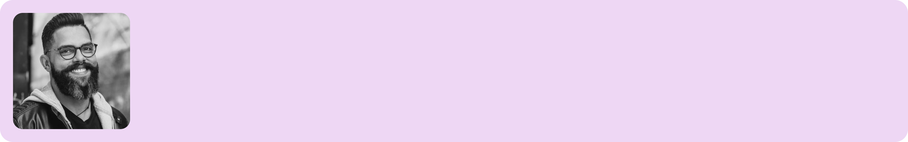

### Na edição de hoje temos uma reflexão um pouco estranha, oito links interessantes, papo com Filipe Fernandes, e minhas habituais fotos exploratórias.

Um caloroso bem vindo aos **17 novos seguidores** da Stoa! 🥳 Você sabia que trazendo novos seguidores você pode [ganhar recompensas](https://willianmatiola.substack.com/leaderboard)?

### A sensação de não saber se realmente sabe

Não sei se vou ser capaz de explicar isso direito, mas é basicamente estar ciente de que você sabe sobre alguma coisa ao mesmo tempo que você se questiona se aquilo que você sabe é realmente a maneira correta de fazer.

Imagine, por exemplo, que você sabe como realizar um teste de usabilidade. Você já leu como é feito um roteiro de teste, como elaborar as tarefas, como analisar os dados obetidos e todos os demais passos desse processo. No entando, existe uma voz baixinha lá no fundo dos seus pensamentos que fica dizendo “será que é assim mesmo?”. E aí você se sente incomodado por não ter certeza se é ou não é do jeito que você acha que é. Percebe como isso bem é complicado?

Eu me sinto assim na maioria das vezes que estou trabalhando. Fico me perguntando se o que estou fazendo é o jeito certo ou se há um jeito melhor de ser feito. É extremamente incômodo não ter a certeza de estar fazendo algo da maneira correta.

Será que todos sofrem disso? Eu vejo tantos profissionais passando por todos os passos de uma metodologia como se eles estivessem completamente certos do que estão falando e me pergunto se eles realmente têm essa certeza absoluta ou se estão só ignorando a sensação incômoda de, talvez, estarem errados.

Essa sensação tem um nome? Será que é meramente a Síndrome do Impostor? Pra ser sincero, eu não sei. A parte da definição que diz “acredita certamente que é incompetente e uma fraude que poderá ser descoberta a qualquer momento” parece se encaixar na minha situação embora ela ainda não reflita exatamente o que eu sinto.

∰

### Da minha mente para a sua 🧠 🥦🥕

1. [B612](https://b612-font.com/) é uma fonte altamente legível e open source que foi desenvolvida e testada para telas de painel de controle de aeronaves.
2. Não basta apenas desenhar componentes e enviar para produção. Para desenvolver um sistema que realmente funcione e seja adotado é necessário ter um bom processo para a criação de [componentes de Design System](https://articles.redesigningdesign.systems/why-you-need-a-design-system-component-process-86aba41827fb).
3. [Dicas para organizar e manter seus arquivos no Figma.](https://uxdesign.cc/how-to-build-trust-with-others-by-cleaning-your-figma-files-f283e72cb057)
4. [As formas surpreendentes de como a sua mente influencia sua saúde](https://greatergood.berkeley.edu/article/item/the_surprising_ways_your_mind_influences_your_health) é o tema de um novo livro que argumenta a possibilidade de melhorarmos a conexão entre nossas mentes e corpos com o objetivo de fortalecer nossa saúde.

### Filipe Fernandes

Hoje vamos mergulhar no consciente do **[Filipe Fernandes](https://www.instagram.com/filipesf/)**. Ele atua como Front-End Developer na Irlanda e foi meu sócio no Choco La Design, um dos maiores blogs brasileiros de Design entre os anos de 2010 e 2015. Conheço o Filipe desde os meus 14 anos e, por incrível que pareça, nos encontramos pessoalmente apenas 2 vezes na vida.

Eu gosto de estudar sobre saúde mental, relacionamento, auto-cuidado, autoconhecimento, moda masculina, astrologia, e assuntos criativos como fantasia, história, mitologias etc. Acredito que esses assuntos são muito ligados com nosso interior e podem nos ajudar a ter uma perspectiva diferente sobre nossas vidas.

Naruto. Pode parecer clichê, mas esse anime tem personagens muito profundos e aborda, de forma indireta, assuntos relacionados à saúde mental como TEPT, depressão, crise de identidade, entre outros.

A paternidade, com certeza, mudou minha forma de ver o mundo e me ensinou a ser mais perseverante do que eu já era.

Recomendo visitar o norte da Itália porque além de comida boa, tem vistas incríveis!

Gostaria de trabalhar com Psicologia porque eu acho que lido e me sinto bem ajudando os outros a lidarem ou encontrarem uma perspectiva diferente nos desafios que enfrentam. Ou algo mais criativo como escritor ou algo relacionado à arte.

∰

### Wildpark Grafenberger Wald, Düsseldorf

Minha última aventura foi nesse parque de vida selvagem que fica em Düsseldorf. Lá é possível alimentar cervos como esses das fotos, javalis selvagens e ver outros animais.

Por mais interessante que lugares assim possam parecer, é um pouco triste ver animais selvagens que não estão completamente livres na natureza. Embora o parque tenha muito espaço verde para os animais, ainda assim ficam confinados em seus respectivos ambientes.

### Links úteis

1. [Żaneta Antosik](https://www.instagram.com/zanetaantosik/) - Ilustrações de borboletas, flores e plantas.
2. [Roadmapping](https://productschool.teachable.com/p/roadmapping?) - Curso gratuito que ensina a criar roadmaps de produto.
3. [QR Code Generator](https://www.adobe.com/express/feature/image/qr-code-generator) - Você sabia que a Adobe tem esse serviço?
4. [UX Hints](https://uxhints.com/) - Pequenas doses de UX para seu dia a dia.

∰

### Fazer mudança é cansativo

Saí do Brasil há 5 meses. Foram 3 meses na Itália e agora 2 meses na Alemanha.

Estabelecer novas raízes em um lugar completamente novo é uma tarefa que consome muita energia mental e social. Ah, e dinheiro também. Toda a burocracia de se registrar na cidade, alugar apartamento, comprar móveis, contratar pessoas para montar coisas, conseguir Internet e todas as outras demandas necessárias para dizer “finalmente! estou em casa.” não é algo que acontece do dia para a noite.

Sem preparo financeiro e, principalmente, psicológico, as chances de você se esgotar em todos os sentidos é muito grande. Não vou dizer que tem sido fácil, mas com certeza tem sido menos pior do que para muitos outros imigrantes que tentam a sorte longe de casa.

Falando em sorte, se não fossse pela Gaia e sua fluencia em Alemão, eu teria demorado muito mais tempo para fazer qualquer coisa aqui nesse país. Até agora, a única coisa que consegui lidar sozinho foi com o suporte da Internet.

O meu foco tem sido aproveitar as coisas boas que o país tem a oferecer e evitar ao máximo me chatear com os problemas do dia a dia.

Ainda não é inscrito? Considere se inscrever para não perder as próximas edições.

[Subscribe now](https://www.stoa.news/subscribe?)
