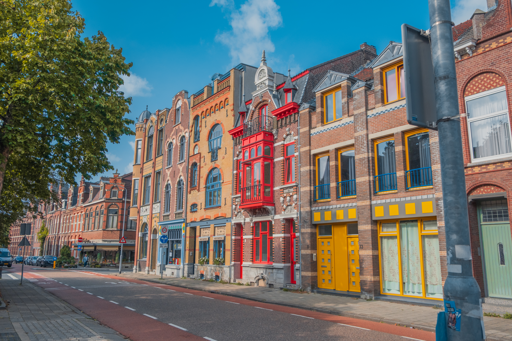

### 7 projetos pessoais que quero fazer, interfaces automotivas, entregas espaciais, boreout, impacto das aparências vs experiências, 7 ferramentas e recursos, e muito mais.

**Dica:** ouvindo o voiceover acima, você vai ter uma explicação mais detalhada dos 7 projetos abaixo.

Um caloroso bem vindo aos **10 novos seguidores** da Stoa! 🥳 Você sabia que trazendo novos seguidores você pode [ganhar recompensas](https://willianmatiola.substack.com/leaderboard)?

### Projetos paralelos

Desde os 14 anos minha vida foi praticamente construída em cima de projetos paralelos que depois viraram negócios. Minha mente nunca para de pensar na próxima coisa que eu poderia estar fazendo. E são muitas!

Quero dividir com vocês algumas ideias que venho maturando mentalmente e que gostaria de um dia colocá-las em prática. Caso você se identifique com alguma delas, deixe um comentário.

1. Garagem de customização de motos 🛵
2. Anéis e acessórios 💍
3. Site com frutas da estação 🍓
4. Acompanhador de cotações de moedas 💸
5. Diretório de viéses cognitivos 🧠
6. Casas bonitas para pets 🐈
7. Acessórios para câmeras fotográficas 📷

É bem provável que eu esteja esquecendo de alguma ideia. 🤓

Tem também o desejo de estudar **interfaces automotivas** que não é um negócio, mas é um objetivo pessoal. Quero documentar esse processo aqui na Stoa em breve.

Agora me conta, que ideias você gostaria de colocar em prática?

∰

### Da minha mente para a sua 🏎️🪞🔥 🚀 🤖

1. Neste artigo você encontra várias ideias de como começar a [prototipar interfaces automotivas](https://www.theturnsignalblog.com/blog/guide-to-prototyping-automotive-interfaces/).
2. [Aparências vs Experiências](https://fs.blog/appearances-vs-experiences/) mostra que tomar decisões baseadas em como as coisas se parecem ao invés de como será a experiência pode nos levar a ter vidas mais tristes.
3. Você já deve ter ouvido falar de **Burnout**, que é a exaustão extrema, estresse e esgotamento físico por conta de uma carga exagerada de trabalho. Mas você já ouviu falar de **[Boreout](https://nesslabs.com/burnout-vs-boreout)**? É uma faceta do primeiro, mas que acontece quando você luta contra a mesmice diária do seu emprego.
4. [Inversion Space](https://www.inversionspace.com/) é uma empresa com uma ideia nada convencional: criar veículos de re-entrada para entregar encomendas pelo espaço. Parece coisa de ficção científica, mas te garanto que é real. O site é muito bonito e cheio de ilustrações dos futuros produtos da empresa.
5. [Accordion Editing e Apple Picking ](https://www.nngroup.com/articles/accordion-editing-apple-picking/)são dois padrões comportamentais iniciais de usuários de inteligências artificiais generativas como o ChatGPT.

### Laura Venturini Minotto

Hoje vamos mergulhar no consciente da [Laura](https://www.linkedin.com/in/lauraventuriniminotto/), que atua como UI/UX Designer desde 2021 e nutre uma grande paixão por interfaces automotivas.

Gosto de estudar sobre ciências da natureza, astrofísica e o comportamento do mundo ao nosso redor.

"Drops of God" é uma série baseada em um mangá japonês de mesmo nome. A trama se concentra em uma disputa entre a filha e um estudante de enologia pela herança do pai dela, um renomado crítico de vinhos. A série é muito viciante e conforme os episódios passam não da vontade de parar de assistir.

A minha participação no concurso de pintura da Bamaq MotorSport para o carro de corrida virtual deles da Porsche Cup Brasil (Spoiler fui uma das poucas mulheres inscritas e acabei vencendo).

Recomendo visitar Gramado durante o inverno. A cidade se transforma em um cenário mágico, com suas ruas decoradas e o clima perfeito para curtir um bom vinho e comidas deliciosas.

Gostaria de trabalhar como Arquiteta se eu não fosse Designer. Acho lindo como estruturas de concreto podem se transformar em ambientes lindos e aconchegantes.

∰

### Venlo, Holanda

Eu fui para essa cidadezinha que faz fronteira com a Alemanha e já pude vislumbrar a onipresença das bicicletas e o charme dos prédios holandeses.

Na próxima edição eu trago mais fotos desse dia.

### Links úteis

1. [The Behavioral Design Database](https://habitweekly.notion.site/habitweekly/The-Behavioral-Design-Database-b26a66109c73406d83059276cfaceaa2) - Links sobre design comportamental
2. [Bite Sized Design](https://www.bitesized.design/) - Bom exemplo de subscrição de serviços de Design
3. [Async](https://async.com/) - Mensagens de voz ao invés de reuniões
4. [Framer Skills](https://www.framerskills.com/blog) - Aulas em Pt-Br sobre Framer feitas pelo Kacio
5. [Fable](https://www.fable.app/) - Ferramenta pra motion design
6. [Artboard Studio](https://artboard.studio/) - Ferramenta para criação gráfica e motion design
7. [Homerun](https://www.homerun.co/) - Sistema de contração bem interessante

Ainda não é inscrito? Considere se inscrever para não perder as próximas edições.

[Subscribe now](https://www.stoa.news/subscribe?)
