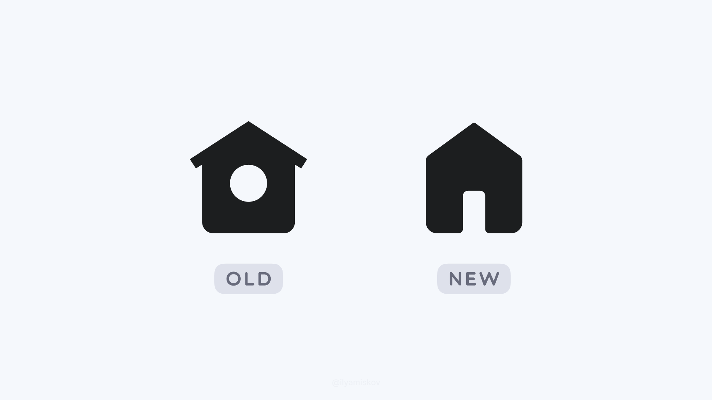

### Na edição de hoje temos fofocas do mundo do design, como leitores de tela funcionam, efeito de enquadramento, jornada do usuário, mentiras e...

Um caloroso bem vindo aos **14 novos seguidores** da Stoa! 🥳 Você sabia que trazendo novos seguidores você pode [ganhar recompensas](https://willianmatiola.substack.com/leaderboard)?

Mudar é bom, mas mudar para pior é complicado. A rede social X acabou de trocar o ícone da página inicial por uma alternativa que, além de esquisita, não segue nem as guidelines de criação de ícones da própria empresa.

Posso estar errado, mas me parece que é mais uma tentativa de apagar os vestígios de que um dia essa rede social já foi habitada por um passarinho azul.

E outra coisa que bombou na comunidade de design lá no X, tanto internacionalmente como nacionalmente, foi a questão dos cantos arredondados. A imagem abaixo prova que, para algumas pessoas, nem desenhando fica fácil entender um conceito.

∰

### Da minha mente para a sua 🧑‍🦯 🖼️ 🎯 🧠📱

1. Você sabia que os leitores de tela leem em uma velocidade **11x **(ou até maior) que a velocidade normal? Nesse vídeo você pode entender [como cegos usam o computador](https://www.youtube.com/watch?v=0n3HthRYY4U) e como pensar em acessibilidade pode mudar para melhor a experiência de muitas pessoas.
2. Dos efeitos existentes em ciências comportamentais, o de [enquadramento (](https://growth.design/case-studies/framing-effect)_[framing](https://growth.design/case-studies/framing-effect)_[)](https://growth.design/case-studies/framing-effect) é um dos que mais gosto. Ao mudar a maneira como exibimos uma informação ou comunicamos uma mensagem podemos alterar completamente nossa percepção sobre ela.
3. [A jornada, a experiência e o sistema](https://bootcamp.uxdesign.cc/the-journey-the-experience-and-the-system-f9e369f1b724) é um texto curto sobre como podemos resolver problemas de design quando colocamos a necessidade do usuário como foco central e conectamos as coisas que aproximam ou os afastam de alcançarem seus objetivos.
4. [Mentir demanda muito mais carga cognitiva do que contar a verdade](https://psyche.co/ideas/these-are-the-mental-processes-required-to-tell-a-convincing-lie). Estudos mostram que pessoas mais sensíveis a receber recompensas e menos motivadas a manter uma autoimagem positiva e honesta tem mais facilidade em serem desonestas.
5. Essa newsletter do The Decision Lab reuniu algumas pesquisas sobre [o uso de redes sociais e seus efeitos nas pessoas](https://editions.thedecisionlab.com/this-is-your-brain-on-social-media). Não há um consenso se ela é ou não ruim para as pessoas. Algumas pesquisas mostram que as redes socais acentuam problemas de ansiedade e depressão em pessoas que já possuem essas condições. Por outro lado, redes sociais também podem fortalecer a saúde mental, conexões e oportunidades de trabalho.

### Willian Matiola, a.ka. Eu mesmo

Hoje vamos mergulhar no meu consciente. Eu trabalho com design desde os 16 anos, então já são 14 anos de carreira. Entre criar conteúdo e projetar interfaces, muita coisa já aconteceu. Você pode ter um resumo aqui no meu [Linkedin](https://www.linkedin.com/in/willianmatiola/) e ver todos [meus links aqui](https://bento.me/willianmatiola).

Aproveitando essa pausa nos convidados, aproveitei para atualizar a lista de perguntas!

O tema que mais venho estudando recentemente é fotografia e edição de fotos. Fazia tempo que eu não me dedicava tanto a um hobby quanto esse. Fotografar me faz silenciar todas as vozes da minha cabeça e me coloca em um estado de atenção plena.

Gosto muito da série **The Bear**. Não tem nada a ver com urso. Ela conta a história de um chefe que larga sua carreira bem sucedida para cuidar do restaurante da família ao mesmo tempo que aprende a lidar com as pessoas que trabalham com ele. A fotografia, as músicas, os personagens e o ritmo da série é insanamente maravilhoso.

O meu primeiro término de namoro (que aconteceu de forma tranquila e somos amigos até hoje) me levou a uma profunda reflexão e realinhamento do que eu queria para a minha vida e para meus futuros relacionamentos. Eu acabei me perdendo e não me reconhecia mais. A partir daí comecei a ver todos os pontos que eu precisava melhorar e todos aqueles que eu não aceitaria no futuro. Desde então sempre tento fazer reavaliações periódicas sobre como posso ser cada vez melhor.

Eu gostei muito [desse vídeo](https://www.youtube.com/watch?v=zzsEPYZ0CKI) do canal [Just Alex](https://www.youtube.com/@just_alex) sobre sua produção de mel totalmente artesanal que gerou 68kg.

Alex é um criador de conteúdo britânico que posta 1 vídeo por mês. Os temas giram em torno de produção de hortas, mel, colheira de cogumelos e outras atividades rurais. São vídeos extremamente relaxantes e gostosos de ver.

Reúna seus amigos uma vez por semana para um café. Quando eu estava no Brasil eu adorava as manhãs de sábado porque geralmente meus amigos e eu nos encontrávamos em um café para atualizar as fofocas e conversar sobre qualquer coisa. É uma das coisas que mais sinto falta agora que estou a milhares de km de distância.

∰

### Venlo, Netherlands

Como prometido, mais fotos da minha visita a Venlo, na Holanda.

A primeira foto da galeria foi um momento muito excitante porque consegui capturar os raios do sol passando pelas árvores com uma casa muito charmosa cheia de plantas trepadeiras.

No meu [Unsplash](https://unsplash.com/@willianmatiola/) você consegue baixar as fotos em alta qualidade.

### Links úteis

1. [Footer Design](https://www.footer.design/) - Inspirações de rodapés de websites
2. [Cloaked App](https://www.cloaked.app/) - Gerador de identidades para proteger dados pessoais
3. [Spirals](https://spirals.vercel.app/) - Crie espirais com AI
4. [Notion Apps](https://www.notionapps.com/) - Crie apps com databases do seu Notion
5. [Spectrum](https://spectrum.art/) - Paletas de cores de inspiração
6. [Steddy](https://www.steddy.health/) - Gerenciador de rotina de exercícios
7. [Lottie Lab](https://www.lottielab.com/) - Crie motion design para suas UIs
8. [Talgg](https://talgg.com/) - Aprenda novas línguas

Ainda não é inscrito? Considere se inscrever para não perder as próximas edições.

[Subscribe now](https://www.stoa.news/subscribe?)
