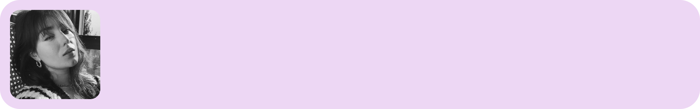

### A edição de hoje gira em torno de criação de novos hábitos, gestão de tempo e motivação. Por incrível que pareça, tudo isso está conectado.

Um caloroso bem vindo aos **8 novos seguidores** da Stoa! 🥳

### Quatro Mil Semanas

Comecei a ler um livro chamado **Quatro Mil Semanas**, escrito pelo jornalista e escritor britânico Oliver Burkeman.

Bebendo um pouco do conceito de Seneca sobre a Brevidade da Vida, em que reconhecemos a finitude do nosso tempo na terra, o autor propõe uma maneira diferente de gerenciar o nosso tempo.

Logo no começo ele traz uma obviedade à mesa: otimizar nossas tarefas não necessariamente nos fornece mais tempo livre. Na verdade, quanto mais rápido você termina seus afazeres, mais rápido novas tarefas serão colocadas na sua mesa.

Recomendo a leitura.

∰

### Da minha mente para a sua

🏄‍♂️ **[O Guia Completo da Motivação](https://www.scotthyoung.com/blog/2020/11/02/motivation/)***(en)*

Uma página sensacional que compila diversos conteúdos e estudos sobre formação de metas, hábitos, tipos de motivação e assuntos relacionados ao tema.

**🤔 [O Paradoxo Abilene - Quando Pensamento em Grupo dá Errado](https://www.theknowledge.io/the-abilene-paradox-when-groupthink-goes-wrong/) ***(en)*

Esse artigo mostra 3 fenômenos diferentes de como exercícios de pensamento coletivo podem levar a decisões irracionais.

**✂️ [Para Iniciar Um Novo Comportamento, Copie e Cole](https://behavioralscientist.org/to-kickstart-a-new-behavior-copy-and-paste-katy-milkman-how-to-change/) ***(en)*

Este artigo mostra que, ao copiar comportamentos de pessoas que possuem hábitos desejáveis, ficamos mais propensos a adquirir os mesmos hábitos. Essa é uma das dicas que sempre dou para UI Designers iniciantes: copie interfaces feitas por profissionais.

**😰 [Tolerância ao Risco - Porque Alguns Países Preferem UI Mais Complexas](https://uxdesign.cc/risk-tolerance-why-some-countries-prefer-more-complex-uis-25dae4402df4) ***(en)*

Esta pesquisa mostra que países em que as pessoas são mais tolerantes ao risco preferem UIs mais simples, ao contrário de países em que as pessoas são mais cuidadosas com as decisões, que acabam preferindo interfaces com mais informações que minimizam os riscos na tomada de decisão.

**🧠 [Como as 3 etapas da “plasticidade adaptativa” podem fazer seu cérebro crescer e facilitar o aprendizado](https://bigthink.com/neuropsych/3-steps-adaptive-plasticity-grow-brain-make-learning-easier/) ***(en)*

O cérebro passa por um processo de três etapas ao longo do tempo para apoiar a aprendizagem, construir mielina e criar novos caminhos. Primeiro muda quimicamente, depois estruturalmente e finalmente funcionalmente.

### Carollina Fieira

Hoje vamos mergulhar no consciente da **Carol**. Para quem me acompanha há alguns anos, talvez vai lembrar dela dos tempos da UI Lab.

Calculando por cima, já nos conhecemos há uns 9 anos. É uma pessoa que sempre enxerguei potencial e força para lutar contra as maiores adversidades que a vida pode proporcionar.

Oi, eu sou a Carol, uma pessoa de alma inquieta e curiosa desde sempre. Por ser inquieta, vivo tentando me redescobrir de tempos em tempos com a esperança de sempre ser melhor em algo. Minhas maiores inspirações vem da arte, de um bom filme, do cotidiano, do poder de observar o outro e da conversa jogada fora com uma taça de vinho ou uma boa cerveja bem gelada. Há uns 3 anos decidi entrar de cabeça no mundo de design e marketing criando a minha própria empresa, a [Umcafé Design](https://www.instagram.com/umcafedesign/). Hoje moro na Itália, vivendo um dia de cada vez, observando a vida passar no seu tempo e sentindo o vento no rosto como um suspiro de liberdade.

Espiritualidade e psicologia. Como uma pessoa que luta contra depressão, estudar e entender os sentimentos que sinto ao longo dos anos me fazem enxergar a vida por outro prisma e tentar sempre evoluir.

Extraordinário. Um filme lindo, que aborda a inclusão e a beleza de ser diferente. Além de falar sobre relações familiares no geral, o filme aborda sobre comportamentos em sociedade.

Minha viagem para a Itália em 2017. Lembro da sensação quando o avião pousou e eu comecei a chorar desesperadamente, só quem conhece minha história de perto (o Willian é uma dessas pessoas), sabe o quanto essa viagem abriu minha visão para o mundo. Uma menina que saiu da roça e que morou no interior até os 16 anos jamais imaginaria ver e viver tudo aquilo um dia. Essa viagem vai ficar marcada sempre no meu coração porque ali a minha criança interior, aquela que falava que o sonho dela era ver castelo, tava pulando de felicidade e gratidão por estar ali. Um agradecimento especial ao Willian, que ajudou tudo isso se tornar possível.

Pode parecer bobo, mas amo o vídeo do filho do Taylor Hawkins ( Foo Fighters) tocando bateria em homenagem ao pai que faleceu. Esse vídeo para mim é lindo, mostra o amor incondicional pelo pai que sempre esteve ali presente, a paixão pela música, pela bateria e em como até os trejeitos de tocar ele herdou do pai. Acho incrível essa conexão.

Não tenha medo de arriscar, de sair da zona de conforto, de começar algo novo. Tudo é aprendizado e só quem se permite errar consegue ver beleza no processo e comemorar as pequenas conquistas.

### Links úteis

1. **[Population](https://population.io/)** - Coloque sua data de nascimento e divirta-se
2. **[Marketing Examples](https://marketingexamples.com/)**
3. **[Geist](https://vercel.com/font)** - Fonte open source criada pelo time da Vercel
4. **[App Motion](https://appmotion.design/)** - Inspiração de motion design
5. **[UX Copy](https://www.ankitpassi.com/projects/uxcopy)** - Ideias para textos de interface

Ainda não é inscrito? Considere se inscrever para não perder as próximas edições.

[Subscribe now](https://www.stoa.news/subscribe?)
