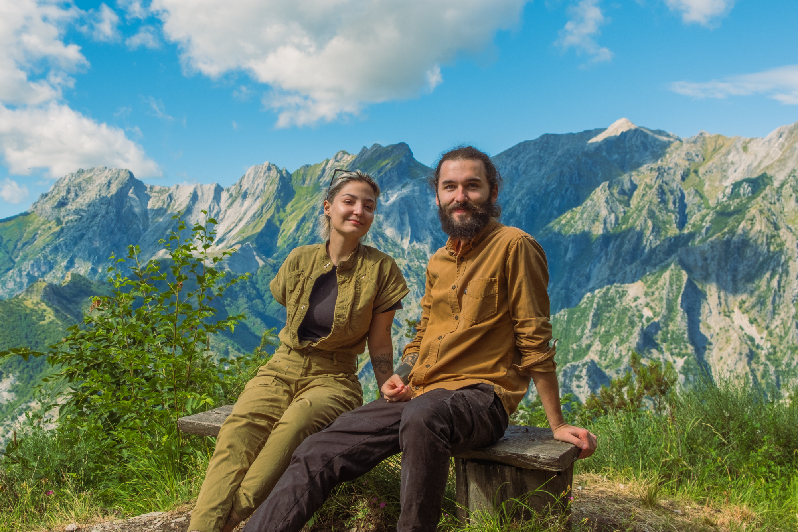
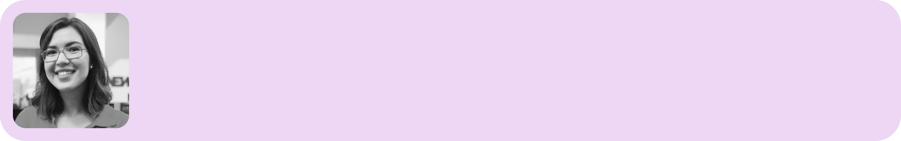

### Estava ansioso por essa edição! Eu trouxe 3 temas que gostei bastante de estudar durante a semana passada e acredito que você também vai.

Olá! Está preparado para mais uma edição imperdível? Se você gostar, considere compartilhar nas suas redes sociais! 😃

### A Vida é Finita

Lendo o livro “Quatro Mil Semanas”, que já indiquei em outra edição, me deparei com essa frase aqui:

> “*Nossas vidas, graças à sua finitude, é inevitavelmente repleta de atividades que realizamos pela última vez.*” - Sam Harris

Já confrontei a finitude diversas vezes em minhas leituras, mas essa frase resumiu bem o fato de que talvez o suco de laranja delicioso que tomei ontem pode ter sido o último. A gente nunca sabe se o momento entre dormir e acordar nos dará uma nova chance de viver um novo dia.

Encarar a finitude tão de perto me permite desacelerar um pouco e agradecer por simplesmente estar vivo e por ter vivido da melhor maneira possível o dia que passou.

Me permite também entender que na escala do tempo da vida existem tantas coisas que são tão irrelevantes que nem merecem sequer uma fração do meu tempo.

Quando confrontado com as situações do dia a dia, seja no trabalho ou vida pessoal, tento usar a mesma régua na hora de avaliar minhas opções: essa discussão é realmente necessária? Preciso mesmo ficar chateado com isso? Ficar irritado com minha parceira faz sentido sabendo que na escala do tempo isso vai ocupar um período tão minúsculo e irrelevante? A resposta 99% das vezes é não.

Ao colocar as coisas em perspectiva, sobra muito mais tempo para aproveitar o que realmente importa.

**Pergunte-se:** como eu posso aproveitar meu tempo finito da melhor maneira? Pense nisso antes que não haja mais tempo para pensar.

∰

### Da Minha Mente Para a Sua

**⚽️ [Designer Como Um Profissional Adaptativo](https://uxdesign.cc/johan-cruyffs-influence-on-adaptive-role-switching-in-product-design-ee885f9af75d) ***(en)*

Inspirado no conceito de *Total Football*, o autor compartilha sua visão de como designers deveriam assumir diferentes papeis dependendo dos tipos de desafio que encaram, não limitando-se apenas a “jogar” somente em uma posição. Se você assistiu a útlima temporada de **Ted Lasso**, provavelmente já está familiarizado com o funcionamento do *Total Football* e porque ele pode ser uma estratégia interessante para a carreira de design também.

**🌇 [O Problema Com a História do Consumidor](https://psyche.co/guides/how-to-be-an-engaged-citizen-and-make-meaningful-social-change)** *(en)*

Nos fazem acreditar que uma vida bem sucedida é pautada pelo sucesso individual e bens adquiridos. Essa dinâmica não só é uma mentira, como também prejudica a vida em sociedade. Neste artigo o autor explora o termo “*consumer story*” e outros dois tipos de história que permeiam nossa sociedade atual e que impactam a maneira como vivemos.

**🔬 [A Verdade é Feita de Detalhes](https://www.raptitude.com/2023/10/the-truth-is-always-made-of-details/)** *(en) *

Como seres humanos rodeados por informações que nos atingem de todos os cantos a todo momento, tendemos a enxergar as coisas de maneira muito superficial. A leva a B, X é bom, Y é ruim. Embora essa perspectiva das coisas facilite nossa vida, a verdade, como o título sugere, é feita de detalhes. Quando ampliamos nossas lentes para enxergar as coisas de maneira mais detalhada, ampliamos também nossa experiência com as pessoas e o mundo em que vivemos. E isso muda, em última instância, nossa perspectiva sobre como tudo funciona.

### Marina Meireles

Hoje vamos mergulhar no consciente da **[Marina](https://www.linkedin.com/in/meirelesmarina/)**. Nos conhecemos na Bitso em 2022, onde formávamos uma dupla de product e content designers. Embora nossa interação tenha sido por pouquíssimo tempo, já foi o suficiente para eu admirar seu trabalho e competência.

Se você estiver procurando uma **excelente Content Designer**, já sabe!

Sou jornalista de formação, e esse ofício me fez aprender sobre comunicação da forma mais genuína possível: entrevistando pessoas e ouvindo suas histórias. Sempre fui muito fascinada com a dinâmica da comunicação em si s passei por redações de jornais impressos, portais de notícias e pela TV para ouvir e contar histórias. O gosto pela comunicação visual me levou ao Design, e foi durante uma pós-graduação em Comunicação e Design Digital que me deixei levar de vez por outros caminhos para ouvir e contar histórias— troquei sites de notícias e boletins de TV pelo design de conteúdo de interfaces de produtos digitais. Atualmente, trabalho com design de conteúdo para uma fintech mexicana com atuação em outros países da América Latina.

Nas horas vagas, gosto de estudar idiomas, uma outra paixão que tem suas raízes nesse amor pela comunicação e por como as culturas de outros lugares são moldadas através de suas línguas. Comecei pelo inglês na escola, conquistei o espanhol já adulta e agora luto para aprender italiano (mesmo que seja só pelo Duolingo, por enquanto).

**Retratos Fantasmas**, a produção mais recente do conterrâneo Kleber Mendonça Filho, e aposta brasileira para o Oscar 2024. O filme passeia entre o documental e o autobiográfico ao mostrar como os cinemas de rua de Recife foram perdendo a força ao longo das décadas com as mudanças sociais e econômicas, mas de um jeito íntimo e cativante até pra quem não é da cidade.

Viajei sozinha ao Peru em 2019 e, durante uma trilha na região de Cusco, os mais de 4 mil metros de altura me causaram náusea, cansaço e a impressão de que eu não iria conseguir chegar ao fim do percurso. Minha mente se dividia entre “eu posso ver a paisagem por foto se eu buscar no Google” e “eu não cheguei até aqui pra voltar sem ter feito o que me motivou a sair de casa”. Depois de longas e várias pausas a cada 20 passos de caminhada numa montanha íngreme, cheguei à Laguna Humantay e vivenciei um dos momentos mais significativos para meu corpo e minha mente: a sensação de ser parte da natureza e de que eu poderia alcançar o que eu quisesse. “Más cerca que lejos”, ou “mais perto do que longe”, é um mantra que me acompanha desde então nos meus momentos de desafio.

**[Nesse TED](https://www.ted.com/talks/lera_boroditsky_how_language_shapes_the_way_we_think)**, Lera Borodisky explica como os idiomas podem moldar a nossa forma de pensar, construindo os vieses comportamentais que temos e a forma que percebemos o mundo. É excelente para entender como a linguagem também impacta no nosso modo de fazer design e no modo como as pessoas consomem as soluções que criamos.

Um conselho para o trabalho, mas que também se aplica a outras esferas: respeitar os próprios limites é o primeiro passo pra que as pessoas ao seu redor também possam te respeitar. ✨

### Links Úteis

1. **[Best Inventions of 2023](https://time.com/collection/best-inventions-2023/) **- Lista sensacional de invenções feita pela Time
2. **[Trending Design](https://trending.design/)**
3. **[Colorful Night](https://colorfulnight.pha5e.com/)** - Um jogo gestual e colorido para desafiar sua agilidade
4. **[Email Inspiration](https://www.audienceful.com/inspiration)**
5. **[Lindsey Poulter](https://www.lindseypoulter.com/)** - Trabalhos incríveis de Data Viz

Ainda não é inscrito? Considere se inscrever para não perder as próximas edições.

[Subscribe now](https://www.stoa.news/subscribe?)
