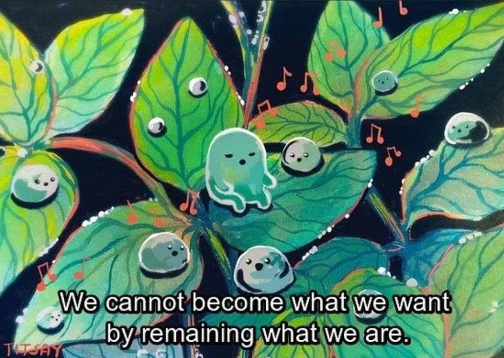

### Na edição de hoje temos novidades sobre a Stoa, métrica de ressonância interna e externa, e uma dica de canal no YT para quem curte arquitetura.

Olá! Está preparado para mais uma edição imperdível? Se você gostar, considere compartilhar nas suas redes sociais! 😃

### Mudanças na Stoa

A parte mais legal de fazer algo pessoal como a Stoa é a possibilidade que eu tenho de experimentar mudanças graduais que vão ressoando cada vez mais com a minha visão de mundo no momento (porque ela muda bastante).

Já pensei muito se eu deveria manter uma estrutura fixa de conteúdo ou se seria melhor deixar tudo mais flexível. Pra ser bem sincero, no momento atual da minha vida a segunda opção parece fazer mais sentido.

Hoje as minhas newsletters favoritas são as do **[Ugmonk Journal](https://manage.kmail-lists.com/subscriptions/web-view?a=aVinKJ&c=01H2R6C96QB9BXS8BR80906YFF&k=0cd47e7e05acb87f1dcb1a5b36e71c79&m=01HGE0VCBF15K2S54EWD0QJQ1C&r=Vgy5zgf)**, **[from DESK of van Schneider](https://vanschneider.com/blog/edition-231)** e **[Dense Discovery](https://www.densediscovery.com/)**. Todas são diferentes uma das outras. Gosto da simplicidade da primeira, da personalização da segunda e da estrutura da terceira.

É bem provável que uma síntese das três seja um pouco difícil. E nem é meu objetivo aqui. Acho que na próxima edição vou um pouco mais para a simplicidade e depois eu vejo se mudo de ideia ou não.

Espero que você goste do desconforto!

Obrigado por acompanhar minhas loucuras.

∰

### Da Minha Mente Para a Sua

**🧲 [Ressonância Interna e Externa - Medindo o Que Importa](https://ungated.media/artifacts/measuring-what-matters/) \***(en)\*

Rob Hardy está metrificando sua criação de conteúdo em apenas 2 aspectos: ressonância interna e externa. A primeira expressa como ele se sentiu ao publicar um texto, se aquilo o fez sentir vivo, se o conteúdo realmente condiz com seu verdadeiro eu. Já a segunda metrifica como as pessoas reagiram ao que foi publicado. Se o texto as tocou profundamente e qual foi o feedback gerado a partir disso.

**⚽️ [Expandindo Interfaces Conversacionais](https://www.youtube.com/watch?v=Nd_aJeTSPmQ) \***(en)\*

Um vídeo curto do Luke W (o cara que popularizou o conceito de Atomic Design) sobre uma abordagem de FAQ para interfaces conversacionais ao invés do convencional padrão de chat.

**📹 [Open Space -](https://www.youtube.com/@openspace.series) [Architecture + Design + Preservation](https://www.youtube.com/@openspace.series#)** _(en)_

Vi essa dica de canal sobre arquitetura e design na newsletter do **Tobias van Schneider** e os vídeos sobre as casas são muito gostosos de assistir.

### Andrey Knabbenn

Hoje vamos mergulhar no consciente do **[Andrey Knabbenn](https://www.instagram.com/andreyknabbenn/)**.

Já o conheço há alguns anos porque ele também é de Criciúma e frequentava os eventos que o pessoal da Stoika organizava. Além disso, hoje ele é um dos educadores de design de interfaces que mais recomendo quando alguém quer aprender sobre UI.

Ele inclusive lançou um excelente curso chamado **[Intuitive Pixel](https://www.intuitivepixel.com.br/)**.

Eu me chamo **[Andrey](https://www.instagram.com/andreyknabbenn/)**, sou Product Designer na Simples Dental e também "criador de conteúdo" (eu não gosto muito desse termo) no Instagram, onde compartilho muito do que sei e do que aprendo com a comunidade, ajudar outras pessoas me faz feliz demais. Algumas coisas que me definem em poucas frases: amo presenciar momentos felizes de corpo e alma (você nunca me verá preocupado em filmar um show ao vivo com o celular por exemplo). Sou também o "doido" dos gadgets, amo produtos para o meu office e também amo sentir o cheiro de produto novo assim que removo da caixa, é a felicidade do trabalhador.

Psicologia e linguagem corporal. Na minha opinião, é um pré-requisito para a área de UX que só me traz vantagens.

A Fantástica Fábrica de Chocolate. Parece bobo, mas para mim o comportamento do protagonista (Charlie) é uma receita para vencer na vida: humildade, paciência, cuidar do que é seu e não se deixar levar pelo comportamento da maioria.

Com toda certeza o momento em que conquistei minha casa própria e consegui montar meu office do meu jeito. Foi o momento que eu pude com toda certeza pensar: valeu a pena a espera e o esforço pelo meu trabalho.

Gosto muito do vídeo de **[comparação do tamanho do universo](http://Gosto muito do vídeo de comparação do tamanho do universo, me faz pensar em como somos breves e que não vale a pena se preocupar com coisa pequena. https://www.youtube.com/watch?v=i93Z7zljQ7I)**, me faz pensar em como somos breves e que não vale a pena se preocupar com coisa pequena.

Uma dica é manter a humildade independente do crescimento. Humildade para ouvir, para ensinar, para corrigir e ser corrigido. Esse é uma das melhores características por trás de pessoas grandes e que está em falta hoje em dia.

### Links Úteis

1. **[Figmayo](https://www.figmayo.com/)** - Publique seu Design System instantaneamente
2. **[Meshy AI](https://www.meshy.ai/)** - Crie modelos 3D com AI
3. **[Remote Jobs](https://remote.com/jobs)** - Lista de vagas de trabalho remotas
4. **[Speed Vitals](https://speedvitals.com/)** - Teste de velocidade de websites
5. **[Storefront Design](https://www.storefront.design/)** - Curadoria de lojas online com bom design

Compartilhe o conteúdo desta edição com as pessoas mais importantes do seu círculo de amigos.

[Subscribe now](https://www.stoa.news/subscribe?)
