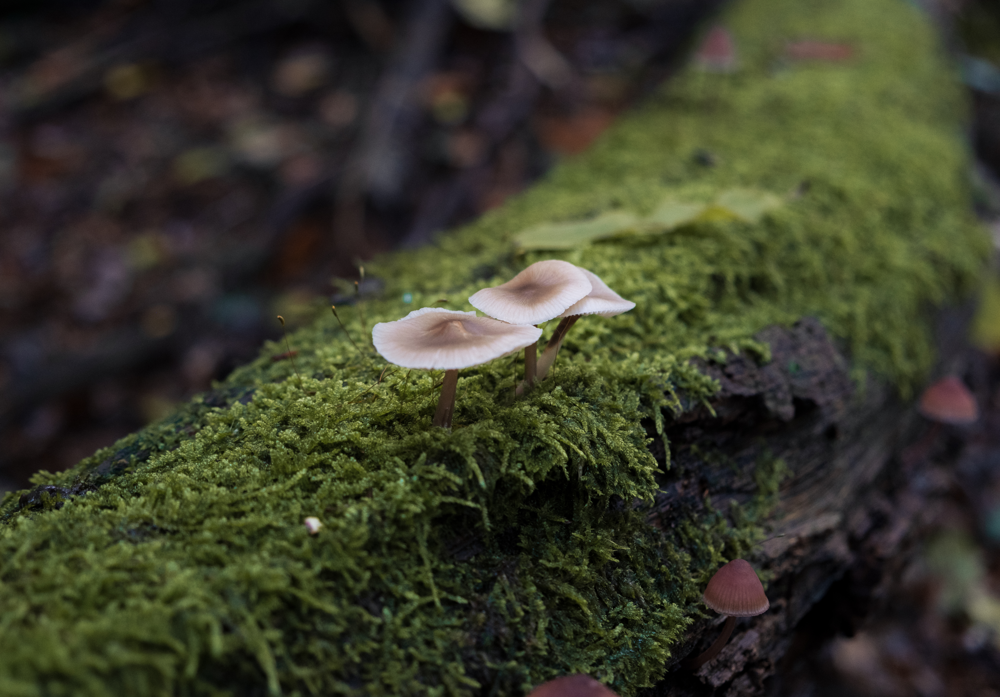

A semana passou rápido e eu estava ansioso para estrear o novo formato da **Stoa**! A ideia é simples e a execução ainda mais.

Listei todas as coisas interessantes que me deparei desde a última edição. Espero que goste. 🥰

### 7 coisas dos últimos 7 dias

1. Se você gosta de tipografia vai achar interessante **[essa timeline](https://uclab.fh-potsdam.de/arete/en)** que mostra a história do alfabeto latino de forma visual. ✍️

1. Ainda na área de design gráfico, **[esse post traz as maiores tendências](https://www.creativeboom.com/features/biggest-trends-in-graphic-design-for-2024/)** para a área em 2024. 🖍️

1. **[Refire](https://en.refire.com/)** é uma empresa de tecnologia que desenvolve produtos para mobilidade e energia elétrica a hidrogênio. Uma ideia sensacional para encarar os desafios das mudanças climáticas. **💧⚡️**

1. **[Cargo Kite](https://cargokite.com/)** é uma empresa alemã com uma ideia bem inusitada para transportes marítimos com zero emissão de carbono. Eles querem usar ventos de alta altitude que ficam acima de 300 metros e possuem 95% de ocorrência. 🚢🪁

1. **[Chamjo](https://chamjo.design/)** é uma alternativa gratuita ao **[Mobbin](https://mobbin.com/)** para quem busca inspirações de aplicativos e seus fluxos. 📱

1. **[Palette Generator](https://palette-generator.significa.co/)** é um dos melhores geradores de variação de cores que já encontrei. É simples e personalizável na medida certa. 🎨

1. **[Design Systems Database](https://designsystems.surf/)** não só permite você ver os componentes de diversos DS de empresas como também está criando documentações de como construir seus próprios componentes. 👨‍💻

P.S: Estou editando várias fotos que estão no meu arquivo desde Outubro. Essa é uma delas e gostei do contraste do cogumelo com o musgo no tronco.

