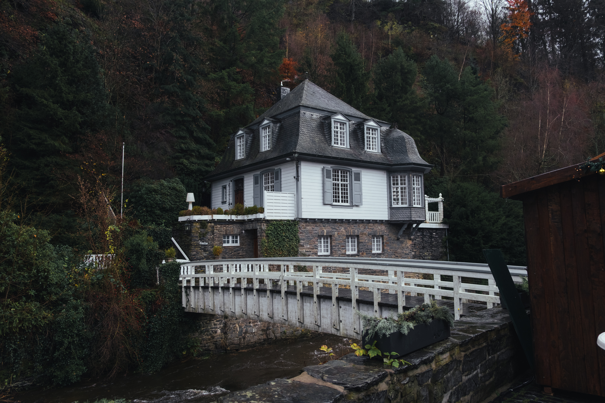

### Na edição de hoje temos ux design automotivo, design de cadeiras, criptografía psicodélica, fazenda vertical e chip que combina tecido cerebral.

Mais um ano está acabando e essa é a penúltima Stoa de 2023. Estou muito feliz por ter tirado essa ideia do papel e pelas **330 pessoas** que estão acompanhando a curadoria semanalmente.

A meta agora é chegar em 400 seguidores. Você pode nos ajudar ao compartilhar esse post nas suas redes sociais! :D

[Compartilhar](https://www.stoa.news/p/018?utm_source=substack&utm_medium=email&utm_content=share&action=share)

1. **[Guias de UX](https://www.theturnsignalblog.com/blog/guidelines-for-good-automotive-ux-design)** para um bom design automotivo traz alguns conceitos já conhecidos mas direcionados a criação de boas experiências para carros.

1. **[Maker](https://audiobox.metademolab.com/maker)** é uma ferramenta desenvolvida pela Meta que permite a criação de sons e vozes geradas por texto. Você descreve o tipo de som e narração, e a ferramenta gera automaticamente pra você. Uma boa ferramenta para quem gosta de contar histórias.

1. Me deparei com o estúdio de design de produto **[Overgaard & Dyrman](https://oandd.com/)** no Instagram e me apaixonei por um dos seus produtos: Circle Dinning Chair (e toda sua família). 🪑

1. **[AppShots](https://appshots.design/)** é mais uma alternativa ao Mobbin.

1. Já ouviu falar de **[PsyCrypto](https://qri.org/blog/psycrypto-contest)**? Uma técnica para esconder mensagens em animações que só pode ser decodificada se você estiver usando alguma droga psicoativa. 💊🤩

1. Cientistas conseguiram criar um **[chip que combina tecido cerebral](https://www.nature.com/articles/d41586-023-03975-7)** cultivado em laboratório com hardware eletrônico. Um sistema que integra células cerebrais em uma máquina híbrida que é capaz de reconhecer vozes. 🤯

1. Sou um grande entusiasta de fazendas verticais e esse mini doc sobre **[como a Plenty desenvolve suas plantações](https://youtu.be/J4SaSfnHK3I?si=Wrwv-vcft0P5Bql3)** é muito interessante. Com essa abordagem é possível reduzir significativamente o impacto ambiental causado pelo agronegócio.

A foto de hoje é uma das minhas preferidas da viagem que a Gaia e eu fizemos à cidade de **Monschau**, aqui no norte da Alemanha. A cidade ficou praticamente intacta durante a Segunda Guerra e hoje ostenta uma arquitetura sensacional que tem mais de 300 anos.

Até a próxima! 👋🏻
