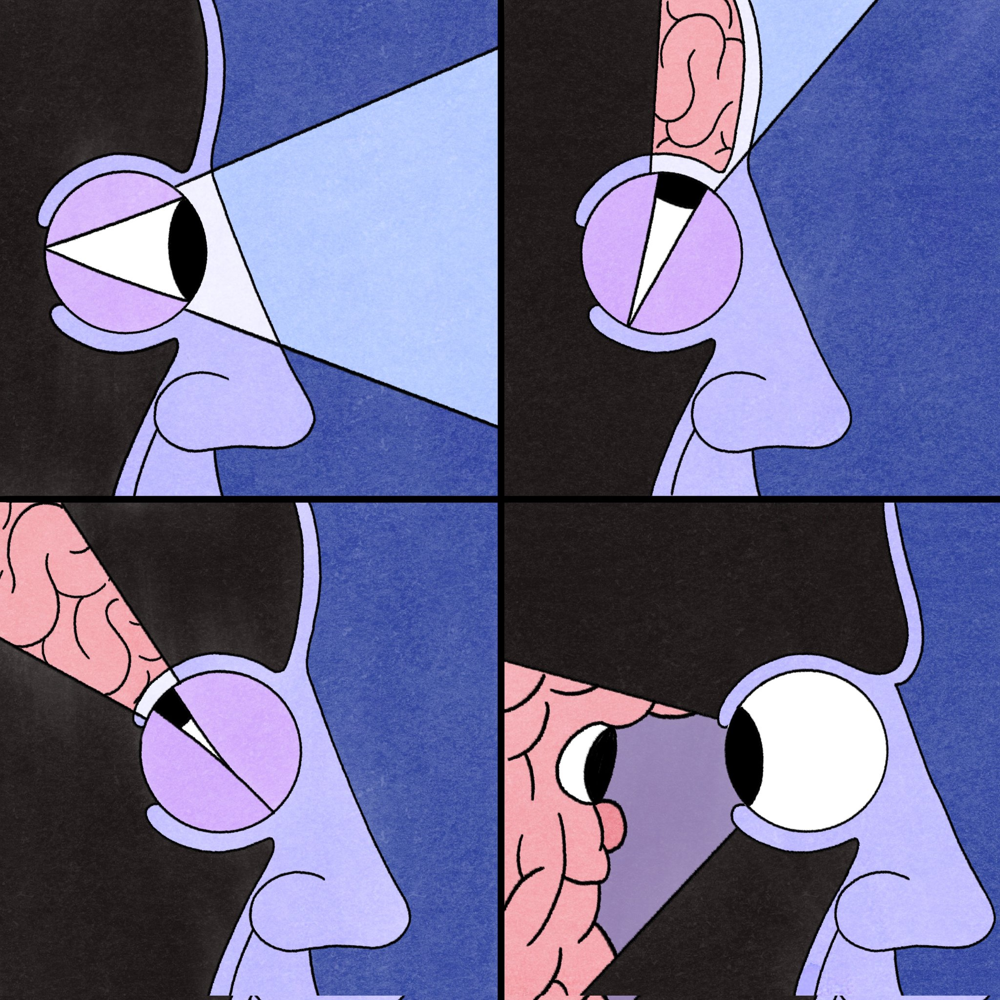

### Terapia genética, apps que mostram o passado, personalizações de botas, como sair do capitalismo e um clássico indiano chamado Bhagavad Gita.

Essa ilustração me lembrou de um conto Zen muito interessante na qual reproduzo aqui na íntegra:

> Há muito tempo, existia um mestre que vivia com seus discípulos num templo em ruínas.Os discípulos eram monges pedintes que sobreviviam do que lhes era dado pelo vilarejo próximo. Os discípulos reclamaram do estado do templo e o mestre respondeu-lhes: “Nós devemos reformar as paredes do templo. Desde que nós somente ocupamos o nosso tempo a estudar e meditar, não há tempo para que possamos trabalhar e arrecadar o dinheiro que precisamos. Assim, eu pensei numa solução simples”.Todos os estudantes se reuniam diante do mestre, ansiosos em ouvir suas palavras. O mestre disse: “Cada um de vocês deve ir para a cidade e roubar bens que poderão ser vendidos para a arrecadação de dinheiro. Desta forma, nós seremos capazes de fazer uma boa reforma no nosso templo”.Os estudantes ficaram espantados por este tipo de sugestão vir do sábio mestre. Mas, desde que todos tinham o maior respeito por ele, não fizeram nenhum protesto. O mestre disse logo a seguir, de modo bastante severo: “No sentido de não manchar a nossa excelente reputação, por estarmos cometendo atos ilegais e imorais, solicito que cometam o roubo somente quando ninguém estiver a olhar. Eu não quero que ninguém seja apanhado”.Quando o mestre se afastou, os estudantes discutiram o plano entre eles. “É errado roubar”, disse um deles, “Por que nosso mestre sugeriu cometermos este ato?”Outro respondeu em seguida, “Isto permitirá que possamos reformar o nosso templo, então é uma boa causa”. Assim, todos concordaram que o mestre era sábio e justo e deveria ter uma razão para fazer tal tipo de requisição. Logo, partiram em direção à cidade, prometendo coletivamente que eles não seriam pegos, para não causarem a desgraça para o templo. “Sejam cuidadosos e não deixem que ninguém os veja roubar”, incentivavam uns aos outros.Todos os estudantes, com exceção de um, foram para a cidade. O sábio mestre se aproximou dele e perguntou-lhe:“Por que você ficou para trás?”O garoto respondeu: “Eu não posso seguir as suas instruções para roubar onde ninguém esteja me vendo. Não importa aonde eu vá, eu sempre estarei a olhar para mim mesmo. Meus próprios olhos irão ver-me a roubar”.O sábio mestre abraçou o garoto com um sorriso de alegria e disse: “Eu somente estava a testar a integridade dos meus estudantes e você é o único que passou no teste!”

[💛 Compartilhe com 1 amigo](https://willianmatiola.substack.com/publish/post/https://willianmatiola.substack.com/?utm_source=substack&utm_medium=email&utm_content=share&action=share)

### Coisas que me surpreenderam nos últimos dias:

1. Uma **[terapia genética](https://futurism.com/neoscope/gene-therapy-virus-deaf-boy)** que implanta um vírus benéfico que substitui um gene defeituoso por uma cópia funcional foi capaz de curar a surdez de um menino de 11 anos. Esse tratamento é uma conquista sensacional! **#ciência**
2. Nesse vídeo a Kristen fala sobre como a maioria dos apps que exibem algum tipo de dado ou relatório **[sempre focam em mostrar o passado](https://kristenberman.substack.com/p/eight-sleep-why-data-visualization)** ao invés de fornecer insights ou sugestões para o futuro. Uma ótima reflexão para pessoas de produto. **#dataviz #comportamento**
3. Eu estou apaixonado pelas **[personalizações](https://www.instagram.com/abigail_and_lauren/)** delicadas que a Abigail faz em botas do modelo Chelsea. Quando eu comprar uma bota dessas vou tentar algo parecido e se der certo eu mostro pra vocês. **#arte**
4. **[Como sair do capitalismo](https://joanwestenberg.medium.com/how-to-quit-capitalism-5044a7290684)** é um artigo que fornece maneiras para nos desvincularmos dessa força ideológica e filosófica que molda nossas vidas, ambiente e percepção da humanidade. **#reflexão**
5. Recentemente terminei a leitura de um clássico indiano chamado **[Bhagavad Gita](https://www.amazon.com.br/Bhagavad-Gita-mensagem-mestre-Vyasa-Dvaipayana/dp/853152296X?crid=1I565BKGQEAR0&keywords=bhagavad+gita&qid=1706609623&sprefix=bha%2Caps%2C177&sr=8-2&linkCode=sl1&tag=ul0dd-20&linkId=a5039db0d615a8da736bd78581d026cb&language=pt_BR&ref_=as_li_ss_tl)**, que relata o diálogo entre Krishna e Arjuna em um campo de batalha prestes a enfrentar uma luta sangrenta contra seus próprios familiares. A história na realidade trata da luta interior do ser humano em busca da Sabedoria, de superar as forças do ego e do despertar para o Eu Superior. **#espiritualidade**
6. Esse é para os apaixonados por **[carro e interfaces](https://www.theturnsignalblog.com/blog/designing-better-digital-instrument-clusters/)**: o problema dos grupos de informações instrumentais digitais (velocidade, combustível, óleo, etc…). **#designautomotivo #uidesign**
