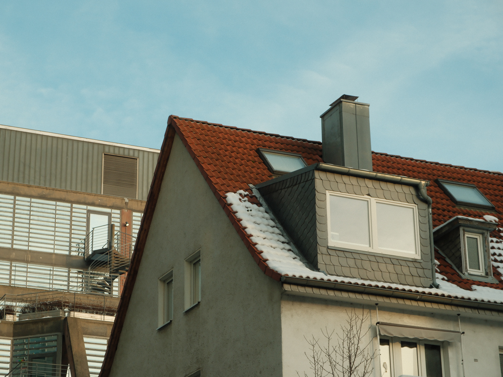

### Aquela misturinha gostosa de assuntos que você não sabia que precisava!

> **Seguidômetro: 356/400**

Os dois primeiros artigos que indiquei a seguir são ótimos para refletir um pouco sobre o péssimo hábito de compartilhar tudo nas redes sociais e sobre a importância de saber calar-se quando você não tem nada de útil para acrescentar.

Não é fácil fazer nenhuma das duas coisas. Mas exercitar isso diariamente é um bom começo.

**Coisas que, como designer, evito fazer:**

- Criticar publicamente designs de outras pessoas que não agregam em nada para nenhum dos lados.
- Expor minhas angústias ou dia a dia nas redes sociais.
- Falar mal de colegas ou da empresa em que eu trabalho.
- Dar palco para vendedor de curso que não tem portfolio coerente com o que ensina.
- Engajar em fofocas da comunidade de design.

**Coisas que faço ou tento fazer:**

- Me manter atualizado no que está acontecendo.
- Curtir e elogiar trabalhos que são bem feitos.
- Engajar com designers de outros países para criar networking.
- Me aprimorar sempre que possível.Isso envolve estudar diversos ramos do design, filosofia, espiritualidade e outras ciências.
- Isso envolve estudar diversos ramos do design, filosofia, espiritualidade e outras ciências.
- Ajudar sempre que alguém pede ajuda.
- Compartilhar sem esperar nada em troca.

**Coisas que quero fazer:**

- Lançar mais projetos pessoais.
- Criar recursos para a comunidade
- Compartilhar trabalhos em progresso.
- Criar interfaces para diferentes dispositivos.

[💛 Compartilhe com 1 amigo](https://willianmatiola.substack.com/publish/post/https://willianmatiola.substack.com/?utm_source=substack&utm_medium=email&utm_content=share&action=share)

### Coisas que me surpreenderam nos últimos dias:

1. **[O poder de calar a boca](https://thoughts.natedickson.com/the-life-changing-power-of-shutting-up)** é uma reflexão na qual me identifico bastante. As vezes tem coisas que você não precisa dizer. Se não vai ajudar alguém, nem elevar de alguma maneira a vida da pessoa, então é melhor ficar quieto. Deixe sua negatividade com você e procure ajuda.
2. **[Você não precisa documentar tudo!](https://www.freyaindia.co.uk/p/you-dont-need-to-document-everything)** A autora desse texto conseguiu extrair de forma sensata tudo o que eu penso sobre pessoas que compartilham tudo nas redes sociais. Que fazem do Twitter um diário, do Instagram um conto de fadas e de qualquer outra rede social um espelho da sua superficialidade.
3. Essa semana descobri um conceito chamado **[Solarpunk](https://solarpunkmagazine.com/9-reasons-why-solarpunk-is-the-future/)**, que muuuito resumidamente é a harmonia entre tecnologia, meio ambiente e sociedade.
4. **[The Expanding Scope of Design](https://assets-global.website-files.com/64638531fc348162adfa6c5e/656fc905975f7d5a9fd57b49_TheExpandingScopeOfDesign.pdf)** é um relatório feito por designers suíços e americanos sobre como eles enxergam o cenário do Design e algumas tendências para o futuro. Tirando todo o viés existente por causa da amostragem da pesquisa, os insights ainda são interessantes.
5. **[Infinite Craft](https://neal.fun/infinite-craft/)** é um jogo super simples que você vai combinando elementos infinitamente para formar outros. Cuidado! É extremamente viciante. Dica: para combinar elementos arraste um sobre o outro.

O **bônus** de hoje é essa playlist que estou alimentando com músicas instrumentais para trabalhar relaxado.
