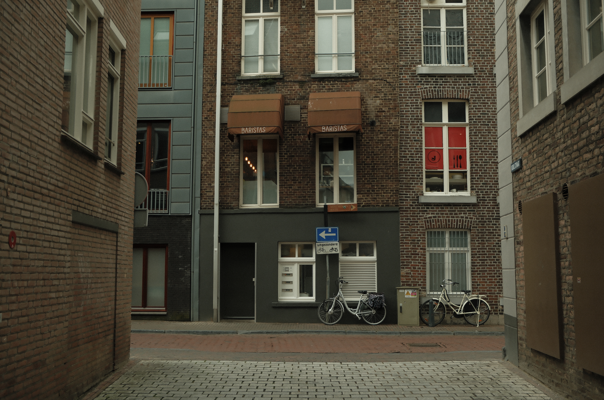

### O ideal de sempre melhorar o melhor. De se dedicar pelo trabalho invisível.

Você provavelmente já deve ter ouvido alguém dizer que é necessário ser bom em “*craft*” ou que você precisa melhorar seu “*craft*” no Design. As vezes parece até que você precisa invocar alguma entidade poderosa que então passará seu conhecimento hermético em troca de algum grande esforço ou favor.

O mais interessante, na minha visão, é que para os mais instruídos é muito fácil identificar quem recebeu essa “dádiva” e quem ainda está lutando para entender o conceito. Se você faz parte do segundo grupo, sugiro que leia este artigo [aqui](https://www.doc.cc/syntax/craft). Se você tem preguiça, acredito que a frase “*dedicação e amor pelo trabalho invisível*” pode ser um bom petisco antes do prato principal.

Agora, de maneira muito, mas muito simples, uma pessoa com um bom *craft *é uma pessoa caprichosa até nas pequenas coisas. Independente se é uma apresentação para a empresa, um post para as redes sociais ou a organização das suas layers no Figma. Mas calma que também não é só isso.

Para engrossar o caldo dessa refeição te apresento o termo japonês **Shokunin**, que na tradução ocidental — pasme — significa algo como *craftsman *ou* artisan. *Mas o significado é ainda mais profundo do que isso:

> “O aprendiz japonês aprende que shokunin significa não apenas ter habilidades técnicas, mas também implica atitude e consciência social. …O shokunin tem a obrigação social de trabalhar o seu melhor para o bem-estar geral do povo. Esta obrigação é tanto espiritual quanto material, pois não importa qual seja, a responsabilidade do shokunin é cumprir o requisito.” — Tasio Odate

Um shokunin é aquele artesão que nutre o ideal de sempre melhorar o melhor. Não importa se seja uma função simples como preparar um bolinho de arroz ou algo mais complexo como construir um super aplicativo, seu objetivo é sempre entregar o melhor resultado.

Na minha visão, a sensação que mais se aproxima desse conceito é quando você cria uma interface e no dia seguinte percebe que poderia ter feito ainda melhor. Se você se deixar enamorar pela sua criação, será bem difícil se tornar mestre do seu ofício e continuar melhorando mais e mais. O segredo é [manter a humildade](https://willianmatiola.substack.com/p/025) e compreender que somos eternos aprendizes em busca de um aperfeiçoamento contínuo.

Já vi muitos designers com 10 anos ou mais de carreira parados no tempo fazendo as mesmas coisas que faziam há 10 anos atrás. O design continua precário, o entendimento das técnicas continua o mínimo e o cuidado pelos detalhes é praticamente inexistente.

Se você não está comprometido e disposto a evoluir no seu ofício, por qual outra razão você ainda permanece nele?

*✶ *

*Agradecimento especial ao meu amigo Henrique Stopassoli pelo feedback inicial sobre essa reflexão.*

*✶*

### O que rolou por aqui:

1. Um **[mini documentário](https://www.youtube.com/watch?v=soWlpFZYOhM&t=2s)** (13 min) sobre uma empresa que está produzindo carne cultivada em laboratório em larga escala.
2. **[É responsabilidade do designer se um app se torna viciante?](https://www.itsnicethat.com/articles/pov-ethics-of-gamified-ux-digital-creative-industry-insights-070324?)** A resposta parece simples e qualquer pessoa com juízo diria que somos responsáveis por aquilo que plantamos, mas num mundo onde o capitalismo te empurra para decisões como essa, fica difícil culpabilizar quem somente quer sobreviver.
3. Se você se interessou pelo termo Shokunin, **[nesse artigo aqui](https://www.linkedin.com/pulse/shokunin-querer-fazer-melhor-mesmo-j%C3%A1-sendo-marcelo-nakagawa/?originalSubdomain=pt)** você encontra dados históricos muito interessantes sobre o surgimento do termo.
4. Recentemente postei duas telas conceito de um app que sincronizaria seus *highlights* do kindle. Quero continuar explorando essa ideia e você pode me acompanhar lá no **[Layers](https://layers.to/willianmatiola)**.
5. No último final de semana fui conferir uma exposição do artista **[Tony Cragg](https://www.tony-cragg.com/)** que faz esculturas enormes utilizando diversos tipos de materiais.

[💛 Compartilhe com 1 amigo](https://willianmatiola.substack.com/publish/post/https://willianmatiola.substack.com/?utm_source=substack&utm_medium=email&utm_content=share&action=share)
