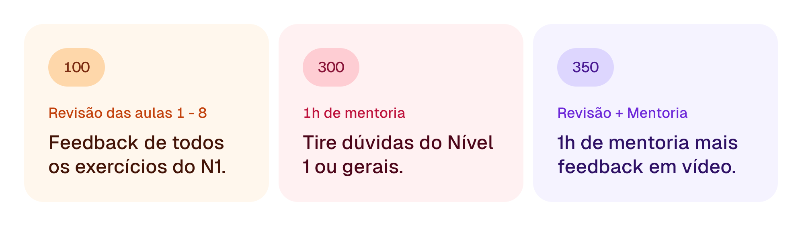
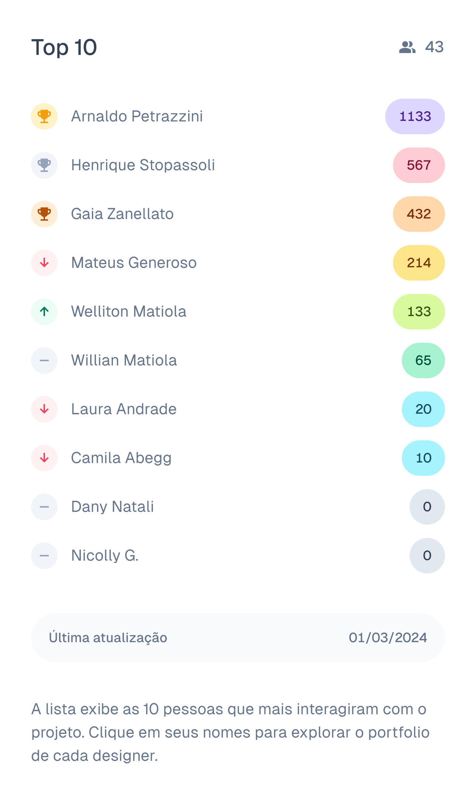

### Estou criando um novo projeto pessoal que pode te ajudar bastante a melhorar seu craft.

Na **[edição](https://willianmatiola.substack.com/p/026)\*\*\*****\***[passada falei sobre ](https://willianmatiola.substack.com/p/026)**\***[craft](https://willianmatiola.substack.com/p/026)\*\* \*e como a prática constante de aprimoramento das suas habilidades leva você a se tornar um Shokunin: um artesão que sempre tenta melhorar o melhor.

E hoje quero apresentar em primeira mão um novo projeto que estou desenvolvendo para ajudar você a melhorar seu *craft *ao mesmo tempo que também aprende os diversos tipos de componentes de interface.

A ideia é bem simples!

### Como funciona

Cada aula vai abordar um componente e vai ensinar do que se trata, qual seu uso e como fazê-lo no Figma. Desta forma nós aprendemos: o** quê**, o **por quê** e **como**.

Algumas aulas serão gratuitas e outras terão um custo que pode variar de acordo com a complexidade do componente (mais complexo = mais tempo para criar o conteúdo).

### Níveis

O projeto contém diversos níveis, aprofundando e explorando componentes que são mais complexos de serem criados. Você tem total liberdade de desbloquear somente as aulas que mais te interessam.

### Extras

Além das aulas, você pode investir em alguns extras:

1. **Revisão dos exercícios:** você recebe um vídeo com meu feedback sobre todos os pontos que você precisa melhorar nos componentes daquele nível.
2. **Mentoria:** você pode agendar 1h de mentoria comigo para conversarmos sobre seu desenvolvimento ou outros assuntos que você tem interesse.
3. **Combo:** você recebe tanto o vídeo de feedback quanto a mentoria de 1h.

### Top 10

O Top 10 exibe as 10 pessoas que mais contribuíram para o projeto. Os pontos são obtidos de acordo com cada aula que você desbloqueia ou extra que você adquire.

O ranking é apenas uma forma de demonstrar minha gratidão por quem está apoiando o projeto e também **oferecer um espaço para divulgar o seu portfolio**.

A lista é atualizada diariamente.

### Perguntas & Respostas

1. **Quando estará disponível?** Ainda não há uma data mas avisarei em primeira mão aqui na Stoa. Se você ainda não é inscrito aproveite para se inscrever.
2. **Haverá algum tipo de assinatura?** Não! Esse projeto não tem como objetivo ser mais um gasto mensal na sua conta. Você paga somente por aquilo que trará um impacto positivo na sua carreira.
3. **Tem certificado?** O projeto não oferece certificado por não ser um curso estruturado. Você ganha algo mais valioso que isso: conhecimento.
4. **Quais serão os valores das aulas? **Pode variar entre 10 a 50 reais dependendo da complexidade do componente.
5. **Posso comprar várias aulas ao mesmo tempo? **Não! A ideia é que você faça compras conscientes e não gaste dinheiro a toa. Ao comprar diversas aulas ao mesmo tempo você pode acabar se arrependendo e se desmotivando. Compre uma, pratique e quando se sentir seguro compre outra.
6. **Por quanto tempo tenho acesso as aulas?** Por tempo indeterminado. Inclusive, se quiser baixar e armezanar localmente e de forma privada, você pode. Só não pode piratear ou compartilhar sem autorização.

Se você gostou da ideia ou conhece alguém que pode se beneficiar dela, compartilhe essa edição da Stoa. 😊

[💛 Compartilhe com 1 amigo](https://willianmatiola.substack.com/publish/post/https://willianmatiola.substack.com/?utm_source=substack&utm_medium=email&utm_content=share&action=share)

### O que rolou por aqui:

1. A árvore da vida na **[Kabbalah Hermética](https://www.youtube.com/live/b_92PX9Dy70?si=78prkfTMtWPsqR3b) **mostra a jornada do ser humano rumo ao seu desenvolvimento enquanto pessoa. É lindo como esse sistema filosófico pode ser aplicado em todos os aspectos da nossa vida.
2. Recentemente meu amigo Mateus me apresentou essa inteligência artificial chamada** [Pi](https://pi.ai/referral) **que possui uma interface simples e prática, diferente de outros modelos populares. Estou usando a IA para praticar Alemão e tem sido uma experiência sensacional!
3. Você se lembra do caso envolvendo centenas de Búfalas abandonadas no interior de SP? O **[Rancho dos Gnomos](https://www.youtube.com/watch?v=UkPyLHU7fQI)**, que é um santuário ecológico, acolheu todas elas e está precisando de colaborações para ajudar no cuidado dos animais. Você pode **[contribuir mensalmente](https://ranchodosgnomos.org.br/novo/quem-somos/)** com o projeto assim como eu! 🐃
