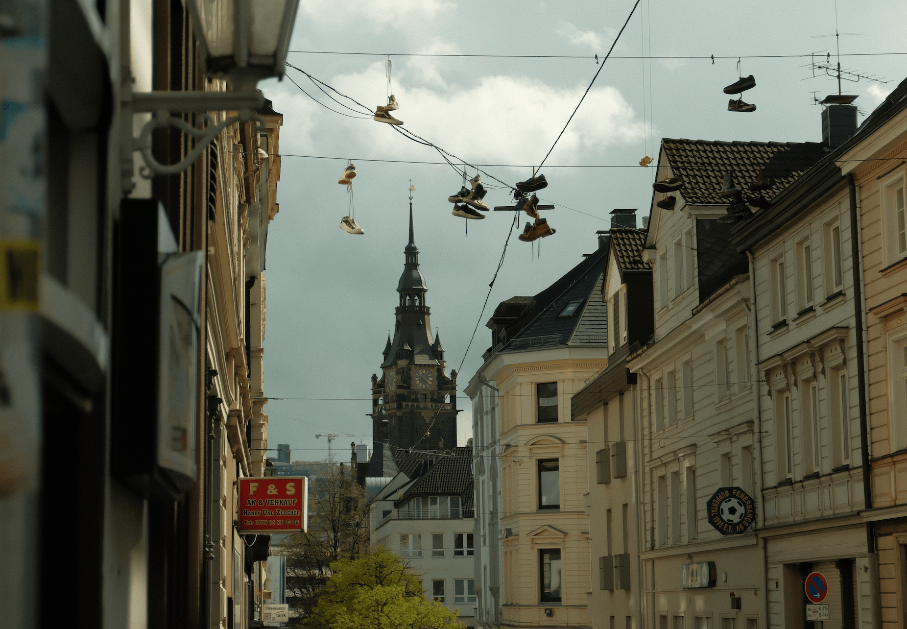

### E como manter uma rotina saudável de exposição dos seus trabalhos nas redes sociais.

A não ser que você seja extremamente fora da curva e bem conectado, as redes sociais ainda são a vitrine para o seu trabalho, especialmente se você deseja ser lembrado.

Infelizmente, vivemos em uma era em que as redes sociais são extremamente eficazes em direcionar a atenção para pessoas irrelevantes e esconder, sob um brilho fraco, aquelas que são notavelmente mais talentosas.

Isso pode acontecer por diversas razões, mas geralmente tem a ver com a forma que você se promove.

Já está na hora de usar essas ferramentas ao seu favor.

### Exposição é diferente de relevância

As vezes a pessoa só é boa em se vender. Têm vários designers que se **[auto intitulam ](https://willianmatiola.substack.com/p/029)\*\*\***[seniors](https://willianmatiola.substack.com/p/029)**\* que são ótimos vendedores mas bem medianos em seu **[craft](https://willianmatiola.substack.com/p/026)\*\*. Muitas vezes, o reconhecimento se deve mais à propaganda do que ao mérito do trabalho bem feito.

Por outro lado, há pessoas realmente talentosas que escolheram se manter longe da exposição. É provável que você tenha contato diário com suas criações, sem sequer saber quem as criou.

Se sua sobrevivência não depende da exposição, fico feliz que tenha alcançado esse patamar. Se você está no outro lado da mesa, precisando se expor para conseguir trabalho, quero contribuir com algumas dicas que talvez consigam te ajudar nesse processo sem que você perca a sanidade.

### Uma questão de consistência e foco

Quem já teve **[mentorias](https://componentes-de-ui-design.lemonsqueezy.com/buy/faefbb14-5473-48d1-b1ad-abeade24be7e)** comigo já deve ter ouvido muito sobre a importância da **consistência**. Na minha visão, é ainda o atributo que traz o melhor retorno. Já o **foco** é uma característica essencial para ir ao encontro do melhor caminho.

### Em qual desses cenários você está?

**🟩🟨 Tem foco mas não tem consistência:** sabe onde divulgar, mas faz isso sem regularidade.

**🟨🟩 Não tem foco mas tem consistência:** vai divulgar em todos os lugares e por muito tempo, mas sem muito retorno.

**🟨🟨 Não tem foco e não tem consistência:** não sabe onde divulgar e nem tem disposição de fazer.

**🟩🟩 Tem foco e consistência:** sabe onde divulgar e mantém uma rotina constante de divulgação.

Mesmo que você esteja no útlimo grupo, existe um fator que impacta diretamente no reconhecimento e relevância: **o** **bom trabalho**. Divulgar nos lugares certos e com constância não garante reconhecimento ou relevância se o design for mal feito. É necessário ter bom senso e qualidade.

### Lugares para promover seus trabalhos

A lista abaixo são as plataformas que utilizo diariamente para interagir ou postar meus trabalhos em progresso. Você não precisa utilizar todas se não fizer sentido para o seu objetivo.

**[Dribbble:](https://dribbble.com/willianmatiola) **já foi grande e relevante, mas hoje sofre muitas críticas da comunidade por ter mudado sua forma de entregar boas referências. Ainda assim, é mais um lugar para divulgar seus trabalhos.

**[Layers:](https://layers.to/willianmatiola) **segue a mesma proposta do Dribbble e, embora muito menor, tem entregue bons resultados. A comunidade se mantém ativa e a ferramenta vem ganhando atualizações constantes.

**[Twitter:](https://twitter.com/willianmatiola) **um bom lugar para compartilhar seus trabalhos desde que você siga as pessoas certas e elas te sigam também.

**[Read.cv:](https://read.cv/willianmatiola) **a comunidade gosta desse site e muitas startups e designers da comunidade enxergam valor em sua proposta.

**[Todays Design:](https://todays.design)** ainda é recente mas a proposta é interessante. Você posta seus trabalhos e o fundador faz uma curadoria diária dos melhores.

**[Linkedin:](https://www.linkedin.com/in/willianmatiola/) **dependendo da qualidade do seu design pode alcançar uma boa relevância e gerar engajamento com outros designers. Também é onde recrutadores podem ter uma noção do seu trabalho.

**[Seu próprio portfolio:](https://willianmatiola.com/)** ter um site próprio que também mostre suas explorações de design é uma ótima ideia. O **[meu](https://willianmatiola.com/)** ainda não tem essa página, mas já está nos meus planos colocá-la no ar o quanto antes.

E sobre o **Instagram** e o **TikTok**? Particularmente, não vejo nenhum valor nas duas plataformas. O público que **eu** quero atingir não está lá. O meu **foco** está nas redes onde bons profissionais interagem mais frequentemente.

### Frequência de Postagens

Vai variar de acordo com a quantidade de **bons designs ou conceitos** que você pode produzir. Eu tento postar algo semanalmente ou a cada 15 dias. Se você quiser aumentar a frequência, certifique-se de **manter a qualidade** também.

Quando não tiver nada novo para postar, interaja com os posts de outras pessoas deixando comentários relevantes e construtivos. Isso pode ajudar a manter sua presença e mostrar que você está envolvido com a comunidade.

O ideal é ter uma cadência que se encaixe na sua rotina sem afetar o seu trabalho e sem tornar o processo um fardo ao invés de uma boa experiência.

### **Boas práticas**

Bom senso deve ser seu mantra. Ao interagir com pessoas e em comunidades tente não ser um bundão.

1. Seguir as pessoas que você admira e gostou do trabalho. E se conseguir criar conexões com elas, melhor ainda.
2. Interagir com as publicações de outras pessoas de forma significativa comentando e deixando bons feedbacks. Evite mensagens repetitivas de “Great Work”, “Awesome! Follow me”. Isso não é bem visto e todos sabem que não foi genuíno.
3. Se não tiver algo construtivo para falar, não fale.
4. Para ajudar a manter o foco e a consistência experimente criar uma lista de tarefas diárias com a rotina de divulgação e interação nas redes. Eu dedico uns 30 minutos todas as manhãs para postar ou interagir nas redes que indiquei.

### Não tem segredo

A verdade é que não há nenhuma fórmula mágica para a exposição — a não ser que você pague. **Foco** e **consistência** ainda são as duas características que provavelmente te ajudarão na divulgação do seu trabalho.

Agora me conta, você costuma ter bons resultados em outras plataformas?

Deixe um comentário e nos vemos semana que vem!

[💛 Compartilhe com 1 amigo](https://willianmatiola.substack.com/publish/post/https://willianmatiola.substack.com/?utm_source=substack&utm_medium=email&utm_content=share&action=share)

### O que descobri por aqui:

1. O projeto de identidade visual da How&How para a **[Aruba National Park Foundation](https://how.studio/work/aruba)** está sensacional. Adorei as cores, pictogramas e composições.
2. Em uma época cada vez mais imediatista e de conteúdos curtos, quem ainda mantém o hábito da leitura obtém **[grandes benefícios](https://nesslabs.com/benefits-of-reading)** de acordo com a ciência.
3. **[Esse site](https://svgl.app/) **agrega diversos logos em SVG de diferentes marcas.
4. **[Interface Watch](https://www.interface.watch/)** é um repositório de inspirações de apps para Smart Watches. Foi meu achado da semana!
5. **[Tapinha nas Costas](https://thedesignedition.substack.com/p/tapinhas-nas-costas)** é uma reflexão do Al Lucca que dialoga bem com um **[Tweet](https://twitter.com/willianmatiola/status/1783465371942482408)** que fiz recentemente.
