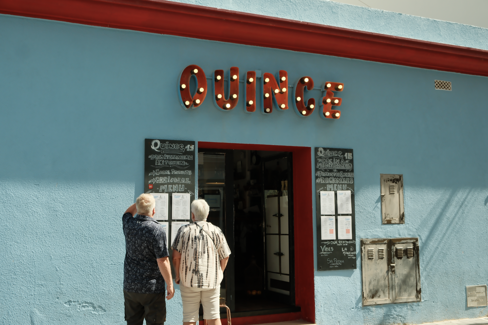

### Nesta edição falo sobre atitudes essenciais para manter uma boa rede de contatos: interações, exposição e bons trabalhos.

Na edição passada abordei o tema de **[expor seus trabalhos](https://willianmatiola.substack.com/p/032)** de maneira consistente e saudável nas redes sociais. Nesta edição quero falar um pouco sobre como manter uma rede de contatos ativa e relevante. Algo que é fundamental e pode proporcionar boas oportunidades profissionais para você.

### Somos Seres Sociais

“*Os humanos, como espécie, evoluíram para serem sociais. Temos uma capacidade inata e biologicamente orientada para desenvolver e formar conexões interpessoais. Estes laços sociais, formados cedo na vida, também criam a base para a coexistência dos seres humanos dentro e entre grupos, e são uma parte vital e essencial da experiência humana.*” [1](#footnote-1)

Formar conexões e saber como nutri-las pode trazer diversos benefícios a longo prazo. É como se você estivesse cuidando de uma planta: ao regar regularmente (**interações**), tomar uma boa quantidade de sol (**exposição**) e oferecer bons nutrientes (**trabalhos**), naturalmente você colherá bons frutos (**oportunidades**).

Embora em teoria isso pareça simples de fazer, na prática as coisas são um pouco diferentes. Em cada uma das etapas é necessário cuidado e atenção para não acabar afogando sua planta, queimando suas folhas ou deixando-a morrer por falta de nutrientes.

### Interações de Qualidade 💧

Para não tornar essa seção uma lista do que fazer e não fazer, vamos simplificar o óbvio: se você interage com os outros buscando apenas benefícios para si mesmo saiba que isso vai passar uma imagem bem ruim sobre você.

**Ter interesses é diferente de ser uma pessoa interesseira.** Uma pessoa com interesses vai criar conexões que geram benefícios mútuos pois ela sabe que se o outro cresce, ela também cresce. Uma pessoa interesseira está sempre buscando crescer a qualquer custo sem pensar nos outros. E é bem fácil identificar alguém com essas características!

> **O interesseiro **é o tipo de pessoa que só entra em contato com você a cada virada de século para pedir coisas e depois some tão rápido quanto apareceu. Ele não se importa em como anda sua vida ou como estão seus projetos.

Entenda que não há nenhum problema em pedir favores para suas conexões desde que elas estejam bem nutridas e há trocas recíprocras entre vocês. Principalmente se há respeito profissional entre as duas partes.

**Exemplos que entendo como boas interações:**

- Interagir com publicações expondo sua opinião de forma respeitosa.
- Fornecer feedback relevantes em projetos de colegas.
- Instruir colegas que necessitarem de ajuda.
- Enviar emails agradecendo ou contribuir com sugestões em outros projetos.
- Agendar mentorias com outros profissionais e manter contatos regulares.
- Demonstrar interesse genuíno no trabalho e projetos dos outros.

### Exposição de Qualidade 🌞

Se você leu a **[edição anterior](https://willianmatiola.substack.com/p/032)** e está colocando as dicas em prática então é bem provável que você já começou a perceber que algumas pessoas estão seguindo seus perfis para acompanhar seus trabalhos.

O proxímo passo é criar conexões com essas pessoas. Você pode iniciar conversas, marcar reuniões de 1:1 para se conhecerem melhor ou simplesmente se apoiarem nas redes sociais quando houver a oportunidade.

**Alguns exemplos que experienciei recentemente:**

- Ao compartilhar **[meu novo projeto](https://componentes.design/)** feito em Framer na comunidade da ferramenta consegui atenção de outros profissionais e já tenho papos agendados.
- Ao compartilhar meus designs conceitos nas redes que indiquei na edição anterior, criei conexões com outros profissionais e agora nos ajudamos mutuamente nas redes quando alguém publica algo novo.
- Recebi propostas interessantes no Linkedin por estar ativamente compartilhando coisas relevantes por lá.
- Fui convidado para uma seção de uma newsletter internacional bem relevante e expressiva porque meses antes simplesmente respondi umas das edições elogiando o projeto e agradecendo pelo conteúdo.

### Trabalhos de Qualidade 🌱

Neste contexto, todos os trabalhos que você produz são importantes, independentemente de serem projetos para a empresa ou agência em que trabalha ou realizados por conta própria. A chave para atrair reconhecimento e relevância é a qualidade, já que as pessoas tendem a valorizar e dar mais atenção a projetos notáveis e bem-executados.

Como consequência, seu nome será lembrado de forma positiva quando novas oportunidades surgirem.

Trabalhos de qualidade são sementes plantadas nas cabeças das pessoas que eventualmente crescerão e darão frutos.

### Oportunidades de Qualidade 🍎

Se você está mantendo boas relações, expondo seus trabalhos de forma consistente e saudável e criando trabalhos de qualidade onde quer que você esteja, boas oportunidades natualmente surgirão.

> Trabalhos de qualidade levam a exposição de qualidade. Exposição de qualidade leva a interações de qualidade.  Interações de qualidade geram oportunidades de qualidade.

É um ciclo virtuoso.

Desde que comecei a compartilhar mais meus projetos, designs conceito e ideias aqui na Stoa, diversas pessoas já enviaram mensagens com sugestões, propostas de parceria ou apenas agradecendo pelo conteúdo.

### Uma Verdade Incoveniente

Pessoas que não mantém relações com outras pessoas geralmente não serão lembradas quando oportunidades surgirem (a não ser que sua relevância seja **tão** **expressiva** que se relacionar com alguém seja opcional).

É difícil ter que dizer o óbvio, mas se eu não te conheço, se seu trabalho não é visto e se sua forma de se relacionar não é de qualidade, porque eu lembraria de você se eu tivesse uma boa oportunidade nas minhas mãos? Eu provavelmente vou entrar em contato com as pessoas que geralmente mantém contato frequente comigo ou que atendem os pontos que trouxe aqui.

Para mim, bons relacionamentos com pessoas é importante para uma carreira próspera. No meu caso, todas as relações que criei e mantive desde 2010 na época do Choco La Design, sempre geraram excelentes oportunidades de carreira e me trouxeram amigos muito queridos para a vida.

Se você tem dificuldades de se relacionar talvez seja interessante começar aos poucos e ir aumentando suas atividades gradativamente a medida que você ganha mais segurança em si mesmo.

Até a próxima e **[bora se conectar](https://bento.me/willianmatiola)**!

## Quantos cafés essa edição merece?

Se você gostou muito dessa edição e quiser me fazer feliz é só patrocinar um cafézinho pra mim aqui na Alemanha. Toda edição patrocinada eu faço questão de trazer uma foto e o nome dos bem feitores. ♥️

**Quero patrocinar: **

- **[1 café](https://componentes-de-ui-design.lemonsqueezy.com/buy/57e29feb-5217-4e6f-996c-68242d56dd6d?media=0&discount=0) ☕️**
- **[1 café + 1 croassaint](https://componentes-de-ui-design.lemonsqueezy.com/buy/57e29feb-5217-4e6f-996c-68242d56dd6d?media=0&discount=0&quantity=2) ☕️+🥐**
- **[ 1 café + 1 croassaint + 1 docinho](https://componentes-de-ui-design.lemonsqueezy.com/buy/57e29feb-5217-4e6f-996c-68242d56dd6d?media=0&discount=0&quantity=3) ☕️+🥐+🍩**

### O que descobri por aqui:

1. Esse papo sobre a “**[Psicologia da Religião](https://www.youtube.com/watch?v=USLW5PUmeXY)**” traz algumas ideias e estudos interessantes sobre satisfação de vida, depressão, impacto na sociedade e outros temas relacionados às crenças religiosas.
2. Dificilmente acho modelos de motos elétricas atraentes, mas a **[Ares](https://www.real-motors.com/ares)** trouxe um conceito que é a medida certa entre o futuristico e o design atraente que eu busco.
3. Onboarding é um assunto fascinante e um dos pontos que mais me incomodam é: como fazer **[onboarding de usuários ativos](https://lawsofux.com/articles/2024/onboarding-for-active-users/)** que já querem sair usando a ferramenta? A solução para isso talvez seja adotar a técnica de *progressive onboarding*.
4. Os colegas do projeto Produtos para Humanos lançaram um e-book muito bom chamado **[Tudo é Hipótese: 10 Princípios de Experimentação em Produtos Digitais](https://produtosparahumanos.substack.com/p/livro-novo-gratuito-para-download)**.
5. Esse artigo traz a perspectiva de um dos 5 tipos de poder chamado **[Referent Power](https://www.nirandfar.com/referent-power/)**, que é quando as pessoas sentem “unidade” com você ou desejam ser como você, levando ao respeito e admiração por você.
6. **[Exactly AI](https://exactly.ai/)** permite que você treine uma inteligência artificial para imitar o seu estilo de ilustração. Assim você pode otimizar seu fluxo de trabalho e ainda manter o controle das suas criações.
