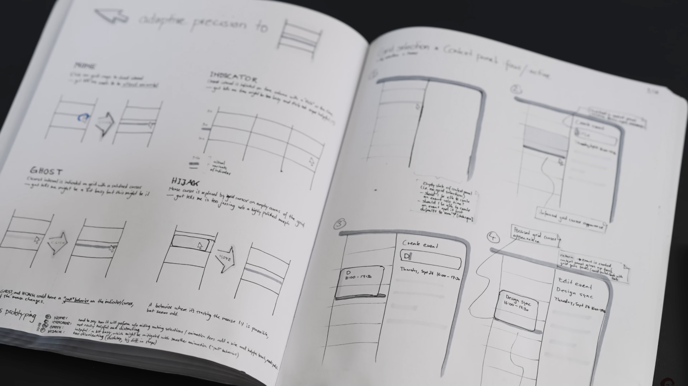
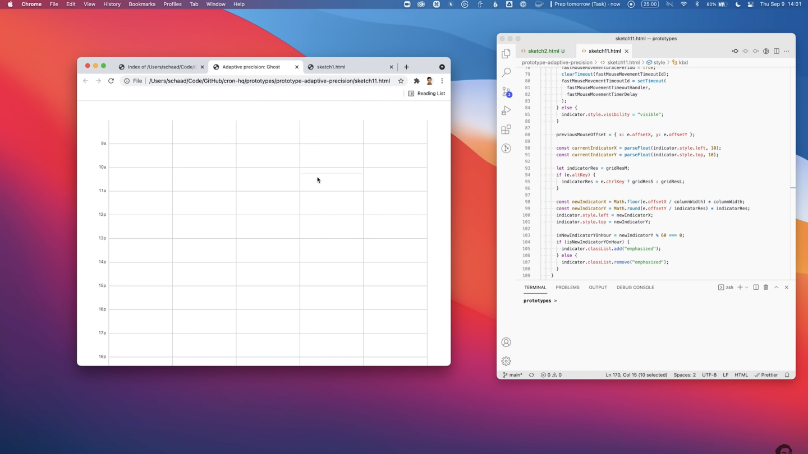
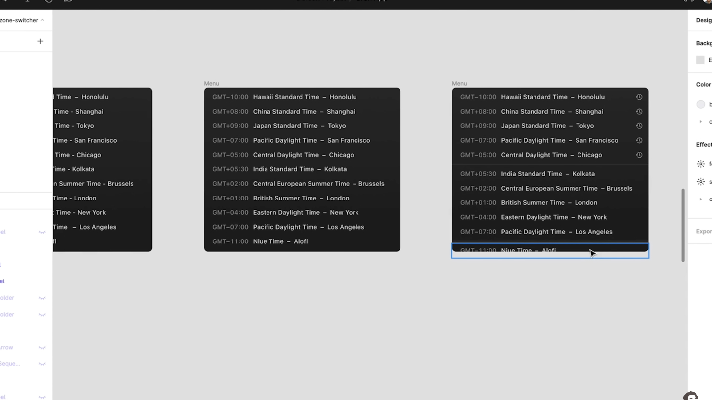

### Raphael Schaad é designer e engenheiro. Criou o app Cron, uma experiência de calendário que conquistou muitas pessoas.

Essa semana assisti uma entrevista muito boa do **Garry Tan**, que é presidente e CEO da Y Combinator, com o fundador do calendário Cron, **Raphael Schaad**. Nessa entrevista o Raphael mostra seu processo de design para desenvolver produtos que resultou na aquisição do Cron pela Notion poucos anos depois.

O processo do Schaad, pelo menos até o momento em que esse vídeo foi gravado, é simples e eficaz, como todo processo deveria ser.

Quando o nível de complexidade aumenta sem que haja uma razão para que isso aconteça, é hora de ligar o sinal de alerta. Muitas vezes nós acabamos caindo no conto de que para um produto ser bem feito é necessário seguir uma extensa lista de tarefas. Quando, na verdade, o que precisamos é focar naquilo que realmente importa. E o que realmente importa é fazer bem feito. E para fazer bem feito você precisa menos do que você imagina.

### **Exploração em desenho**

- Simples e fácil. Não precisa de muito comprometimento com fidelidade e é ideal para pensar em recursos ou produtos inteiros.
- Todos possuem certo grau de habilidade em desenho, então isso facilita compartilhar ideias mais rápido.
- Quanto mais você explora, mais ideias você tem. Primeiro você expande, depois você aprofunda.

### Protótipos / Design de Interação

- Design não é só como funciona ou como se parece, mas também como é **construído**.
- Testar seus desenhos em ferramentas de protótipo ampliam sua capacidade de pensar nas interações.
- Faz você sentir como o produto vai funcionar quando construído.

### Design de Interface

- Identificar as pequenas coisas que fazem a diferença e aparar as arestas.
- Partir do senso comum e explorar novas maneiras de otimizar uma experiência existente.
- Entender que as pequenas melhorias afetarão a vida de muitas pessoas.

### Mas é só isso?

A resposta curta é não. Essas 3 etapas transferem suas ideias abstratas para o mundo tangível. Os próximos passos, naturalmente, seriam a validação com os usuários e a implementação dos recursos ou produto. E somente essas duas etapas possuem diversos desdobramentos.

Mais importante do que fazer, é se questionar o porque de fazer e qual a melhor maneira de ser feito.

E a frase que vai ficar marcada na minha cabeça daqui em diante é:

Até a próxima!

## Quantos cafés essa edição merece?

Se você gostou muito dessa edição e quiser me fazer feliz é só patrocinar um cafézinho pra mim aqui na Alemanha. Toda edição patrocinada eu faço questão de trazer uma foto e o nome dos bem feitores. ♥️

**Quero patrocinar: **

- **[1 café](https://componentes-de-ui-design.lemonsqueezy.com/buy/57e29feb-5217-4e6f-996c-68242d56dd6d?media=0&discount=0) ☕️**
- **[1 café + 1 croassaint](https://componentes-de-ui-design.lemonsqueezy.com/buy/57e29feb-5217-4e6f-996c-68242d56dd6d?media=0&discount=0&quantity=2) ☕️+🥐**
- **[ 1 café + 1 croassaint + 1 docinho](https://componentes-de-ui-design.lemonsqueezy.com/buy/57e29feb-5217-4e6f-996c-68242d56dd6d?media=0&discount=0&quantity=3) ☕️+🥐+🍩**

### O que descobri ou aconteceu por aqui:

1. A Plau escreveu um artigo interessante chamado “**[Quantas Artes Cabem no Design?](https://plau.design/entrelinha/quantas-artes-cabem-no-design/)**”, que explora como ambos podem dialogar.
2. O **[Alvaro Souza](https://www.youtube.com/@AlvaroSouzadesign)** tem um canal no youtube em que dá dicas de como se tornar um designer internacional.
3. **[Entrevista completa com o Raphael Schaad](https://www.youtube.com/watch?v=2MrNSjJFBBI)**. Uma verdadeira aula de design.
4. Estou usando **[essa ferramenta aqui](https://oklch-palette.vercel.app/)** para criar paletas de cores que estejam dentro do espaço de cores OKLCH, e que respeitam níveis de contraste da APCA e WCAG.
5. Estou oferecendo mentorias. Para marcar um horário **[siga essas instruções](https://componentes-de-ui-design.lemonsqueezy.com/checkout)**.
