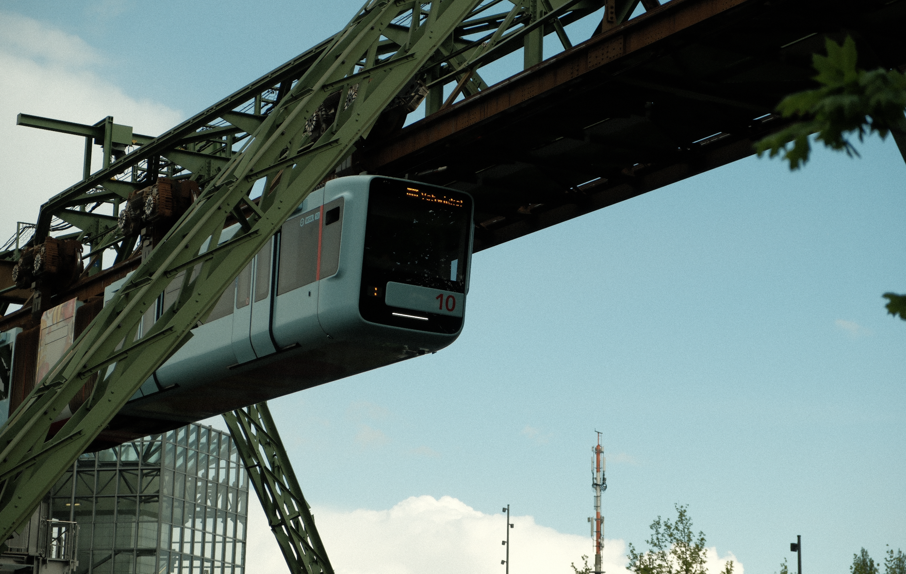

### Meu planejamento e mentalidade para fazer uma grande mudança de vida.

Um dos tópicos mais sugeridos para a Stoa foi sobre **minhas experiências pessoais** em relação a minha carreira e vida. Então eu vou contar como foi o meu processo de mudança para a Alemanha e como se planejar com antecedência é vital para evitar qualquer dor de cabeça.

## A vontade

Não acredite em quem diz que mudar de país é fácil, pois não é. Mas também não é tão difícil se você se planejar com antecedência.

Eu sempre ouvi histórias de imigrantes passando sufoco em sub-empregos, tendo dificuldades em se ajustar e muitas vezes desistindo do sonho por não suportar os desafios que um novo país impõe a todo imigrante.

Sempre tive em mente que eu não teria essa mesma história, até porque eu já contava com mais de 10 anos de experiência em Design e meu objetivo era permanecer na área.

Então eu tomei uma das decisões mais difíceis da minha carreira: sair da Stoika.

A Stoika foi o estúdio que fundei com mais 4 amigos e que foi uma das minhas melhores experiências de vida. Mas eu sabia que precisava arranjar um emprego que tivesse um retorno maior.  Era necessário dar esse passo. E meus amigos já sabiam do meu sonho de ir morar fora. Então eu fui em busca de empregos internacionais.

## O financeiro

Essa é uma das partes que eu nunca vou brincar com a sorte. Dá ideia de se mudar até de fato isso acontecer foram 4 ou 5 anos. Em todos esses anos eu guardei dinheiro suficiente para manter meu padrão de vida por alguns meses na Europa caso eu não conseguisse um emprego internacional ainda no Brasil.

Se você pensa em se mudar para um país totalmente novo eu sugiro que você **não caia no conto** de que ao chegar lá você vai arranjar um emprego fácil e vai começar a ganhar em euro ou em dólar e sua vida vai se ajeitar do dia para noite. Na grande maioria das vezes isso não vai acontecer. E eu tenho gente bem próxima que acreditou nisso e passou por muita dificuldade.

**É necessário ter plano A, B e C**.

Veja como é o custo de vida no país em que você quer morar e guarde dinheiro suficiente não só para se manter durante uns 4 ou 6 meses sem emprego, mas também para começar sua nova vida por lá. Muita gente esquece que ao chegar você vai precisar alugar um apartamento, comprar alguns móveis e pagar contas de luz, gás, internet e outras coisas.

No meu caso, meu plano sempre foi me mudar somente quando eu tivesse um emprego remoto com um salário coerente com os custos de vida do país. Mas ainda assim eu tinha reservas suficientes para ficar meses sem emprego caso algo desse errado.

## A língua

A não ser que você vá para Portugal ou outro país que fale nosso idioma, eu sugiro que você domine pelo menos o inglês.

Quando minha parceira e eu decidimos nos mudar do Brasil, a Alemanha não foi nossa primeira escolha. Embora ela fale alemão fluentemente por ja ter morado aqui, nossa ideia inicial era a Holanda. No entanto, não consegui ofertas de emprego por lá. A Alemanha foi nossa segunda opção porque seria muito mais fácil para ela arranjar emprego e começar a ganhar dinheiro.

Tem sido bem desafiador aprender a língua por aqui. O que me salva na maioria das vezes é saber falar inglês enquanto vou aprendendo aos poucos a me comunicar em alemão. Sendo bem honesto, se não fosse pela Gaia, minha vida teria sido bem mais difícil. Ela que foi responsável por resolver as questões de aluguel, registro na cidade, plano de saúde e outras coisas necessárias aqui na Alemanha.

Então se você quer mesmo se mudar sugiro que aprenda inglês, ou a língua do país do seu destino ou tenha um parceiro/parceira que domine a língua local.

## A burocracia

Burocracia existe em todo país. Se você acha o Brasil burocrático, então não venha para a Alemanha. Mas isso é história para outra Stoa. O importante é você pesquisar com antecedência coisas importantes sobre o funcionamento do país em alguns aspectos:

1. Como é alugar uma casa ou apartamento?
2. Como eu contrato energia, internet, gás, etc?
3. Quais os meios de pagamento que as pessoas usam?
4. Como eu me registro na cidade?
5. Quais documentos eu preciso?
6. Como funciona o transporte público?
7. Como funciona o sistema de saúde?

Não deixe para aprender isso quando estiver por aqui. As chances de você fazer besteira são inúmeras e pode custar caro.

## A situação fiscal

Não é porque você decidiu sair do Brasil que você deixa de ter relações com ele instantaneamente. Se você declara imposto de renda, é necessário se planejar para fazer a comunicação de saída definitiva do país para encerrar seus laços tributários com ele já que agora sua residência fiscal será outra.

Isso evita que você seja bi-tributado ou que pague multas por não declarar seus ganhos de capital mesmo que o ganho tenha acontecido no seu novo país. A Alemanha, por exemplo, deixou de ter acordos de bi-tributação com o Brasil há muito tempo, então mesmo morando aqui e ganhando dinheiro aqui, se eu não encerro meus laços fiscais com o Brasil, sou obrigado a recolher imposto nos dois países.

Muita gente não faz a mínima ideia disso, e as consequências são inúmeras. Sugiro que pesquise a respeito!

## As relações

Somos seres sociais e necessitamos interagir com outras pessoas. Se você não tem amigos e familiares por perto para te ajudar a se ajustar durante o processo de adaptação, ele vai demorar um pouco mais.

Eu tive um pouco de sorte porque a Gaia já tinha uma vida aqui, então conheci alguns de seus amigos e, embora eu não tenha uma relação próxima com eles, já ajuda a se sentir menos isolado.

Meus planos a partir de agora é me involver em comunidades de design, eventos ou até encontros que acontecem frequentemente para começar a conhecer outros estrangeiros ou locais.

## A mente

Se sua mente não estiver num bom estado, será bem fácil dar lugar aos sentimentos ruins. Você vai sentir saudade da família, dos amigos, dos eventos sociais, da cervejinha no final de semana. De tudo.

E se você tiver problemas no Brasil não pense que eles ficarão por lá quando você se mudar. Não é como se eles fossem barrados na imigração e não pudessem entrar com você. O passaporte deles é tão válido quanto o seu.

Trabalhar o seu mental é importante. Ter resiliência é fundamental. Saber que haverá dias de luta e dias de glória é necessário. Resolva seus problemas no Brasil, porque aqui eles podem ficar ainda maiores se sua mente não estiver em um bom estado.

## Resumo

Volto a repetir que não é fácil se mudar para um novo país, mas também não precisa ser um fardo. Basta se organizar e se preparar com antecedência.

1. Junte dinheiro e arranje um emprego antes de se mudar;
2. Aprenda inglês ou a língua local;
3. Pesquise como o país funciona e quais as burocracias;
4. Resolva sua situação fiscal no Brasil após a saída;
5. Tente desenvolver relações com outras pessoas ou comunidades;
6. Prepare sua mente e fortaleça suas ideias;

Não cometa a imprudência de achar que quando você chegar aqui você resolve as coisas. Isso até pode acontecer, mas a que custo?

Eu espero que você tenha gostado desse tipo de conteúdo e se tiver alguma dúvida sobre meu processo de mudança fique a vontade para perguntar na caixa de comentários abaixo.

Por último, mas não menos importante: seja inteligente.

## Quantos cafés essa edição merece?

Se você gostou muito dessa edição e quiser me fazer feliz é só patrocinar um cafézinho pra mim aqui na Alemanha. Toda edição patrocinada eu faço questão de trazer uma foto e o nome dos bem feitores. ♥️

**Quero patrocinar: **

- **[1 café](https://componentes-de-ui-design.lemonsqueezy.com/buy/57e29feb-5217-4e6f-996c-68242d56dd6d?media=0&discount=0) ☕️**
- **[1 café + 1 croassaint](https://componentes-de-ui-design.lemonsqueezy.com/buy/57e29feb-5217-4e6f-996c-68242d56dd6d?media=0&discount=0&quantity=2) ☕️+🥐**
- **[ 1 café + 1 croassaint + 1 docinho](https://componentes-de-ui-design.lemonsqueezy.com/buy/57e29feb-5217-4e6f-996c-68242d56dd6d?media=0&discount=0&quantity=3) ☕️+🥐+🍩**

## O que descobri ou aconteceu por aqui:

1. App bem interessante para **[criar shots](https://shots.so/)** dos seus designs.
2. Um **[mini documentário](https://www.youtube.com/watch?v=lXaAMWuZXd8)** sobre uma aventura de 6 dias na Islândia feita com motos. As paísagens são incrivelmente lindas e a vontade de fazer essa rota é enorme.
3. Um **[protótipo](https://www.youtube.com/watch?v=S3DR0uZsKhg)** de troca de bateria elétrica de um caminhão.
4. **[A ciência por trás de uma pele saudável](https://youtu.be/IuejGNkUIRI?si=naHxJlv12BWDGaYY)**
