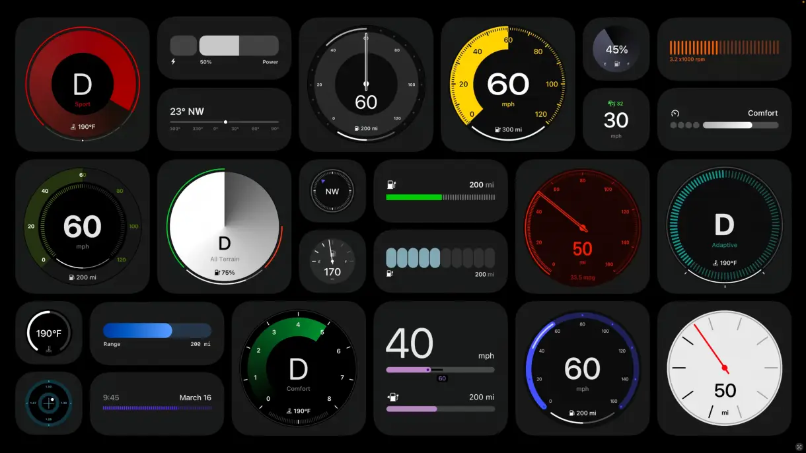

### O pensamento intrusivo que me assola com frequência.

O pensamento de que talvez eu nunca terei a experiência de projetar certos tipos de design me deixa um pouco mal, porque são áreas interessantes e que tenho muita vontade de atuar. Aí depois de um tempo, quando o pensamento já está se encaminhando para um lugar bem distante na fila dos meus outros pensamentos, eu volto a me lembrar disso e continuo me sentindo mal — me desculpa se você pensou que eu diria que me sentia melhor, mas não me sinto. 😂

Você também já teve esse pensamento intrusivo? Que talvez nunca vai desenhar uma **interface automotiva**, ou uma **interface para um jogo**, ou até mesmo uma simples interface para um **_smartwatch_** qualquer. Isso não te incomoda nem um pouco?

Eu sei que as probabilidades disso acontecer não estão ao meu favor, mas isso não quer dizer que minha mente, que é tão incessante em buscar rotas alternativas, não ofereça soluções para esse mal estar. Minha mente e eu temos uma relação de parceria. Quando me sinto mal com algo ela se esforça muito para mostrar que, em algum lugar por aí, existe uma solução para os "problemas” que me assolam. É como se ela dissesse “_Calma meu garoto! você pode fazer tudo isso se você tiver um bom plano!_”. E eu confio bastante na minha mente. São anos convivendo juntos. Não há motivos para acreditar que ela estaria tentando me sacanear logo agora.

## Os planos

Foi assim quando eu decidi que queria aprender a fotografar. Eu não tinha aquele olhar que as pessoas dizem que é necessário para tirar boas fotos. E minha mente estava lá dando tapinhas nas minhas costas dizendo “_Calma meu garoto! Você precisa ter paciência. Depois de estudar isso aqui e um pouco daquilo ali suas fotos também ficarão boas. Acredite!_" E não é que ela estava certa? Minhas fotos hoje são bem melhores e satisfazem meu lado artista que eu nem sabia que existia.

Mas Mente, e quanto aos tipos de interfaces que eu não sei se um dia farei? Perguntei na esperança de uma solução milagrosa.

“_Ah meu nobre e impaciente garoto, você tem apenas 30 anos. Saiba que sua espécie pode viver muito mais. Talvez até os 100 anos. Isso significa que você tem, na melhor das hipóteses, e dependendo de como você cuida da sua saúde, mais 70 anos pela frente. Até lá você vai fazer muitas interfaces se essa ainda for sua área de atuação._“

Quanta sabedoria! Exclamei. É tão óbvio não é? Na escala das coisas do mundo eu ainda tenho bastante tempo (se eu não morrer inesperadamente) para aprender, praticar e fazer todo tipo de interface que eu quero. Já aprendi coisas novas tantas vezes e o caminho é sempre o mesmo: primeiro você aprende os **fundamentos**, depois procura as **boas referências**, e depois **pratica incansavelmente** até se sentir confortável e, por fim, **compartilha** isso com o mundo. E se você tiver os **contatos certos**, quem sabe até rola um emprego na área.

É tudo uma questão de foco.

## O foco (ou a falta dele)

A minha Mente sabe bem que esse é um problema tão antigo quanto nossa relação. Eu sou uma pessoa que tem muitas ideias. Muitas mesmo! Ao ponto de eu não saber priorizar muito bem o que eu devo fazer. No passado já foi pior. Na verdade, já foi bem pior! Atualmente eu até consigo me controlar um pouco. Mas é bem pouquinho.

Eu já disse que tenho muitas ideias? Então, eu fico excitado com todas elas. É tanto entusiasmo que eu **pre-ci-so** colocá-las no mundo. Algumas dão muito certo e outras nem tanto (e provavelmente você nem vai saber que elas existiram).

Me sinto assim com todos os tipos de design que existem por aí. São tantas coisas legais! Tantas possibilidades! Mas a minha mente está implorando que eu foque em uma coisa de cada vez. E eu concordo com ela, embora vou precisa abrir uma exceção para umas 2 ou 3 ideias adicionais.

Mil perdões minha querida Mente, mas pensando bem, vai que eu não tenho tanto tempo assim?

## Quantos cafés essa edição merece?

Se você gostou muito dessa edição e quiser me fazer feliz é só patrocinar um cafézinho pra mim aqui na Alemanha. Toda edição patrocinada eu faço questão de trazer uma foto e o nome dos bem feitores. ♥️

**Quero patrocinar: **

- **[1 café](https://componentes-de-ui-design.lemonsqueezy.com/buy/57e29feb-5217-4e6f-996c-68242d56dd6d?media=0&discount=0) ☕️**
- **[1 café + 1 croassaint](https://componentes-de-ui-design.lemonsqueezy.com/buy/57e29feb-5217-4e6f-996c-68242d56dd6d?media=0&discount=0&quantity=2) ☕️+🥐**
- **[ 1 café + 1 croassaint + 1 docinho](https://componentes-de-ui-design.lemonsqueezy.com/buy/57e29feb-5217-4e6f-996c-68242d56dd6d?media=0&discount=0&quantity=3) ☕️+🥐+🍩**

## Lista de Coisinhas

1. Esse é o melhor material para entender que typefaces também tem personalidade! **[O cara se vestiu](https://www.instagram.com/p/C8aIcZ1N_Hq/)** de acordo com a vibe de diversas typefaces.
2. A Dinamarca está com um plano radical para tornar **[sua cadeia de alimentos](https://reasonstobecheerful.world/denmark-radical-plan-plant-based-future/)** mais sustentável. Torcendo para dar certo e outros países seguirem o exemplo.
3. Como os **[conteúdos de saúde mental no TikTok](https://bigthink.com/neuropsych/mental-health-awareness-backfiring)** estão saindo fora dos trilhos com muitos “criadores” de conteúdo falando besteira sobre ansiedade, depressão e outros temas sensíveis.
4. Estou namorando esse lápis mecânico da marca japonesa OHTO.
5. Lancei a página de recursos do **[componentes.design](https://componentes.design/recursos)** e estou colocando vários links interessantes por lá.
6. Pirei nessa luminária feita pelo estúdio **[Vietnamita BằNG](https://www.bangoibanga.com/en/collection/lop)**.
