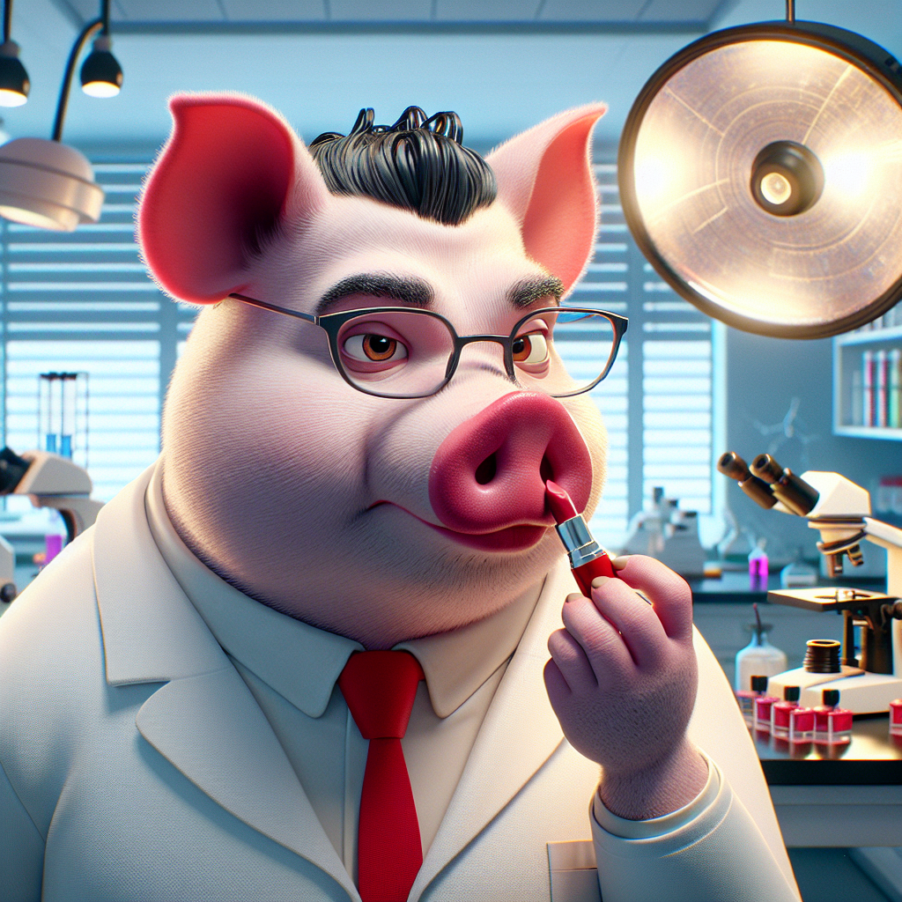

### Essa edição não é um post explicativo, mas uma crítica a um termo desnecessário para a nossa área de atuação.

Ao longo dos anos já vi muitas terminologias nascerem e morrerem na área de Design. Sou da época do web designer, que já era uma evolução do termo webmaster. Depois apareceu o termo Arquitetura da Informação e Design de Interação, que depois acabou se tornando UX Design e hoje o termo da vez é Product Design.

Todos os anos alguma terminologia nova aparece e contribui para o que Nielsen chamou de **[UX Vocabulary Inflation](https://jakobnielsenphd.substack.com/p/ux-vocabulary-inflation)**, que impacta não somente como nossa área é vista pelo mercado mas também como ela é entendida pelas pessoas. As empresas criam vagas sem saber o que realmente querem, profissionais se vendem de uma forma que não condiz com sua atual experiência e no fim ninguém entende mais nada mas finge que entende alguma coisa.

E o termo que atualmente vem me dando uma coceirinha lá no fundo da minha mente é o tal do “**Neurodesign**”. Sua definição é a seguinte:

> *Essencialmente, o neurodesign envolve aproveitar os insights da neurociência para criar designs que se alinhem com a forma como o cérebro humano processa as informações. É uma abordagem estratégica que reconhece a intrincada interação entre os elementos de design e as funções cognitivas dos usuários.[1](#footnote-1)*

Com a popularização da neurociência e as pesquisas sobre comportamento humano ficando mais acessíveis e despertando a atenção do mercado, algumas áreas começaram a introduzir esses insights em suas práticas, levando ao surgimento de termos como neuromarketing, neuroarquitetura, e muitos outros neuro-alguma-coisa.

Essa mistura de conhecimentos é extremamente benéfica e capaz de gerar bons resultados, mas até que ponto precisamos de uma nova nomenclatura para descrever o ato de usar conhecimento de uma outra área — nesse caso a neurociência — na nossa profissão de design?

Não dou muito tempo para que comece a aparecer pessoas se intitulando **Neurodesigners** que não possuem nem título de neurocientista nem de designer. Com conhecimento raso nas duas áreas, mas que com um pinguinho de marketing e falta de bom senso vão acabar vendendo a ideia de algo sensacional mas que na verdade estão apenas colocando batom em porco.

Como designers, é fundamental nos aprofundarmos em conhecimentos de muitas áreas para melhorar nossa atuação porque é exatamente isso que se espera de um bom designer. Podemos nos tornar especialistas em psicologia, filosofia, neurociência, medicina, finanças, agro e qualquer outra área na qual fomos contratados para atuar sem ser um contribuidor da inflação de nomenclaturas.

*Simple is better.*

## Quantos cafés essa edição merece?

Se você gostou muito dessa edição e quiser me fazer feliz é só patrocinar um cafézinho pra mim aqui na Alemanha. Toda edição patrocinada eu faço questão de trazer uma foto e o nome dos bem feitores. ♥️

**Quero patrocinar: **

- **[1 café](https://componentes-de-ui-design.lemonsqueezy.com/buy/57e29feb-5217-4e6f-996c-68242d56dd6d?media=0&discount=0) ☕️**
- **[1 café + 1 croassaint](https://componentes-de-ui-design.lemonsqueezy.com/buy/57e29feb-5217-4e6f-996c-68242d56dd6d?media=0&discount=0&quantity=2) ☕️+🥐**
- **[ 1 café + 1 croassaint + 1 docinho](https://componentes-de-ui-design.lemonsqueezy.com/buy/57e29feb-5217-4e6f-996c-68242d56dd6d?media=0&discount=0&quantity=3) ☕️+🥐+🍩**

## O que rolou por aqui

1. Tive que vir para o Brasil por motivos pessoais e aproveitei para rever o pessoal da Stoika. Tenha amigos talentosos e que te fazem crescer como pessoaDa esquerda para direita: Welliton Matiola, Arnaldo Petrazzini, Mateus Generoso, Henrique Stopassoli e eu
2. Falando em Stoika, na época do estúdio, nós nunca tivemos dívidas e nossa meta era sempre ter um caixa que fosse capaz de enfrentar qualquer adversidade. Nem todo negócio pensa dessa forma, e **[esse é o tema desse artigo aqui](https://collabfund.com/blog/how-i-think-about-debt)**. Algumas empresas não conseguem sobreviver por contraírem mais dívidas do que caixa. E quando situações inexperadas acontecem, a falência é um destino quase certo.
3. O livro “**[Fundamentos da Visualização de Dados](https://clauswilke.com/dataviz/index.html)**” publicado pela O’Reilly foi disponibilizado gratuitamente no formato digital.
