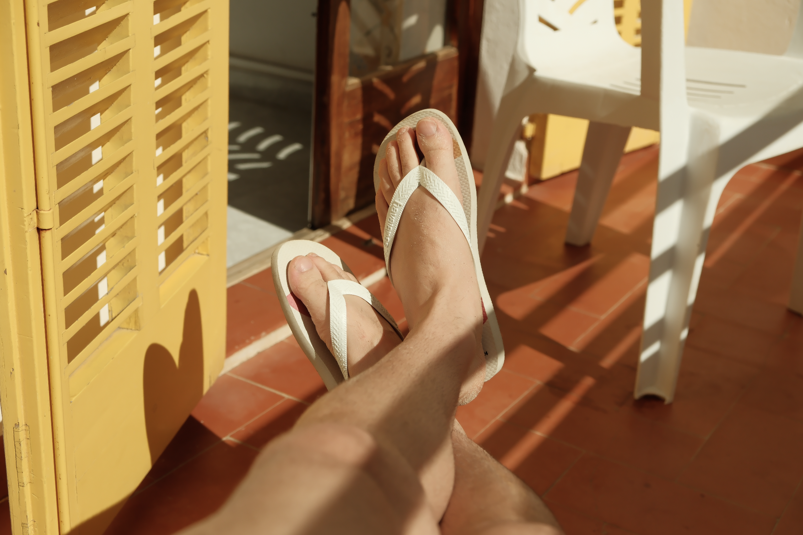

### Você está vivendo ou apenas existindo?

Eu sempre tive uma relação tranquila com a morte. Tranquila no sentido de entender que ela é a única certeza que temos e que de maneira alguma é o fim da nossa história, mas apenas o começo de um novo capítulo em nossas vidas.

Recentemente vi de perto como a vida é imprevisível. Uma hora a pessoa está lá, vivendo tranquilamente, e em um piscar de olhos, deixa de existir. Restando apenas lembranças. Algumas pessoas deixarão para trás boas lembranças. Outras, nem tanto. E é sobre isso que às vezes me pego pensando: o que será que vou deixar para trás?

Tem gente que vive a vida inteira sem se preocupar com isso. Já eu, desde muito cedo, sempre pensei qual seria meu legado nessa vida. Eu não quero viver uma vida inteira sem contribuir positivamente com a época em que escolhi viver. Tenho consciência de que não vou mudar o mundo com o que eu faço, mas se eu puder mudar algumas pessoas, já vai ter valido a pena.

**Seneca**, em seu livro "**Sobre a Brevidade da Vida**", tem uma frase muito boa sobre esse assunto:

É difícil ser útil o tempo todo, mas se na totalidade da nossa vida tivermos consciência de ter investido tempo considerável em deixar um bom legado já é muito melhor do que viver uma vida sem ter contribuído com nada.

## Não espere para começar a viver

Esperar até uma certa idade para começar a viver parece bobo se pensarmos que, em média, temos apenas cerca de 4000 semanas (ou uns 80 anos) de vida desde que nascemos. Colocando nessa perspectiva, apesar de ser um tempo suficientemente generoso, ainda parece muito pouco. E se você começar a colocar as coisas ainda mais em perspectiva, vai se deparar com verdades que podem ser inconvenientes:

- Se você encontrar seus amigos uma vez por mês, os verá apenas 12 vezes em um ano. Em 50 anos, considerando que você esteja na faixa dos 30 como eu e que todos seus amigos também estejam vivos, os verá apenas 600 vezes.
- Se você mora fora e visita o Brasil apenas uma vez por ano, a conta fica ainda mais triste. Você verá seus familiares e amigos muito pouco, talvez uns 7 dias no ano, ou apenas 350 vezes durante todo o resto da sua vida.
- Se você viaja uma vez por ano, viajará apenas 50 vezes durante toda a vida que lhe resta.

E por aí vai…

Não é necessário desesperar. Pensar sobre a morte não é uma tarefa fácil para a maioria das pessoas e leva tempo para se acostumar com o fato de que muito em breve nos tornaremos apenas lembranças. E agora que você sabe disso, não espere que seus cabelos fiquem brancos para começar a viver, pois cabelos brancos nem sempre são sinais de que alguém viveu por muito tempo. Muitas vezes, segundo Seneca, cabelos brancos significam apenas que essa pessoa existiu por muito tempo.

Entre viver e existir, prefiro viver. Enquanto vivo, optarei sempre por deixar um legado positivo, independentemente da profissão, projeto ou ideias que eu tenha. E você?

*Com carinho, Willian Matiola*

## Quantos cafés essa edição merece?

Se você gostou muito dessa edição e quiser me fazer feliz é só patrocinar um cafézinho pra mim aqui na Alemanha. Toda edição patrocinada eu faço questão de trazer uma foto e o nome dos bem feitores. ♥️

**Quero patrocinar: **

- **[1 café](https://componentes-de-ui-design.lemonsqueezy.com/buy/57e29feb-5217-4e6f-996c-68242d56dd6d?media=0&discount=0) ☕️**
- **[1 café + 1 croassaint](https://componentes-de-ui-design.lemonsqueezy.com/buy/57e29feb-5217-4e6f-996c-68242d56dd6d?media=0&discount=0&quantity=2) ☕️+🥐**
- **[ 1 café + 1 croassaint + 1 docinho](https://componentes-de-ui-design.lemonsqueezy.com/buy/57e29feb-5217-4e6f-996c-68242d56dd6d?media=0&discount=0&quantity=3) ☕️+🥐+🍩**

## O que rolou por aqui

1. Até agora estou babando **[por esse trabalho do Studio Koto](https://www.instagram.com/p/C9SdxentCKh/?img_index=6)**. O motion design do símbolo está tão suave que chega a emocionar. 
2. **[Pride Flows](https://prideflows.org/)** é um projeto que tenta propor uma identidade visual unificada para a comunidade LGBTIQA+. O resultado ficou bem interessante
3. Finalmente emoldurei esse poster belíssimo do **[Studio Feixen](https://www.studiofeixen.ch/shop/) **que ganhei de presente do **[Fresh Fonts](https://newsletter.freshfonts.io/)**.
