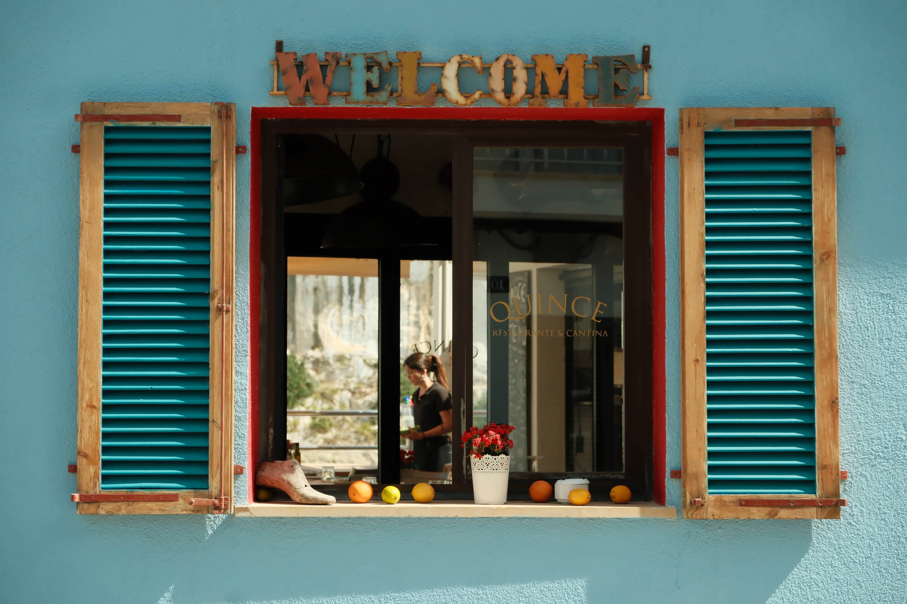
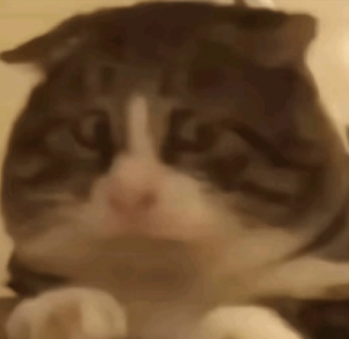

### Nem só de Design vive o Designer.

Quanto maior o **repertório**, maior será sua capacidade de fazer **conexões** que outras pessoas ainda não fizeram. E quanto maior a quantidade de interesses que você possui, mais interessante você se torna.

Não há nada mais frustrante que conhecer ou conviver com pessoas que apenas sabem falar sobre outras pessoas. _Você viu que fulano casou? E ciclano que terminou o relacionamento com beltrana? E a Mariazinha que fez o maior escândalo na casa do Joãozinho porque ele estava usando as calcinhas dela escondido? _

**Pessoas superficiais são como bóias:** elas mantém você flutuando e dão um senso de tranquilidade e segurança, mas se você quiser ver toda a vida que habita abaixo da superfície é necessário se desfazer das suas boias.

Essa edição da Stoa é um recorte de quase tudo aquilo que eu tenho interesse (certamente estou esquecendo de muita coisa). Todos os itens na lista **me** **ajudam a construir repertório como designer**.

Talvez você se surpreenda com alguns dos itens.

### A lista:

- FilosofiaHermetismoEstoicismoBudismo
- Hermetismo
- Estoicismo
- Budismo
- OcultismoMagiaKabbalahAlquimiaEspiritualidadeReligiõesMitologias
- Magia
- Kabbalah
- Alquimia
- Espiritualidade
- Religiões
- Mitologias
- Ufologia
- História
- PsicologiaNeurociênciaCiências ComportamentaisEconomia Comportamental
- Neurociência
- Ciências Comportamentais
- Economia Comportamental
- Meio AmbienteAgricultura SustentávelClimaSustentabilidade
- Agricultura Sustentável
- Clima
- Sustentabilidade
- CarrosFórmula 1Carros ElétricosRally
- Fórmula 1
- Carros Elétricos
- Rally
- FinançasInvestimentosGerenciamento de Empresas no Exterior
- Investimentos
- Gerenciamento de Empresas no Exterior
- LínguasInglêsAlemão
- Inglês
- Alemão
- Arquitetura
- DesignDesign de InterioresMotion DesignMicro-interaçõesTipografiaCoresDesign de MarcasDesign GráficoDesign de ProdutoDesign DigitalInterfaces AutomotivasInterfaces para produtos físicosInterfaces para relógios
- Design de Interiores
- Motion DesignMicro-interações
- Micro-interações
- Tipografia
- Cores
- Design de Marcas
- Design Gráfico
- Design de Produto
- Design DigitalInterfaces AutomotivasInterfaces para produtos físicosInterfaces para relógios
- Interfaces Automotivas
- Interfaces para produtos físicos
- Interfaces para relógios
- Marcenaria
- Viagens
- Fotografia
- Health Techs
- Tecnologia
- Música
- Ciência
- AlimentaçãoVegetarianismo
- Vegetarianismo
- Esportes Radicais
- Política

Cada um desses assuntos é o que **me torna único** como **indivíduo** e **profissional**. Cada coisa que consumi até hoje me ajuda a construir o design de amanhã.

Assim como bons alimentos fortificam nosso corpo, bons conteúdos fortificam nossa mente. E uma mente bem nutrida tem mais capacidade de ter bons pensamentos. E com bons pensamentos você consegue ter boas ideias. E boas ideias levam a bons Designs. E bons Designs ajudam mais pessoas.

O que você tem consumido recentemente? Que nutrientes para sua mente você está dando prioridade?

## Quantos cafés essa edição merece?

Se você gostou muito dessa edição e quiser me fazer feliz é só patrocinar um cafézinho pra mim aqui na Alemanha. Toda edição patrocinada eu faço questão de trazer uma foto e o nome dos bem feitores. ♥️

**Quero patrocinar: **

- **[1 café](https://componentes-de-ui-design.lemonsqueezy.com/buy/57e29feb-5217-4e6f-996c-68242d56dd6d?media=0&discount=0) ☕️**
- **[1 café + 1 croassaint](https://componentes-de-ui-design.lemonsqueezy.com/buy/57e29feb-5217-4e6f-996c-68242d56dd6d?media=0&discount=0&quantity=2) ☕️+🥐**
- **[ 1 café + 1 croassaint + 1 docinho](https://componentes-de-ui-design.lemonsqueezy.com/buy/57e29feb-5217-4e6f-996c-68242d56dd6d?media=0&discount=0&quantity=3) ☕️+🥐+🍩**

## O que rolou por aqui

1. **[Builders & Users](https://hvpandya.com/builders-and-users)** é uma reflexão excelente sobre como designers de produto deveriam saber quando parar de implementar coisas no produto. Nem sempre o produto precisa de mais um recurso. As vezes o usuário só espera encontrar exatamente aquilo que ele está esperando encontrar. E está tudo bem.
2. **[Public Work](https://public.work/)** é um projeto do site **[Cosmos](https://www.cosmos.so/home)** que exibe em um grid infinito várias imagens de domínio público.
3. **[Digital Culture Index](https://www.behance.net/gallery/202754337/Digital-Culture-Index)** traz alguns dados interessantes sobre as diferenças culturais na Europa, mas o que me chamou atenção foi a paleta de cores. Ela é formada pelas cores das bandeiras dos países Europeus e o resultado é uma colcha de retalhos muito bonita.
4. Quero recomendar um anime que me trouxe muitas risadas: **Mashle: Magia e Músculos**. A história acompanha Mashle que nasceu sem magia em mundo onde todos possuem magia. 
