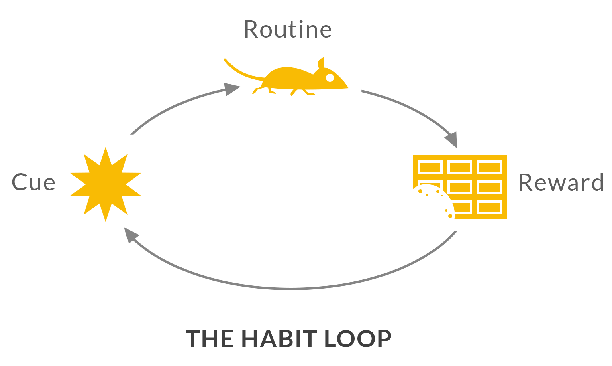
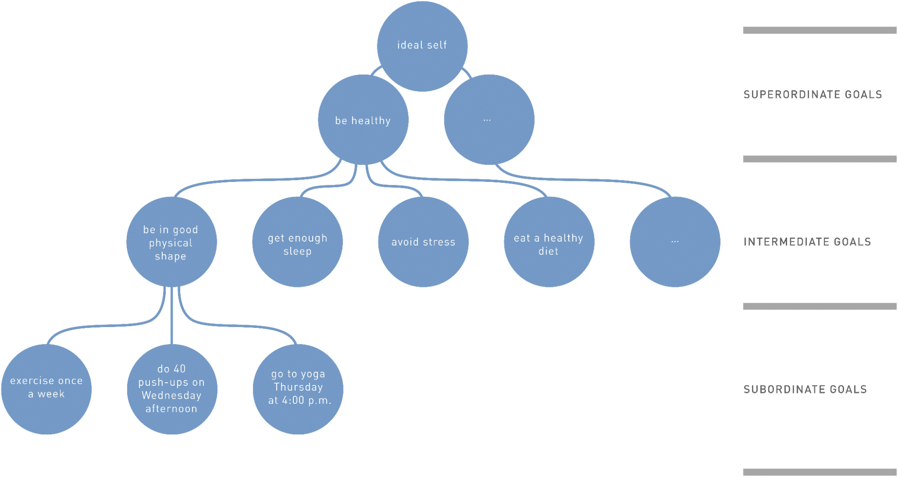

### Uma introdução a hierarquia de criação de metas para mudanças comportamentais.

Na edição de hoje quero introduzir as bases para a definição de visão, metas e ações de acordo com os estudos comportamentais. A ideia é que esse conhecimento sirva de base para caso você esteja trabalhando em produtos ou serviços que tentem auxiliar na mudança de comportamento dos usuários.

Se você chacoalhar uma árvore caem mil aplicativos de mudança de hábitos. O que todos tem em comum é que dificilmente eles funcionam. Não porque são mal feitos (grande parte é), mas porque mudar um hábito é um negócio extremamente difícil.

## O que é um hábito?

Hábitos são definidos como ações que são desencadeadas automaticamente em resposta a pistas contextuais que foram associadas ao seu desempenho[1](#footnote-1). Fazer carinho num gato (ação) depois de ver ele com a barriga pra cima (pista contextual), ou comprar uma coca-cola bem gelada (ação) depois de ouvir o icônico som de uma lata sendo aberta (pista contextual).

A imagem do **loop do hábito** apresentada pelo jornalista Charles Duhigg em seu livro **O Poder do Hábito** ilustra esse mecanismo. Nesse esquema temos a pista (*cue*), que nos leva a uma rotina (hábito/ação), e essa rotina em última instância nos trará uma recompensa (positiva ou negativa).

Esse mecanismo não é tão fácil quanto a imagem sugere. Muitas ações químicas acontecem em nosso cérebro quando executamos hábitos e é por isso que as vezes é tão difícil parar ou substituir comportamentos. Nesse caso, querer nem sempre é poder.

Estudos na área de mudanças comportamentais com foco em saúde[2](#footnote-2) sugerem que para obtermos uma mudança efetiva é necessário definir boas **metas** que estejam atreladas a um bom **plano de execução** que, em última instância, estão relacionadas a uma **visão** de um “Eu ideal” ou uma versão futura e melhor de você.

## O que é uma visão?

Podemos entender a **Visão** como sendo um conceito amplo de você mesmo em uma situação desejada, como por exemplo: *ser mais saudável*.

A Visão também é uma meta, mas é uma meta baseada em seus valores como indivíduo e tem uma característica mais ampla do que as metas e as ações que veremos a seguir.

Entenda a visão como o “**Porquê**” ou a razão de você estar fazendo algo.

## O que é uma meta?

Metas são **menos abstratas** do que a Visão. Elas são mais específicas e fornecem caminhos que leverá você até a sua Visão. Seria então o “**O quê?**” deve ser feito.

Se sua Visão é se tornar *alguém mais saudável,* suas metas podem incluir: dormir mais, comer melhor, fazer mais exercícios e gerenciar melhor seu nível de estresse.

Definir boas metas é mais difícil do que parece, pois o tipo de meta que você escolhe influencia positivamente ou não a sua **performance**.

Não vou entrar em detalhes dos tipos de metas que existem, mas você pode se aprofundar nesse assunto se pesquisar por esses termos: *approach goals*, *avoidance goals*, *mastery goals* e *performance goals*.

## O que são ações?

Ações são objetivos **bem específicos** que farão você cumprir suas metas e te levarão a alcançar sua visão. Seria o seu “**Como?**”.

Se pegarmos uma das metas anteriores, como por exemplo “fazer mais exercícios”, um exemplo de ação seria:

> Um plano específico para fazer **45 minutos** de **treinamento de resistência** antes do trabalho, às **segundas**, **quartas** e **sextas-feiras**, na **academia** perto do seu local de trabalho.

Aqui cabe a utilização do *framework* **S.M.A.R.T** (*specific, measurable, achievable, realistic, timebound*). Ele ajuda a criar ações que respondem **como** alcançar suas metas.

## Nomenclaturas

Eu já tive problemas com clientes que interpretam visão, metas e ações como sendo tudo a mesma coisa. E embora elas compartilhem a mesma natureza de serem um tipo de “objetivo”, cada uma possui suas próprias características.

É necessário entender suas diferenças para que você não corra o risco de criar metas que parecem objetivos e objetivos que parecem metas. Especialmente se você estiver criando um aplicativo em que o intuito é auxiliar os usuários a criarem ou modificarem seus hábitos.

Uma outra abordagem dessa hierarquia de Visão, Metas e Ações é apresentado por Carver e Scheir[3](#footnote-3), que utilizam os termos **Superordinate Goals **(= visão), **Intermediate Goals** (= metas)e **Subordinate Goals **(= ações).

A imagem acima representa as relações que cada tipo de “objetivo” tem dentro da hierarquia. As ações (*subordinate goals*) são subordinadas às metas (*intermediate goals*), e as metas agem como intermediadores que fazem você alcançar sua visão (*superordinate goal*).

O ponto é: existe uma hierarquia para uma mudança comportamental. Cada nível abre diversas oportunidades para criarmos interações que facilitam essa jornada.

## Como aplicar isso em produtos?

Não basta apenas que seu app ajude o usuário a definir uma boa visão, boas metas e boas ações. Para que uma mudança real aconteça há diversas alavancas que precisam ser puxadas. Algumas são puxadas pelo produto, outras pelos usuários e muitas delas fogem do controle de ambos.

Nível de dificuldade das metas, ambiente em que o usuário está inserido, rotina, motivação e dezenas de outras variáveis influenciam a criação de hábitos.

O que podemos fazer, enquanto designers, é utilizar mecanismos como vieses cognitivos, gamificação, modelos mentais e outras estruturas que podem facilitar ou influenciar essas mudanças comportamentais. Mas isso é assunto para outra edição.

Espero que tenha gostado dessa introdução!

## Quantos cafés essa edição merece?

Se você gostou muito dessa edição e quiser me fazer feliz é só patrocinar um cafézinho pra mim aqui na Alemanha. Toda edição patrocinada eu faço questão de trazer uma foto e o nome dos bem feitores. ♥️

**Quero patrocinar: **

- **[1 café](https://componentes-de-ui-design.lemonsqueezy.com/buy/57e29feb-5217-4e6f-996c-68242d56dd6d?media=0&discount=0) ☕️**
- **[1 café + 1 croassaint](https://componentes-de-ui-design.lemonsqueezy.com/buy/57e29feb-5217-4e6f-996c-68242d56dd6d?media=0&discount=0&quantity=2) ☕️+🥐**
- **[ 1 café + 1 croassaint + 1 docinho](https://componentes-de-ui-design.lemonsqueezy.com/buy/57e29feb-5217-4e6f-996c-68242d56dd6d?media=0&discount=0&quantity=3) ☕️+🥐+🍩**

## O que rolou por aqui

1. **[Atoms](https://atoms.jamesclear.com/)** é um app de mudança de hábitos que segue os conceitos apresentados nessa edição. Foi lançado pelo escritor do livro Atomic Habits.
2. Se você gosta de design de interação confira **[esse artigo](https://benji.org/family-values)** sobre como a carteira cripto **Family** aplica em seu produto.
3. E falando de interação, **[esse artigo](https://emilkowal.ski/ui/great-animations)** mostra como criar grandes interações.
4. **[Rebrand Gallery](https://www.rebrand.gallery/) **é um ótimo diretório para buscar inspiração de brand design.
