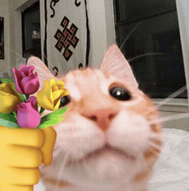
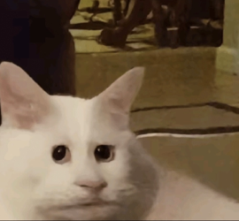
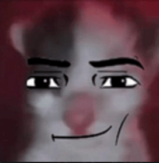
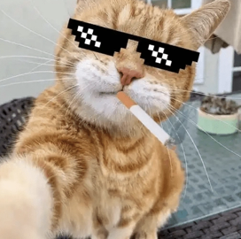
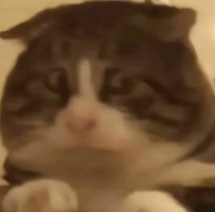
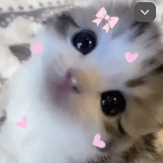

### Uma edição recheada de imagens de gatinhos e reflexões.

Essa é a história de um criador de projetos compulsivos que adorava criar coisas novas sem antes terminar as antigas. Talvez você se identifique com a minha história…ops, quero dizer, com a história dessa personagem. 👀

## O Início

Todo novo projeto é como uma nova paixão: você fica entusiasmado, excitado e empolgado em começar um novo dia porque você não vê a hora de interagir novamente com aquele pedacinho fofo que caiu do céu nos seus braços.

Assim como toda paixão, você vive dias, semanas e meses de puro êxtase. Tudo é lindo. “_Nada vai nos separar e nem abalar nossas estruturas,_ *babe” - *você pensa.

Você investe tempo, dinheiro e se compromete em fazer seu melhor.

Quanta alegria!

## O tempo passa…

Alguns meses se passam. Aquela empolgação inicial já não é mais a mesma. Aquelas borboletas que antes faziam festa na sua barriga já migraram para outro lugar.

Você ainda está apaixonado, mas agora o filtro da realidade é menos perfeito do que antes. O compromisso ainda é o mesmo: manter seu projeto funcionando.

Nem todo dia será perfeito. Em alguns você estará cansado e sem motivação, em outros você estará super empolgado e dedicará novamente algum tempo ao seu projeto.

Nessa fase é necessário **desenvolver algo mais forte do que paixão** se você quiser que seu projeto continue. Compromisso deveria ser suficiente para garantir continuidade, mas compromissos mudam.

## O marasmo

Esteja muito atento a este momento.

Se apaixonar por um novo projeto é tentador e você pode cair no conto de que consegue manter os dois ao mesmo tempo.

No fundo você sabe que não é possível, mas a excitação de começar um novo projeto cega os seus sentidos porque a sensação de algo novo é bem gostosa.

Esse malabarismo pode até funcionar por um tempo, mas uma hora você percebe que agora você tem duas vezes mais trabalho do que antes. Não há de onde tirar mais tempo e motivação para manter duas coisas se antes já não existia energia suficiente para manter apenas um.

Você tem 3 possíveis opções:

1. Empurrar ambos com a barriga e fazer um trabalho mais ou menos.
2. Pausar um e focar 100% do seu tempo no outro até finalizá-lo.
3. Chutar o pau da barraca e abandonar os dois ao relento de uma noite fria de inverno.

A primeira opção é triste, a segunda mais honrosa, e se você cogitou a terceira, que feio! Não esperava isso de você.

## O Fim

Como já dizia aquele velho filósofo bêbado no fundo de um bar: “_a história só acaba quando termina, ick!_”. Quanta sapiência ele tinha.

Mas tem um porém: se o seu projeto não te faz bem, então é melhor largar e seguir adiante. Você não precisa dedicar tempo em algo que não te faça um profissional ou uma pessoa melhor durante o processo.

Mas se no fundo do seu coração ainda há aquela fagulha que outrora esquentava todo o seu corpo e fazia você sonhar acordado com fama, dinheiro e muito…não, espera…essa é outra história. Desculpa!

Mas se no fundo do seu coração você sabe que seu projeto tem potencial, então tente **transmutar** essa paixão em amor.

Amor pela sua ideia.

Amor pela capacidade que ela tem de ajudar outras pessoas (a não ser que você seja um egoísta safado, aí é melhor você sair daqui)

O que eu quero dizer é que **projetos-paixão** são efêmeros e precisamos saber dizer não quando eles tentam nos seduzir.

Já os **projetos-amor** são aqueles que fazemos porque sabemos lá no fundo que eles precisam ser feitos. Eles são cheios de potencial. São sólidos. Precisam apenas da dedicação que só o amor tem capacidade de prover.

Eles precisam de um final feliz.

## Quantos cafés essa edição merece?

Se você gostou muito dessa edição e quiser me fazer feliz é só patrocinar um cafézinho pra mim aqui na Alemanha. Toda edição patrocinada eu faço questão de trazer uma foto e o nome dos bem feitores. ♥️

**Quero patrocinar: **

- **[1 café](https://componentes-de-ui-design.lemonsqueezy.com/buy/57e29feb-5217-4e6f-996c-68242d56dd6d?media=0&discount=0) ☕️**
- **[1 café + 1 croassaint](https://componentes-de-ui-design.lemonsqueezy.com/buy/57e29feb-5217-4e6f-996c-68242d56dd6d?media=0&discount=0&quantity=2) ☕️+🥐**
- **[ 1 café + 1 croassaint + 1 docinho](https://componentes-de-ui-design.lemonsqueezy.com/buy/57e29feb-5217-4e6f-996c-68242d56dd6d?media=0&discount=0&quantity=3) ☕️+🥐+🍩**

## O que rolou por aqui

1. A história de hoje é só um desabafo pessoal de como funciona minha cabeça quando o assunto é projetos paralelos. Tudo isso pra dizer que eu preciso finalizar o **[componentes.design](https://componentes.design/)** antes de assumir coisas novas.
2. A **[Teenage Engineering](https://teenage.engineering/products/ep-1320)** lançou um produto focado em sons medievais que está lindo de-mais
3. Meu irmão gravou várias aulas para o curso de **[Product Design da PM3](https://www.cursospm3.com.br/curso-product-design/)** e tem um cupom para quem tiver interesse: **WELLITONMATIOLA10**
4. O estúdio de design **[Vagabund Moto](https://vagabund-moto.com/projects/ce02)** lançou uma versão em parceria com a BMW da moto elétrica CE02 que está quase me fazendo cometer uma loucura
