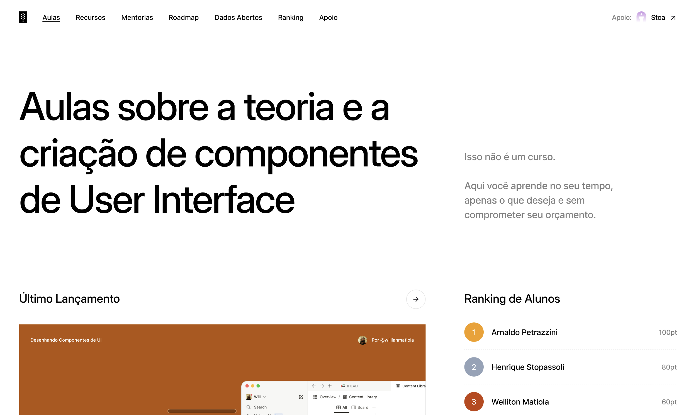
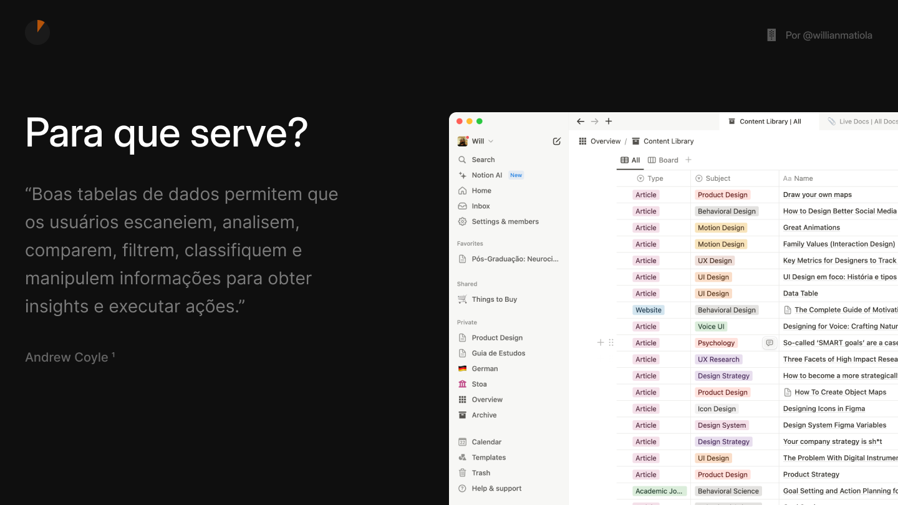

### Corre aqui, tem novidades. 😍

Venho trabalhando em uma nova versão do [componentes.design](https://componentes.design/) que reflete mais o meu estilo de Design e tem um caráter mais atemporal também.

A versão atual é bem bonita, mas ela tem um período curto de sobrevivência. Talvez você não tenha sentido isso ainda, mas eventualmente vai acessar o site e sentir que ele, assim como você e eu, está ficando velho. 👴

Por isso decidi ir por uma linha mais minimalista, com fundo branco e texto preto. Assim o foco fica completamente no conteúdo e o projeto ganha uma sobrecarga de vida estética maior.

## Rodada de Feedback

Se você quiser contribuir com feedback ou sugestões basta [acessar esse link](https://www.figma.com/design/NEReamzRI47Z1neaMQTKoH/Componentes-de-UI-2.0?node-id=17-466&t=prbRxw2bBCJ8yuDN-1) e sentar o dedo nos comentários. Sério! Quero muito saber sua opinião e como posso deixar a nova versão ainda melhor.

## Template das Aulas

Também estou atualizando os slides para seguir o novo design. É bem provável que você comece a ver as próximas aulas com essa nova estética antes do novo site ir ao ar.

Eu estava em dúvida entre manter fundo branco ou ir para o fundo escuro, pois minha hipótese é de que as pessoas costumam estudar mais a noite e aí o fundo escuro seria mais agradável. Mas fiz uma enquete no meu instagram e deu 50% de cada, então não sei mais qual a melhor opção.

## Lançamento

Ainda não tenho uma data para lançar a atualização, mas quero fazer isso antes do ano acabar junto com muitas outras aulas. *Staaaay tuned!*

## Quantos cafés essa edição merece?

Se você gostou muito dessa edição e quiser me fazer feliz é só patrocinar um cafézinho pra mim aqui na Alemanha. Toda edição patrocinada eu faço questão de trazer uma foto e o nome dos bem feitores. ♥️

**Quero patrocinar: **

- **[1 café](https://componentes-de-ui-design.lemonsqueezy.com/buy/57e29feb-5217-4e6f-996c-68242d56dd6d?media=0&discount=0) ☕️**
- **[1 café + 1 croassaint](https://componentes-de-ui-design.lemonsqueezy.com/buy/57e29feb-5217-4e6f-996c-68242d56dd6d?media=0&discount=0&quantity=2) ☕️+🥐**
- **[ 1 café + 1 croassaint + 1 docinho](https://componentes-de-ui-design.lemonsqueezy.com/buy/57e29feb-5217-4e6f-996c-68242d56dd6d?media=0&discount=0&quantity=3) ☕️+🥐+🍩**

## O que rolou por aqui

1. A [Sharge](https://sharge.de/) é uma marca de carregadores com um estilo bem parecido com os produtos da Nothing, que exibe os componentes utilizando carcaças transparentes.
2. Meus colegas aqui na Cactus compartilharam [esse site muito bacana](https://blobmixer.14islands.com/) que permite você criar *blobs *personalizadas. Se você trabalha com ID Visual, fica a dica.
3. [Porque não há mais sociólogos trabalhando em UX?](https://uxdesign.cc/why-arent-there-more-ux-sociologists-out-there-c57f12576f98) Esse é um texto bem interessante que incentiva a reflexão dessa área trabalhando a favor da construção de melhores produtos e serviços digitais. Ao invés de continuar focando somente nos aspectos individuais da interação do usuário podemos ampliar nossas lentes e entender como a sociedade em que ele está inserido também afeta sua experiência.
