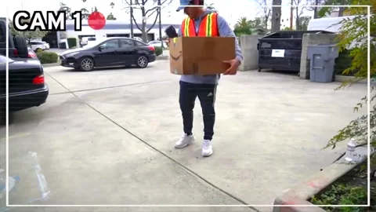
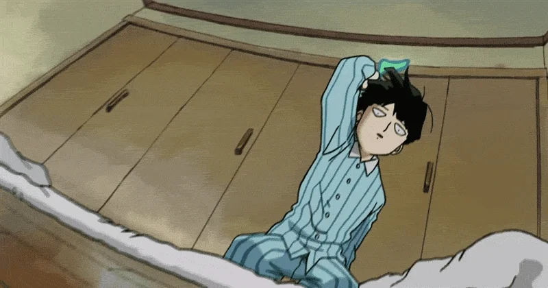

### O processo de tornar as ofertas de produtos ou serviços digitais em uma 💩

**Emerdificação** 💩 é uma tradução livre (e não tão boa) do termo em inglês “_Enshittification_”[1](#footnote-1), que significa exatamente o que você está pensando: tornar algo uma merda, especialmente produtos e serviços online.

Esse padrão é bem comum e provavelmente você já experienciou mais de uma vez um produto que antes tinha uma ótima oferta para seus usuários mas que com o tempo foi diminuindo essa ofertas para servir melhor aos interesses de empresas, e quando as duas pontas já estavam fisgadas, os serviços que antes eram bons para os usuários e para as empresas passaram a maximizar lucros para seus investidores.

## Por que isso acontece?

A resposta é bem óbvia, mas vamos por partes. Quando um novo produto ou serviço surge ele precisa de usuários, e para atrair usuários a oferta precisa ser boa. Em um primeiro momento está tudo bem operar no prejuízo, afinal, aqui a gente funciona com a mentalidade de **GROWTH **com G maiúsculo, irmão! Quanto mais gente entrando mais vamos ferrar com eles lá na frente ajudar nossos estimados usuários.

Uma empresa que emerdificou com sucesso sua oferta, de acordo com Cory Doctorow[2](#footnote-2), é a Amazon: por anos ela operou no negativo porque tinha acesso ao mercado de capitais que ajudavam a subsidiar o que nós comprávamos por lá.

Todos se beneficiaram dos produtos sendo vendidos a um preço mais baixo, entregas mais rápidas, pesquisas mais direcionadas e todo o tipo de comodidade que fez com que seus usuários não pensassem duas vezes ao procurar um lugar para fazer compras.

E quando todo mundo já estava morrendo de amores por tanta facilidade, a Amazon começou a vender ebooks e audiobooks que ficam presos dentro de sua própria plataforma, obrigando você a desistir das suas compras caso decida se desfazer dos aplicativos ou dispositivos da empresa.

Ela também criou o serviço Prime, em que você paga uma anualidade para ter frete grátis e outros benefícios nas suas compras. Ou seja, você dá dinheiro para a empresa antecipadamente e ainda precisa voltar lá e gastar mais para usufruir desse benefício.

Ela mantém como refém tanto seus usuários compradores quanto os negócios que dependem dela para venderem seus produtos.

Nessa fase já não importa muito se a oferta é boa para seus usuários, porque no final do trimestre os acionistas querem ver é a cor dos dividendos caindo em suas contas. É para agradar os investidores que os produtos direcionam seu foco.

O mesmo aconteceu com o Instagram, TikTok, Airbnb, Uber, Twitter (🖕elói mosca) e qualquer outro aplicativo que começou com uma oferta ótima para seus usuários e depois deu início ao seu processo de emerdificação. Tão natural quanto a luz do dia. Só que essa notícia não é boa.

## O que acontece depois que isso acontece?

Bom, o produto morre.

Segundo Cory Doctorow, o processo de emerdificar um produto é o caminho natural das empresas rumo a sua morte. E para ele está tudo bem, porque não precisamos de empresas se tornando eternas reguladoras da Internet.

A morte de empresas merdas dá lugar a outras empresas que poderão ou não perpetuar esse escatológico ciclo.

Deixe nos comentários quais empresas você acredita que estão passando por essa fase de emerdificação de suas ofertas.

Até a próxima. 💩

## Quantos cafés essa edição merece?

Se você gostou muito dessa edição e quiser me fazer feliz é só patrocinar um cafézinho pra mim aqui na Alemanha. Toda edição patrocinada eu faço questão de trazer uma foto e o nome dos bem feitores. ♥️

**Quero patrocinar: **

- **[1 café](https://componentes-de-ui-design.lemonsqueezy.com/buy/57e29feb-5217-4e6f-996c-68242d56dd6d?media=0&discount=0) ☕️**
- **[1 café + 1 croassaint](https://componentes-de-ui-design.lemonsqueezy.com/buy/57e29feb-5217-4e6f-996c-68242d56dd6d?media=0&discount=0&quantity=2) ☕️+🥐**
- **[ 1 café + 1 croassaint + 1 docinho](https://componentes-de-ui-design.lemonsqueezy.com/buy/57e29feb-5217-4e6f-996c-68242d56dd6d?media=0&discount=0&quantity=3) ☕️+🥐+🍩**

## O que rolou por aqui

1. **[O Branding das Bets](https://bitstobrands.substack.com/p/apostas-bets-brasil-marcas-branding)** é uma reflexão em como essa praga inundou os espaços de mídia e vem influenciando as pessoas a caírem nesse papinho sujo de prosperidade.
2. “Uma visão popular na ciência convencional é que a vida é um tipo de ilusão, totalmente explicável pelas leis que governam os átomos. A física Sara Imari Walker acredita que esta é uma abordagem equivocada para a questão: O que é a vida? De acordo com Walker, **[a vida usa a informação como um agente “autocriador e automantenedor](https://bigthink.com/13-8/sara-walker/)**”.”
3. **[Não confie no processo de design](https://jennywen.substack.com/p/dont-trust-the-design-process)**. Toda crítica contra o processo de design é bem vinda nessa publicação. Enjoy!
4. **[Departure Mono](https://departuremono.com/)** é uma fonte monospaced que chamou minha atenção. A landing page traz vários exemplos muito bem desenhados.
