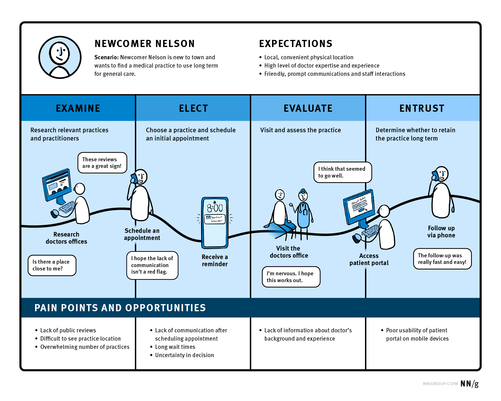
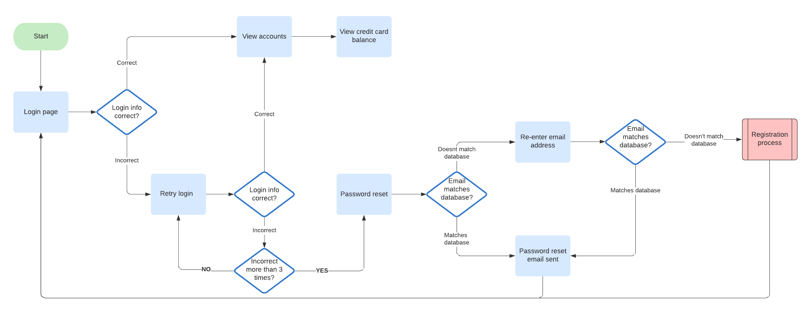

### Aprenda quando e como usar cada uma dessas ferramentas de UX em seus projetos.

Se você também precisa dar um Google toda vez que esquece a diferença entre os dois, essa edição da Stoa foi feita exclusivamente para você.

Hoje vamos aprender de uma vez por todas a diferença entre essas duas ferramentas, em que momentos utilizá-las e alguns exemplos de como fazer.

Embora ambas nos ajudem a entender como os usuários conseguem alcançar seus objetivos dentro de um produto ou serviço, uma oferece uma visão geral e a outra oferece uma visão mais detalhada dos passos dos usuários.

## **O que é uma User Journey?**

Uma _User Journey_, ou Jornada do Usuário, é uma sequência das etapas que o usuário faz para alcançar seu objetivo. Nesse tipo de atividade, vários pontos de contato e canais podem fazer parte do caminho do usuário.

Imagine, por exemplo, que você precisa se consultar com um médico. Os possíveis passos dessa jornada seriam:

1. Pesquisar por um especialista.
2. Agendar uma consulta.
3. Ir no consultório médico.
4. Fazer os exames solicitados pelo médico.
5. Acessar os resultados.
6. Fazer um retorno ao médico.

A sua jornada foi comprimida em 6 grandes passos. Cada um desses passos contém inúmeros outros pequenos passos até que cada etapa seja concluída com sucesso. É nesse momento que entra o _User Flow_, ou Fluxo do Usuário.

Mas antes de pularmos para isso, vamos entender como é a estrutura básica desse _framework_.

Na imagem a seguir, temos características do usuário, suas expectativas, as etapas dessa jornada, pontos de dor e oportunidades. Outros exemplos também adicionam uma camada de sentimento do usuário com 5 níveis 😩🙁😐🙂😀.

## O que é um User Flow?

Se uma _user journey_ é uma **visão geral **da experiência, o _user flow_ é basicamente uma versão granulada e rica em detalhes de como cada passo acontece.

Se pegarmos por exemplo o passo 2 da nossa jornada e considerarmos que o agendamento acontece pelo app do seu plano de saúde, teremos um _user flow_ parecido com isso:

1. Abrir o app
2. Clicar na página de especialistas
3. Pesquisar especialista
4. Entrar na página de detalhes do especialista.
5. Clicar no botão agenar consulta.
6. Escolher dia e hora da consulta.
7. Clicar em agendar.
8. Receber confirmação de agendamento.
9. Salvar ou não em seu calendário.

Dependendo do app, teremos muito mais passos do que os listados acima. Cada passo é uma ação que o usuário precisa fazer para concluir sua tarefa. E não pense que esse fluxo ocorrerá sempre de maneira bem sucedida. Muitas coisas podem acontecer no caminho e é por isso que precisamos planejar nossas jornadas levando em consideração:

1. Caminho do sucesso: o caminho que esperamos que aconteça se tudo ocorrer bem.
2. Erros: mapear possíveis erros e rotas para voltar ao caminho do sucesso.
3. Loops: ações que acontecem repetidamente antes de seguir para o próximo passo.

Podemos criar user flows de diferentes maneiras e complexidades. As vezes pode ser um simples flow chart, um wireflow (quando temos wireframes de baixa fidelidade), ou diagrama de tarefas.

O objetivo de um fluxo do usuário é mapear todas as interações

## Combinando User Journey com User Flow

Considerando que a jornada fornece uma visão macro da experiência e os fluxos uma versão micro, podemos combinar as duas ferramentas de forma sequencial para tornar mais claro a experiência que queremos desenvolver.

Onde trabalho atualmente nós usamos jornadas para explicar conceitos para nossos clientes que muitas vezes não possuem tanta experiência com design. E quando aprovamos um conceito, mergulhamos um pouco mais em seus detalhes criando o passo a passo do funcionamento com os fluxos de usuário.

https://www.nngroup.com/articles/user-journeys-vs-user-flows/

## Resumão:

1. User Journeys são mapas de jornadas com uma visão mais abrangente.
2. Você pode mapear pontos de contato, canais, emoções, necessidades e dores.
3. User Flows mostra os diferentes tipos de interação que o usuário faz para completar a tarefa em um produto.
4. Journeys = Visão Macro / Flows = Visão Micro.

## Quantos cafés essa edição merece?

Se você gostou muito dessa edição e quiser me fazer feliz é só patrocinar um cafézinho pra mim aqui na Alemanha. Toda edição patrocinada eu faço questão de trazer uma foto e o nome dos bem feitores. ♥️

**Quero patrocinar: **

- **[1 café](https://componentes-de-ui-design.lemonsqueezy.com/buy/57e29feb-5217-4e6f-996c-68242d56dd6d?media=0&discount=0) ☕️**
- **[1 café + 1 croassaint](https://componentes-de-ui-design.lemonsqueezy.com/buy/57e29feb-5217-4e6f-996c-68242d56dd6d?media=0&discount=0&quantity=2) ☕️+🥐**
- **[ 1 café + 1 croassaint + 1 docinho](https://componentes-de-ui-design.lemonsqueezy.com/buy/57e29feb-5217-4e6f-996c-68242d56dd6d?media=0&discount=0&quantity=3) ☕️+🥐+🍩**

## O que rolou por aqui

1. O Figma tem feito diversos conteúdos interessantes sobre o [básico do Design.](https://www.figma.com/resource-library/design-basics/)
2. O Scott fez um dock para [iPhone em modo Standby](https://www.youtube.com/@ScottYuJan/videos) inspirado um ícone produto feito por Dieter Rams.
3. [Workout.lol](https://workout.lol/) é uma ferramenta simples para montar treinos físicos de acordo com os músculos que você quer desenvolver.
4. [Recursos](https://www.printforfigma.com) para quem quer trabalhar com materiais impressos direto no Figma.
