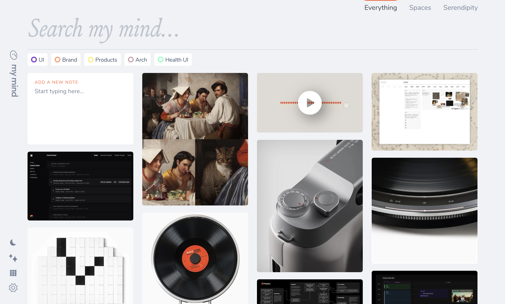
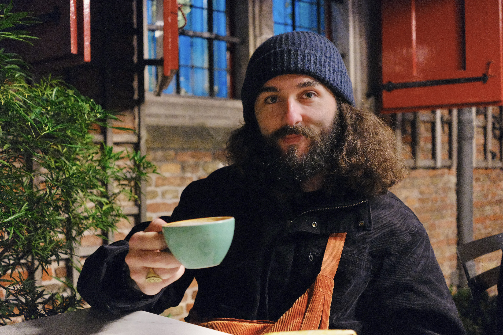

### Nem tudo que é bonito precisa ser salvo. Mas tudo que é salvo precisa, no meu entendimento atual, de um bom motivo para ser selecionado.

Olá!

Faz pouco mais de 1 mês desde a última edição da Stoa e muitas coisas aconteceram de lá pra cá. Se você é uma das **85 novas** **pessoas** que assinaram a publicação nesse período, seja muito bem vindo.

Um agradecimento especial ao **[Al Lucca](https://thedesignedition.substack.com/)** e ao Marcos Carolino por indicarem a Stoa em suas redes sociais. Fiquei extremamente feliz com o carinho de vocês dois.

## O que rolou por aqui:

1. A Stoa agora tem domínio próprio: **stoa.news**. 🗞️
2. E aproveitei para fazer uma atualização na identidade visual também.
3. Acabei de fazer 31 anos e comemorei em Amsterdam com direito a um bolo espacial especial. Em breve postarei fotos no meu **[Instagram](https://www.instagram.com/willianmatiola/)**. 🎉🍰👽Se quiser me pagar um **[café de presente](https://componentes-de-ui-design.lemonsqueezy.com/buy/57e29feb-5217-4e6f-996c-68242d56dd6d?media=0&discount=0)**, fique a vontade.
4. Se quiser me pagar um **[café de presente](https://componentes-de-ui-design.lemonsqueezy.com/buy/57e29feb-5217-4e6f-996c-68242d56dd6d?media=0&discount=0)**, fique a vontade.
5. Adotamos um gatinho e nomeamos ele de Mob (referência ao anime) para fazer companhia para a nossa outra gata chamada Mione.
6. Comprei 2 novos itens para o meu "design stack”: uma lapiseira **[OHTO Sharp Pencil](https://www.amazon.de/OHTO-APS-250N-Druckbleistift-scharf-Naturholz/dp/B00MN76I5O/)** e um escalímetro de 15cm da **[Rumold](https://rumold.de/produkt/praezisions-dreikantmassstab-art-195aluminium-3-farbige-hohlkehlen-o-14-mm-schlanklaengen-10-15-30-cm-teilungen-1-4-din-mb)**.

## O ato de selecionar boas referências com intenção

Buscar por referências é uma das atividades mais comuns dentro de um processo de Design e praticamente qualquer projeto, por menor que seja, vai exigir uma pesquisa por referências e inspiração.

Eu costumava fazer isso no piloto automático e nunca parei para refletir a respeito. Minha única regra era: a coisa em questão é bonita? Se sim, então eu salvaria.

Acontece que nem tudo que é bonito precisa ser salvo. Mas tudo que é salvo precisa, no meu entendimento atual, de um bom motivo para ser selecionado.

Esse bom motivo geralmente está associado a alguma emoção ou sentimento que o item despertou em mim. Pode ser deslumbre, fascinação, empolgação ou qualquer fator que me faça intencionalmente querer salvar no meu mymind.

Depois de usar esse filtro percebi que minha curadoria de referências se tornou muita mais seletiva e, por consequência, muito mais bonita do que antes.

Selecionar coisas com intencionalidade me faz observar com mais atenção os detalhes daquilo que está na minha frente. E enxergar os detalhes me ajuda a ser mais crítico comigo mesmo na hora de trazer algo novo para meu jardim de referências.

O ato intencional de selecionar boas referências é como montar uma playlist com um propósito específico. A experiência sempre será mais prazerosa ao ouvi-la.

### Saber dizer não

Acho que o mais difícil nesse processo de selecionar coisas com intencionalidade é saber dizer não para todas as outras coisas que você também gostaria de salvar.

Nem tudo aquilo que você vê é importante ou vai te ajudar a desenvolver um melhor senso crítico ou estético. Estar consciente disso é fundamental para uma boa curadoria.

### Boas referências, bom craft

É algo óbvio mas que precisa ser reforçado: referências ruins não te ajudam a ter um bom craft. Se você não souber separar as boas referências das ruins seus designs dificilmente vão ficar melhores.

Selecionar boas referências não é difícil, basta buscar nos lugares corretos. Ao invés de selecionar trabalhos de profissionais estranhos e duvidosos no Dribbble, a melhor opção é optar por sites que já tenham uma curadoria própria. Dessa forma somos expostos ao que há de melhor na indústria.

Quanto mais exposição a boas curadorias, melhor a sua curadoria pessoal se torna e, por consequência, seu craft naturalmente vai melhorando a cada novo projeto.

### Manutenção do Jardim

Todo jardim necessita de cuidados para que sua beleza seja mantida. É importante remover aquelas referências que não fazem mais sentido porque perderam a motivação inicial de estarem ali devido ao seu olhar ainda mais aguçado e seletivo.

Não se apegue ao que já não te empolga mais. Remova e siga em frente adicionando inspirações cada vez melhores.

Com o passar do tempo espero que você se sinta tão feliz com suas curadorias quanto eu me sinto quando acesso meu arquivo de referências.

## Quantos cafés essa edição merece?

Se você gostou muito dessa edição e quiser me fazer feliz é só patrocinar um cafézinho pra mim aqui na Alemanha. Toda edição patrocinada eu faço questão de trazer uma foto e o nome dos bem feitores. ♥️

**Merece: **

- **[1 café](https://componentes-de-ui-design.lemonsqueezy.com/buy/57e29feb-5217-4e6f-996c-68242d56dd6d?media=0&discount=0) ☕️**
- **[1 café + 1 croassaint](https://componentes-de-ui-design.lemonsqueezy.com/buy/57e29feb-5217-4e6f-996c-68242d56dd6d?media=0&discount=0&quantity=2) ☕️+🥐**
- **[ 1 café + 1 croassaint + 1 docinho](https://componentes-de-ui-design.lemonsqueezy.com/buy/57e29feb-5217-4e6f-996c-68242d56dd6d?media=0&discount=0&quantity=3) ☕️+🥐+🍩**

## O que achei por aqui

1. Essa **[ferramenta](https://branddb.wipo.int/en/similarname)** ajuda você a checar se existem marcas com nome iguais.
2. **[Ajoto](https://www.ajoto.com/)** é um estúdio de design britânico de produtos que é especialista em artigos de papelaria como canetas e outros acessórios.
3. **[Arcade Belts](https://arcadebelts.eu/)** é uma marca de cintos com um design bem interessante, simples e que provavelmente eu não usaria, mas achei super interessante.
4. A **[Hanna](https://hannahviaart.com/)** é uma artista sensacional que produz tapetes, almofadas e outros produtos com tecidos que são verdadeiras peças de design.
5. Essa **[análise de um gringo](https://www.instagram.com/p/C7poMBTPDe4)** sobre a capacidade de qualquer brasileiro de falar sobre qualquer coisa é muito interessante. Aparentemente temos o poder natural do monólogo.
6. **[Design Sinking](https://designobserver.com/design-sinking/)** é um texto sobre como o "design thinking" se tornou superficial, muitas vezes ignorando impactos maiores. As empresas precisam de estratégias resilientes e de longo prazo que considerem crises complexas e stakeholders futuros.
7. O querido Rafael Frota escreveu uma reflexão muito boa chamada “**[Designers, busquem velas](https://brasiluxdesign.substack.com/p/designers-busquem-velas)**” sobre a importância de procurar ajuda de outras pessoas em nossa jornada profissional.
8. **[Plutocrat Archipelagos](https://www.macguffinmagazine.com/stories/macguffin-plutocrat-archipelagos)** traz a reflexão de como bilionários herdeiros vivem isolados da realidade, protegidos por muros físicos e psicológicos que evitam críticas e consequências. Desconectados da sociedade, enfrentam crises existenciais e mantêm um estilo de vida vazio e insustentável, mesmo com o mundo em colapso ao seu redor.
9. Vídeo do José Kobori sobre o **[mito do estado mínimo](https://www.youtube.com/watch?v=s7XsaXjGHLI)** e porquê o estado é fundamental para tirar a economia das crises ou até mesmo salvar indústrias do setor privado.
