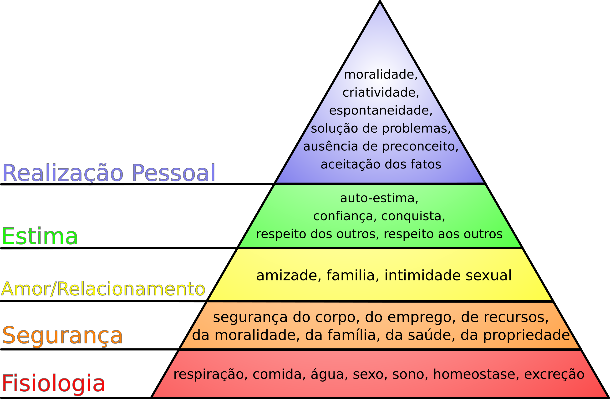

### Quais os fatores que influenciam nossas decisões de design? Será que temos um preço? Quem nos influencia?

Olá!

O ano está chegando ao fim e gostaria de encerrá-lo com algumas reflexões sobre ética e moral dentro do Design.

Essa é uma daquelas edições em que eu vou apresentar diversas coisas e provavelmente nenhuma delas terá uma conclusão definitiva. A ideia é deixar espaço para o diálogo e principalmente ouvir o que **você** pensa a respeito do tema.

Mas antes de entrarmos nesse assunto, quero fazer uma retrospectiva do que aconteceu desde a **[última Stoa](https://www.stoa.news/p/050)** publicada no dia **13 de novembro**.

## O que rolou por aqui:

1. Lancei uma seção nova da Stoa chamada **[Basculante](https://www.stoa.news/s/basculante)** para trazer referências visuais todas as segundas-feiras. Se você não está recebendo ainda, entre em uma das edições e se inscreva.
2. Nas últimas semanas trabalhei praticamente todos os dias para desenvolver a versão 2.0 do **[componentes.design](https://componentes.design/)**. Em 2025 teremos grandes mudanças! Quero trazer aulas de Figma, Framer e convidados especiais para criar aulas de diferentes assuntos.
3. Voltei a atualizar meu perfil do **[Pexels](https://www.pexels.com/@willianmatiola/)** com muitas fotos que estavam guardadas.

## I – Ética e Moral

De maneira bem simplificada, ética diz respeito as ações que fazemos com base em nossos valores individuais. [1](#footnote-1)

Moral é um conjunto de hábitos e costumes de uma sociedade e está relacionada com a cultura de um local em um determinado espaço de tempo.

Nem tudo que é moralmente aceito (normas ou costumes) significa que é moralmente ético. Um exemplo disso é a escravidão, que era moralmente aceita na época mas não é de maneira alguma ética.

Dessa forma, decisões éticas estão relacionadas principalmente aos seus valores pessoais e morais que também são influenciados pela cultura e sociedade em que você vive. Todos esses fatores impactam diretamente nos designs que você desenvolve.

## II – Ética no Design

De acordo com Mike Monteiro, em seu famoso artigo “**[A Designer's Code of Ethics](https://deardesignstudent.com/a-designers-code-of-ethics-f4a88aca9e95)”**, antes de sermos designers, somos seres humanos. E como qualquer outro ser humano, fazemos parte de um contrato social: compartilhamos um único planeta.

Dessa forma, quando escolhemos atuar como designers, decidimos criar produtos ou serviços que têm o poder de ajudar ou prejudicar as pessoas. Segundo essa perspectiva, somos diretamente responsáveis pelas consequências das nossas criações no mundo.

Mas até que ponto somos realmente responsáveis sobre aquilo que colocamos no mundo? Até que ponto as nossas necessidades básicas influenciam em nossas decisões profissionais? Que poder temos frente a grandes corporações?

Ética no Design, em teoria, é relativamente simples: se não ajuda a vida das pessoas, não há razão de existir. Contudo, quanto mais variáveis entram nessa discussão, mais rapidamente isso se torna um assunto complexo.

Fatores como lugar em que vivemos, conhecimento adquirido, necessidades pessoais, carreira, aspirações, oportunidades e diversos outros tópicos influenciam diretamente em como fazemos design.

## III – Ética é proporcional a própria ignorância?

Uma pessoa ignorante é aquela que não detém conhecimento sobre um determinado assunto.

Será então que nossa ética enquanto indivíduo está relacionada diretamente ao quão ignorante somos em relação ao mundo em que vivemos e ao impacto que temos nele?

Uma pessoa com pouca consciência social e humanitária, que não entende como o seu design afeta a sociedade e o planeta, vai continuar tomando decisões questionáveis do ponto de vista ético. Isso acontece porque, na cabeça dela, não há nada de errado nessas escolhas.

Quanto menos ignorantes nos tornamos, mais noção passamos a ter do impacto que nossos designs têm na vida das pessoas. A partir daí, cabe a nós lutar por soluções que estão mais alinhadas com o melhoramento da vida dessas pessoas.

Se isso não for possível na instituição em que você trabalha, porque ela não compartilha dos mesmos valores que você, talvez seja um sinal de que é hora de buscar outro lugar para exercer sua profissão.

## IV – Ética está alinhada aos nossos valores?

Se entendemos o impacto social negativo do nosso design, não estamos em uma situação extrema que nos obrigue a abrir mão da nossa ética (situação financeira ruim, família que depende da gente, etc), e ainda assim escolhemos colaborar com empresas ou projetos que deliberadamente prejudicam a sociedade, será que não compartilhamos os mesmos valores distorcidos dessas instituições?

Um profissional com essa mentalidade jamais fará um bom design. Ele pode até possuir uma estética maravilhosa, mas qualquer coisa que vá contra o bem estar das pessoas e do mundo jamais será considerado um bom design.[2](#footnote-2)

Será que é possível separar nossos valores pessoais da nossa atuação profissional como se uma coisa fosse independente da outra e não tivesse qualquer relação?

## V – O Designer isentão das responsabilidades

> “Ah mas eu não tenho culpa se os usuários decidiram perder dinheiro nos jogos de aposta que eu ajudei a projetar. A escolha é deles e eu não tenho nada a ver com isso”

A designer e sociologista **Leyla Acaroglu** entrevistou designers ao redor do mundo sobre os fatores limitantes na integração de sustentabilidade em seus trabalhos e descobriu que, embora muitos designers saibam das consequências sistêmicas da inovação rápida e como tomar melhores decisões, a maioria deles transferem a responsabilidade para outros, como chefes, clientes ou consumidores. [3](#footnote-3)

> “Quando todos dentro de um sistema jogam esse jogo de "não intervir", "isso não é problema meu", o sistema é rapidamente crivado de externalidades... e um monte de problemas! Este parece ser o caso do complexo debate em torno da ética do design e da tecnologia.”

Será que um designer que se considera ético e com bons valores morais mas contribui conscientemente para que outras pessoas tenham prejuízo por meio do trabalho que desenvolve pode ser considerado um designer ético?

Será que um designer que aceita fazer trabalho para outras pessoas cuja reputação é comprovadamente questionável está sendo ético?

Qual é a quantia de dinheiro necessária ou outros fatores capazes de fazerem designers cruzerem essa linha de não responsabilidade?

## VI – O preço da ética

Imagine o seguinte dilema: você está passando por dificuldades financeiras e está extremamente difícil encontrar um trabalho. De repente, uma ótima oportunidade financeira aparece mas com um porém: você vai trabalhar para uma empresa ou pessoa que é reconhecidamente danosa à sociedade. O que você faria?

1. Aceitaria o trabalho, pois precisa muito do dinheiro.
2. Recusaria porque seus valores e ética são maiores que qualquer quantia de dinheiro mesmo que resolvesse seus problemas.
3. Aceitaria a oportunidade mas pensaria em como sair dela o mais rápido possível.

Não é uma decisão fácil e muitos já enfrentaram algo parecido ou estão nesse dilema nesse exato momento.

Espera-se que a intenção de qualquer designer jamais seja a de prejudicar alguém. Contudo, dependendo da situação, esse fator sequer será levado em consideração na tomada de decisão quando outras pessoas dependem dele ou quando, no curto prazo, não é possível enxergar nenhuma outra saída.

Num cenário ideal, ninguém deveria ser obrigado a tomar uma decisão desse tipo.

Mas será que existem designers que dependendo da quantia de dinheiro fariam algo assim sem pensar duas vezes? Mesmo que não estejam passando por nenhuma necessidade que os force a tomar essa decisão?

### As necessidades humanas

Outra maneira de abordar essa situação é pela ótica das necessidades humanas.

De acordo com a pirâmide de Maslow, temos cinco categorias de necessidades humanas: **fisiológicas, segurança, afeto, estima e as de auto realização**. Nossas decisões podem ser fortemente impactadas dependendo de onde nos encontramos nessa pirâmide.

Alguém que não consegue nem suprir as necessidades básicas como dormir, se alimentar, ter segurança física ou emocional, dificilmente vai se importar se suas decisões são moralmente éticas ou não. O importante é sobreviver.

A partir do momento que você se encontra nos níveis mais altos, como estima e auto realização, você tem tempo suficiente para racionalizar melhor suas decisões morais.

Nesse último estágio espera-se que nossa ética não seja mais refém de um preço.

## VII – As nossas relações importam

Semelhante atrai semelhante.

A maneira como vemos o mundo e como nos comportamos frente as decisões diárias nos aproximam de pessoas similares e nos afastam das que não são.

Quando temos valores éticos e morais que vão ao encontro do bem estar das pessoas e da sociedade, naturalmente atraímos pessoas com pensamentos semelhantes e potencializamos ainda mais o impacto dos nossos designs.

Por outro lado, se ignorância, falta de ética e ações moralmente questionáveis são a norma, provavelmente atraíremos pessoas que também pensam dessa maneira. E o potencial destrutivo do design também é aumentado.

## VIII – Um bom design, mas não para todo mundo

Às vezes, trabalhamos para empresas que têm bons valores e desenvolvem bons produtos ou serviços. No entanto, o impacto desse trabalho é limitado, beneficiando apenas uma minoria da população que possui os recursos necessários para acessar essas oportunidades.

Nos encontramos então em mais um dilema: será que o nosso design ainda é realmente bom se quem mais precisa dele não tem condições de acessá-lo?

Um bom exemplo é o desenvolvimento de serviços e produtos na área de saúde que somente classes sociais mais altas conseguem acessar. Embora os designers ainda estejam projetando algo que é benéfico para as pessoas, esse benefício é restrito.

Como profissionais de design, estamos contribuindo para um mundo mais igualitário ou potencializando desigualdades? Esse é um dilema recorrente e que nem sempre tem uma solução fácil.

## IX – Quando a ética não é o poder mais forte

Outro ponto importante sobre a ética é que ela quase nunca é o elo mais forte na tomada de decisões de uma empresa.

A maioria dos empresários ou pessoas com cargos executivos estará, acima de tudo, visando os lucros no final do próximo trimestre. E se for necessário passar por cima de valores éticos para aumentar 1% de receita imagino que não será nenhum grande problema para essas pessoas.

E mesmo que você, como designer, tenha conquistado um “**[lugar na mesa](https://thedesignedition.substack.com/p/a-sala-onde-as-coisas-acontecem)**” e se tornado um dos executivos, isso não significa necessariamente que você estará na sala onde as decisões são tomadas. Design ainda é visto, em muitas empresas, com menor importância do que áreas como vendas, financeiro e pessoas.

No fundo, tanto você quanto eu sabemos que, enquanto estivermos em um sistema que coloca o lucro acima de tudo, nossa ética individual dificilmente será suficiente para influenciar decisões corporativas. Para realmente gerar impacto, precisamos do apoio de outras pessoas que compartilham da mesma visão.

Talvez o que nos reste seja ampliar nossa influência e mostrar, cada vez mais, que nossa melhor versão pode – e deve – ser a melhor escolha.

## Conclusão (ou não)

Num cenário ideal, onde todos vivem em harmonia, guerras não existem e os direitos básicos de cada ser humano são garantidos, esses dilemas éticos e morais sequer teriam espaço para existir.

Embora ainda tenhamos um longo caminho a percorrer para resolver esses problemas, nós, como designers, possuímos as ferramentas necessárias para pavimentar as estradas que desejamos que a sociedade siga.

Espero, do fundo do coração, que todos vocês estejam utilizando essas ferramentas para construir caminhos que levem a um futuro melhor, e não becos sem saída.

Desejo um novo ano repleto de boas decisões e muito amor.

Agradecimento especial ao **[Henrique Stopassoli](https://www.linkedin.com/in/henrique-stopassoli/)** por revisar e discutir esses assuntos comigo. E também ao **[Al Lucca](https://www.linkedin.com/in/allucca/)** pelo feedback que levou a adição do item IX.

## Quantos cafés essa edição merece?

Se você gostou muito dessa edição e quiser me fazer feliz é só patrocinar um cafézinho pra mim aqui na Alemanha. Toda edição patrocinada eu faço questão de trazer uma foto e o nome dos bem feitores. ♥️

**Merece: **

- **[1 café](https://componentes-de-ui-design.lemonsqueezy.com/buy/57e29feb-5217-4e6f-996c-68242d56dd6d?media=0&discount=0) ☕️**
- **[1 café + 1 croassaint](https://componentes-de-ui-design.lemonsqueezy.com/buy/57e29feb-5217-4e6f-996c-68242d56dd6d?media=0&discount=0&quantity=2) ☕️ + 🥐**
- **[ 1 café + 1 croassaint + 1 docinho](https://componentes-de-ui-design.lemonsqueezy.com/buy/57e29feb-5217-4e6f-996c-68242d56dd6d?media=0&discount=0&quantity=3) ☕️ + 🥐 + 🍩**

## O que achei por aqui

1. **[Signling as a Service:](https://julian.digital/2020/03/28/signaling-as-a-service/)** pensamos e dizemos que fazemos algo por uma razão específica, mas na realidade, há um motivo oculto e egoísta: exibir e aumentar nosso status social.
2. Uma **[linha do tempo interativa](https://seismic-explorer.concord.org/)** com todos os abalos sísmicos registrados até hoje no mundo.
3. **[A sala onde as coisas acontecem:](https://thedesignedition.substack.com/p/a-sala-onde-as-coisas-acontecem)** a diferença entre ter um lugar na mesa como designer e apenas estar na sala sem qualquer poder decisório.
4. **[Visual Electric:](https://visualelectric.com/)** o primeiro gerador de imagem com IA feito para designers. Testei e recomendo.
5. **[Por que não nos importamos com a paz?](https://tomgreenwood.substack.com/p/why-dont-we-care-about-peace)** Uma reflexão sensacional sobre porque ninguém aborda as guerras pela ótica da sustentabilidade.
6. **[Brand e Design System do eBay](https://playbook.ebay.com/)**
7. **[Commit Mono](https://commitmono.com/)** - Typeface monospaced
