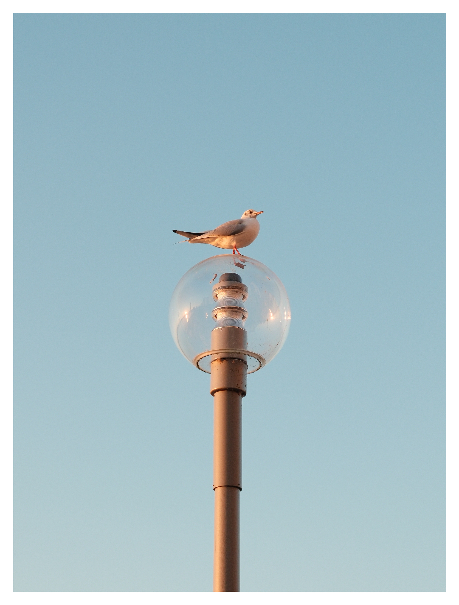
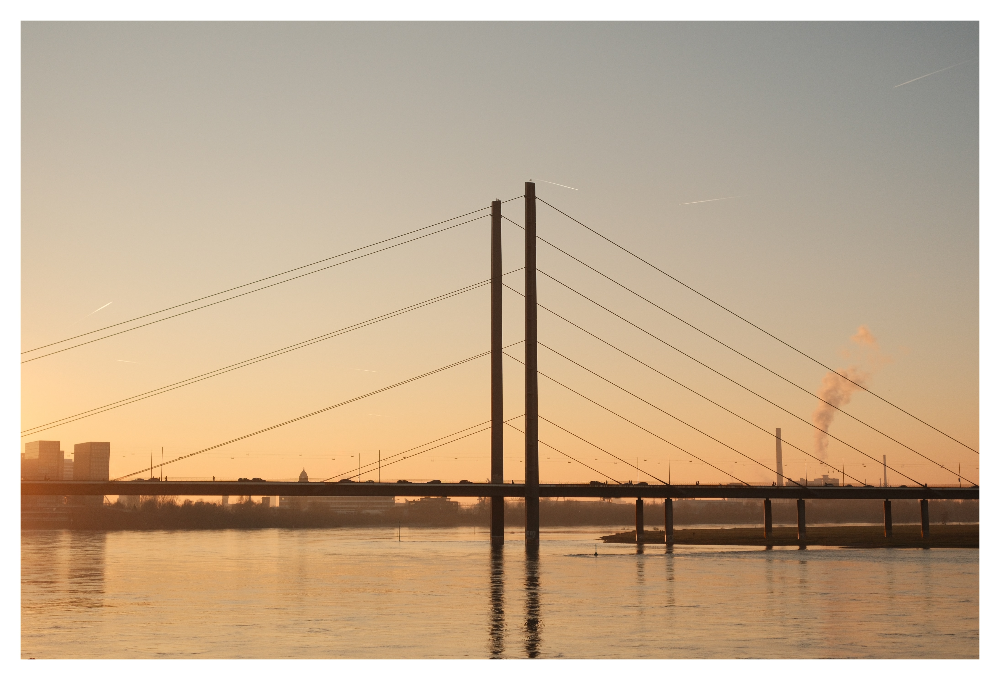
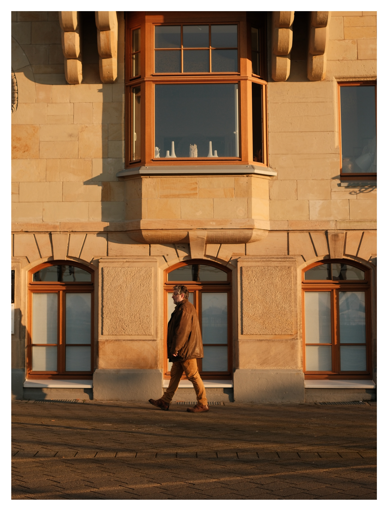
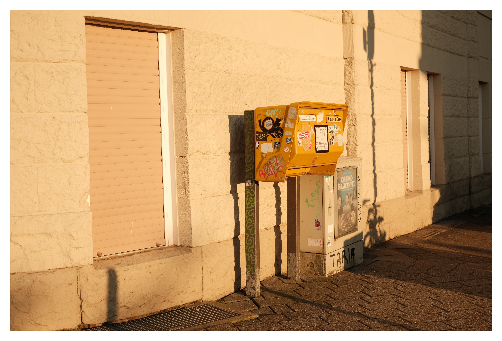

### Reflexões sobre a importância de ter um hobby que difere do seu trabalho.

Antes de mais nada, algumas novidades:

1. **[Componentes Design 2.0](https://componentes.design/)** está no ar
2. Aula sobre **[Tabelas](https://componentes.design/aulas/tabelas)**
3. Aula sobre **[Accordions/Collapse](https://componentes.design/aulas/collapse-accordion)**
4. Aula sobre **[Alertas e Mensagens](https://componentes.design/aulas/alerta)**

Sou de uma geração de designers que começou a trabalhar com isso quando o design ainda não era visto como uma profissão rentável ou importante. Parecia mais com um hobby criativo do que uma carreira profissional.

Por anos, o meu “design” não gerou nenhum retorno financeiro. Mesmo assim, eu persistia, movido pelo prazer de criar e pelo entusiasmo de melhorar minhas habilidades. Era uma satisfação pessoal que bastava para me manter motivado.

Com o tempo, o que era um hobby transformou-se no meu trabalho. E meu trabalho deixou de ser apenas entretenimento. Essa transição foi tão natural que mal percebi o momento em que uma coisa deixou de ser o que era e tornou-se algo totalmente diferente.

A vida, com suas exigências, nos empurra para novas jornadas. Boletos e responsabilidades aparecem, e aquilo que antes era apenas um passatempo torna-se o sustento da sua família.

## Meu trabalho ainda é meu hobby?

Eu diria que depende. O sentimento de criar algo para um cliente é diferente de criar algo para mim mesmo. Quando me envolvo em algum projeto pessoal, parece que voltei ao tempo onde design era apenas meu hobby.

Contudo, ainda assim o sentimento não é a mesma coisa. Talvez porque meus projetos pessoais acabam, de alguma forma, sendo monetizados de alguma maneira. Isso me faz pensar que hobbies com finalidades financeiras perdem, de certa maneira, a sensação de serem apenas hobbies.

Quando eu comparo design com a fotografia, que tem sido meu hobby nos últimos anos e que ainda não monetizei de alguma forma (o que não significa que eu já não tenha pensado na ideia), eu sinto o mesmo entusiasmo de quando comecei no Design.

## A sensação do desconhecido

Sabe aquela entusiasmo de descobrir algo novo e se empolgar com cada pequeno progresso? É isso que sinto todas as vezes que saio para fotografar e volto pra casa com fotos legais.

Tenho medo de que, ao começar a monetizar minhas fotos, meu hobby se torne um trabalho e deixe de parecer apenas um hobby.

Meu lado monetizador sempre sussurra nos meus ouvidos “isso daria um belo quadro, ein!” ou “já pensou em jogar todas as fotos em um shutterstock da vida meu campeão?".

A sensação de não saber nada sobre o assunto é o que me motiva a continuar estudando todos os dias um pouco mais sobre o assunto. Meu objetivo é de um dia, com toda a humildade possível, encontrar a maestria nessa atividade.

## Porque eu tenho um hobby?

Para muitos, hobbies são uma forma de escapismo. Um refúgio de trabalhos exaustivos ou de uma vida sem sentido.

No meu caso, estou bem satisfeito com meu trabalho atual e meus projetos paralelos. A fotografia virou meu hobby porque eu não suporto a ideia de viver uma vida inteira fazendo apenas uma única coisa como alguns designers que só conseguem falar sobre design e transformam sua identidade inteira ao redor de sua profissão.

Eu estou nos meus 30 e poucos anos e me arrepia até o último pelo do corpo pensar em resumir minha existência para apenas o cara que fazia interfaces bonitas.

## Qual será o meu próximo hobby?

Está aí uma ótima pergunta. Eu sou o tipo de pessoa que não se compromete com algo se não for para ficar bom naquilo. Então meus hobbies tendem a durar vários anos.

Posso dizer com certeza que a fila de coisas que gostaria de aprender é bem grande. Vou listar algumas delas e você me diz quais são as suas nos comentários.

**Marcenaria:** quero aprender a fazer pequenos móveis e materializar algumas ideias que tenho em mente usando madeira e outros materiais.

**Impressão 3D:** esse é um hobby que está bem próximo de acontecer. Ainda esse ano quero investir em uma impressora e começar a produzir produtos. Esse hobby tem grande potencial de ser monetizado e deixar de ser hobby.

**Designer de jóias:** já tive uma prévia experiência nessa área como investidor e agora quero experienciar colocar a mão na massa para criar anéis e outros acessórios.

**Montanhismo:** admiro quem dedica meses para escalar montanhas desafiadoras, com todos os riscos envolvidos. Ainda vai demorar, mas desejo enfrentar algumas antes de morrer (ou talvez morrer escalando – vai saber!).

Existem outras coisas que eu quero fazer, mas elas são mais voltadas para novos negócios do que efetivamente hobbies.

## Qual o seu hobby?

O que você faz somente pelo prazer de fazer?

Quem é você além do trabalho que você desempenha?

Pense nisso.

## Quantos cafés essa edição merece?

Se você gostou muito dessa edição e quiser me fazer feliz é só patrocinar um cafézinho pra mim aqui na Alemanha. Toda edição patrocinada eu faço questão de trazer uma foto e o nome dos bem feitores. ♥️

**Merece: **

- **[1 café](https://componentes-de-ui-design.lemonsqueezy.com/buy/57e29feb-5217-4e6f-996c-68242d56dd6d?media=0&discount=0) ☕️**
- **[1 café + 1 croassaint](https://componentes-de-ui-design.lemonsqueezy.com/buy/57e29feb-5217-4e6f-996c-68242d56dd6d?media=0&discount=0&quantity=2) ☕️ + 🥐**
- **[ 1 café + 1 croassaint + 1 docinho](https://componentes-de-ui-design.lemonsqueezy.com/buy/57e29feb-5217-4e6f-996c-68242d56dd6d?media=0&discount=0&quantity=3) ☕️ + 🥐 + 🍩**

## O que achei por aqui

1. **[Como influenciar a estratégia sendo um Product Designer](https://blog.designary.com/p/how-to-influence-strategy-as-a-product)**
2. **[Case Study sobre o Uber Eats](https://builtformars.com/case-studies/uber-eats-returns)**
3. Não sei como descrever **[esse artigo](https://www.astralcodexten.com/p/trapped-priors-as-a-basic-problem)**, mas ele é muito bom.
4. Um **[artigo interativo](https://ciechanow.ski/)** com tudo sobre a Lua
5. **[Inspotype](https://www.inspotype.com/)** é uma ferramenta que te ajuda a visualizar typefaces em uso.
6. **[Color Match](https://colormatch.jayas.me/)** é um joguinho para você procrastinar seu trabalho (avisado foi)
