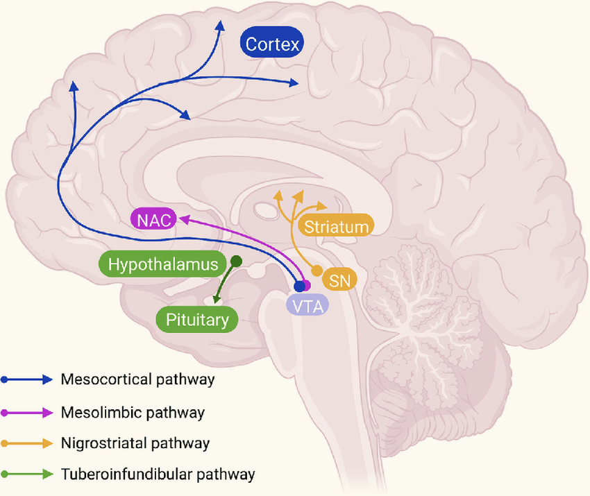
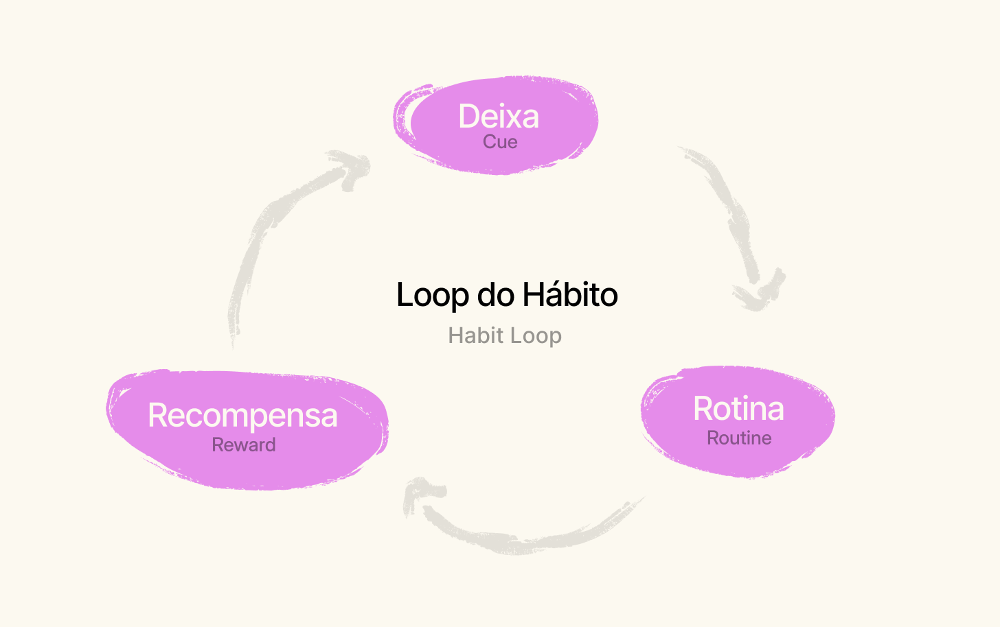
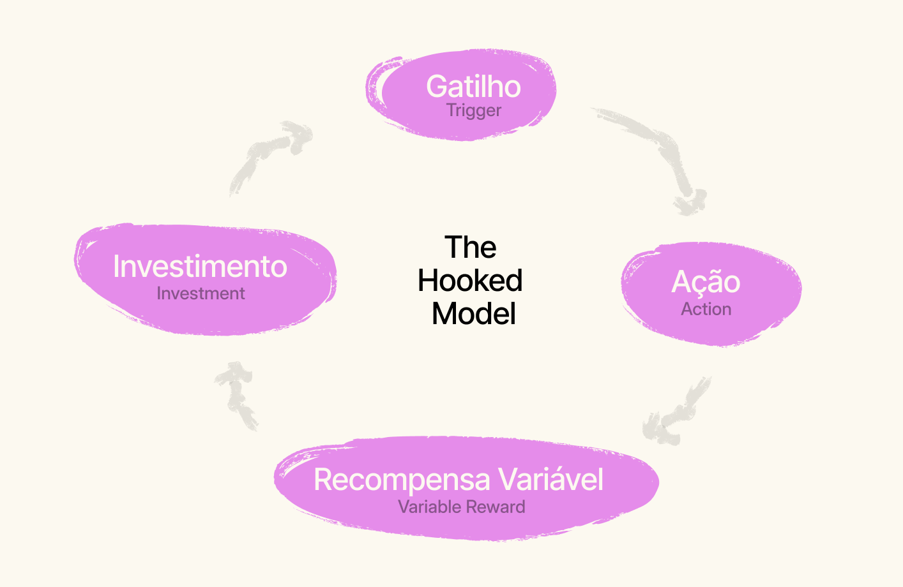
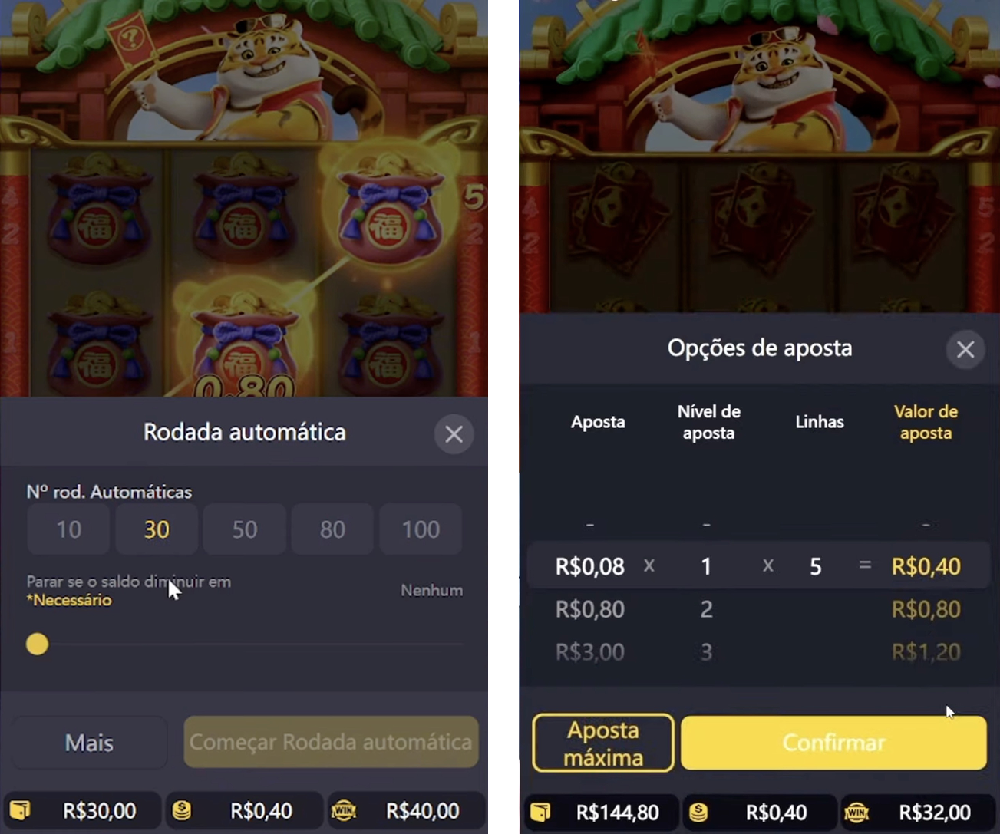
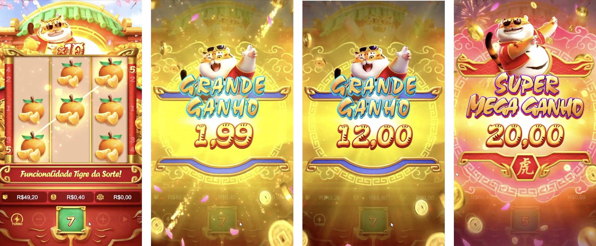
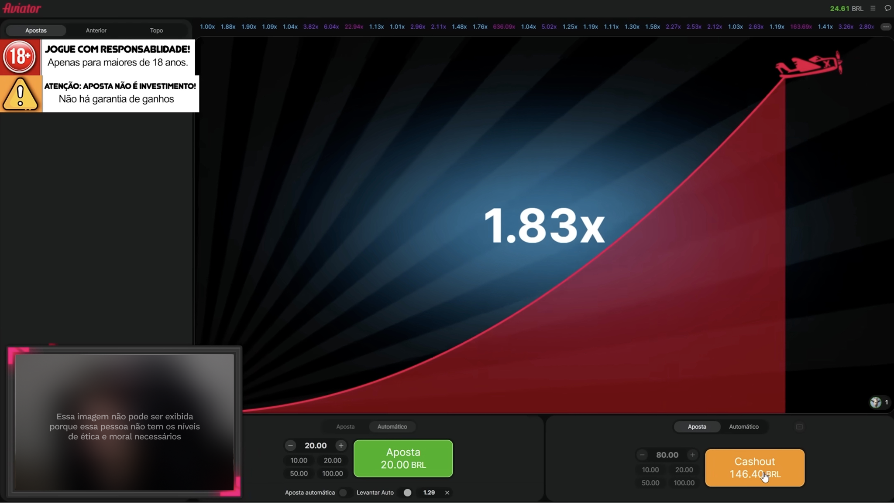
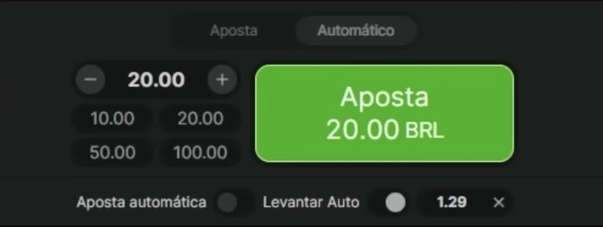
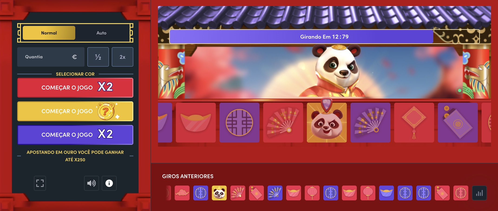
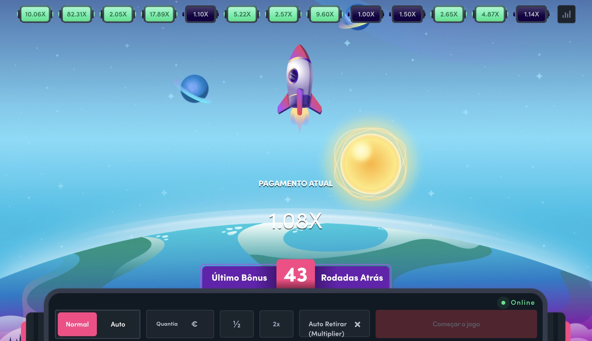

### Como nosso cérebro funciona e como as empresas utilizam de modelos mentais, vieses cognitivos e outros mecanismos para fod*r a vida das pessoas.

Antes de você pular para o conteúdo, confira o que rolou na minha vida desde a última edição da Stoa:

- Lancei o livro **[Tipografia & Interface](https://www.editorabrauer.com.br/livros-de-design/tipografia-e-interface)** pela Editora Brauer.
- Estou planejando conteúdos diferentes para meu **[canal](https://www.youtube.com/@willianmatiola)**.

De acordo com um estudo do Banco Central realizado em agosto de 2024, estima-se que, apenas naquele mês, empresas classificadas como casas de apostas receberam mais de **R$ 20 bilhões** via Pix. O levantamento também aponta que a maioria dos apostadores está na faixa etária entre 20 e 30 anos. Entre os mais jovens, o valor médio mensal enviado é de cerca de **R$ 100**; entre os mais velhos, esse valor salta para **R$ 3.000**. Ainda segundo os dados, aproximadamente 24 milhões de pessoas participaram de jogos de azar e apostas nesse período — entre elas, 5 milhões são beneficiárias do programa Bolsa Família.[1](#footnote-1)

Por trás desses números, há uma realidade bem triste: pessoas estão perdendo amigos, vínculos familiares, patrimônio, dignidade – e em casos extremos, até a própria vida[2](#footnote-2) – por não conseguir escapar do vício em apostas. Um vício alimentado por técnicas sofisticadas de persuasão e por elementos de design criados intencionalmente para manter o usuário jogando, a qualquer custo.

Essa edição será mais longa que o normal e peço que leia com atenção. Vou me esforçar para ser o mais didático possível ao abordar como o sistema de recompensas cerebral funciona, como hábitos são formados, de que forma o design é utilizado para reforçar esses comportamentos compulsivos e também sobre o dilema ético e moral dos designers que trabalham nesse setor.

## Sistema de Recompensas

Para compreender como hábitos e vícios se formam é necessário entender como o sistema de recompensas do cérebro funciona em nível químico.

Nosso cérebro possui um conjunto de estruturas que são ativadas sempre que experienciamos algo recompensador como comer um sorvete delicioso, fazer sexo ou usar drogas aditivas.

Essa ativação ocorre quando o cérebro, ao ser exposto por esse estímulos recompensadores, libera uma grande quantidade de **dopamina** – um neurotransmissor associado com a antecipação de **recompensas** e **prazer**. O principal caminho que a dopamina percorre para atingir essas estruturas é chamado de **via dopaminérgica mesolímbica**.

Imagine que a dopamina é como um barquinho, navegando por um sistema de rios que conecta diferentes “portos” dentro do cérebro. Um dos principais rios dessa jornada é a via dopaminérgica mesolímbica, e um desses portos onde a dopamina passa é o **Núcleo Accumbens** – uma área associada com motivação e recompensas que faz parte de um complexo circuito envolvendo a **amígdala** (que adiciona um peso emocional ao estímulo) e ao **hipocampo** (que fornece contexto baseado em experiências passadas).

Quando a dopamina chega no Núcleo Accumbens, o cérebro recebe o sinal de que o estímulo foi bom e recompensador e que por isso deve ser repetido. A amígdala, por sua vez, reforça essa sensação de prazer atribuindo emoções a essa recompensa (*aiiin que delícia, quero mais!*), já o hipocampo registra essa memória e aprendizado satisfatório (*lembra daquela sensação gostosa? Então…precisamos repetir!*).

O Instagram é um bom exemplo desse processo: ao rolar o feed do Instagram somos expostos a diversos conteúdos (**estímulos**) e quando encontramos algo interessante ficamos felizes (**dopamina liberada**). Para continuar com essa sensação de felicidade, continuamos rolando o feed indefinidamente até encontrar novas recompensas (criando um loop). Esse mecanismo é conhecido como **Loop do Hábito** ou também como **The Hooked Model**.

Embora apresentem pequenas diferenças, os dois modelos explicam o que vimos anteriormente por uma lente mais sócio-comportamental. Veremos a seguir os componentes de cada um e como eles são úteis para entender a formação de hábitos ou vícios em nossas vidas.

Mas antes, pausa para você contemplar meu livro:

[Saiba mais →](https://www.editorabrauer.com.br/livros-de-design/tipografia-e-interface)

## Loop do Hábito e The Hooked Model

Ambos os modelos descrevem de maneira simples o processo comportamental pela qual as pessoas engajam em hábitos e acabam criando vícios.

Assim como qualquer ferramenta, esses modelos podem ser utilizados para ajudar as pessoas a trocarem hábitos ruins por hábitos bons ou utilizados por empresas para sequestrarem a atenção de seus usuários fazendo com que passem mais tempo em seus produtos ou serviços.

### Loop do Hábito

Vamos começar pelo Loop do Hábito[3](#footnote-3), um conceito introduzido pelo jornalista Charles Duhigg em seu livro “**[O Poder do Hábito](https://amzn.to/4l1Gbp1)**” lançado em 2012 que possui 3 componentes principais: **cue** (a deixa), **routine** (rotina) e **reward** (recompensa).

1. **Cue:** é o gatilho que inicia um comportamento habitual e pode assumir diferentes formas: pode ser um local, um tempo, estado emocional, pessoas ao nosso redor ou qualquer estímulo que iniciará os eventos seguintes.

1. **Routine:** se refere ao hábito ou ao comportamento repetitivo. Pode ou não ser algo que você está ciente, como ir à academia todos os dias às 8h da manhã ou levantar sempre com o pé esquerdo.
2. **Reward:** recompensas se referem ao que o comportamento faz por você, ou seja, o que você recebe em troca por ter executado o hábito ou rotina. As recompensas são fundamentais para reforçar as rotinas e manter o hábito firme.

**Exemplo de um loop do hábito:** todos os dias eu levanto (**cue** é o horário), tomo café e vou direto para o computador. A primeira coisa que eu faço é ver todos os sites de inspiração que tenho nos meus favoritos (**routine**) em busca de coisas bonitas para eu salvar no meu My Mind (**reward**).

### The Hooked Model

Já o The Hooked Model[4](#footnote-4)** **é um modelo proposto por Nir Eyal em seu livro **[Hooked](https://amzn.to/4mYBMoA)**, publicado em 2014.

Ele é parecido com o loop do hábito, sendo composto por 4 componentes principais: **trigger** (gatilho), **action** (ação), **variable** **reward** (recompensa variável) e **investment** (investimento). Diferente do primeiro modelo, esse foi desenvolvido para o cenário de produtos digitais e utiliza mecânicas de jogos e de apostas para criar produtos que fisgam (hook) a atenção do usuário.

Alguns críticos[5](#footnote-5) apontam que seu livro ajudou pessoas com objetivos obscuros no cenário tecnológico a criarem produtos que viciam seu usuários. Ironicamente, seu segundo livro se chama “*Indistractable*” e ensina técnicas para você sair do “*hook*” ensinado no primeiro livro.

Será que a consciência do autor pesou ou ele só quer criar um loop de dinheiro caindo na sua conta bancária?

1. **Trigger:** é a ação que desencadeia o comportamento. Esses gatilhos podem ser externos (notificação, email, um link, etc) ou internos (emoções). Quando um usuário recebe um gatilho externo pode acabar criando uma associação emocional que então vai desencadear um gatilho interno. Imagine, por exemplo, que você recebeu uma notificação de mensagem no Instagram de alguém que você gosta (estímulo externo) e isso te deixou muito feliz a ponto de abrir a mensagem (interno).
2. **Action: **assim que um gatilho acontece, vem a ação. E para que essa ação seja executada, designers farão com que ela seja realizada da maneira mais simples possível. Isso mexe com dois aspectos fundamentais do comportamento humano: **motivação** e **habilidade**. Em outras palavras, se sou hábil para executar isso, logo me sinto motivado por ter completado a tarefa com sucesso.
3. **Variable Reward:** a recompensa variável, diferente de um feedback comum, adiciona um componente importante para fisgar os usuários: a **imprevisibilidade**. Como vimos anteriormente, nosso cérebro libera dopamina pela antecipação da recompensa. Sendo assim, quando executamos uma ação estamos liberando esse neurotransmissor poderoso porque esperamos uma recompensa em resposta. É por isso que jogos de apostas são tão viciantes! Você nunca sabe quando vai ganhar, mas fica ansioso por esse momento e continua tentando.
4. **Investment:** é nessa fase que o usuário é solicitado a fazer algum tipo de investimento com a empresa. Elas podem solicitar o fornecimento de dados, algum tipo de esforço, capital social ou até mesmo dinheiro (rawwrr 🐯). Isso acontece porque o cérebro do usuário ainda está inundado por dopamina devido ao passo anterior e isso aumenta a probabilidade de realizar esse investimento para ampliar sua experiência com o produto ou serviço.

Esses modelos estão presentes em praticamente todos os produtos ou serviços que utilizamos hoje em dia.

Se observarmos com atenção, veremos que as redes sociais fazem isso quando criam rolagens infinitas, ou quando precisamos pagar para desbloquear bônus em jogos, ou até mesmo em streamings de vídeo quando eles exibem o próximo episódio de uma série sem que façamos qualquer esforço.

Para que cada uma dessas etapas seja bem sucedida tem alguém por trás pensando nas melhores maneiras de explorar **modelos mentais**, **heurísticas** e **vieses cognitivos** capazes de moldar nossos comportamentos.  E é sobre isso que veremos a seguir.

## Modelos Mentais, Heurísticas e Vieses Cognitivos

Vimos até agora como hábitos ou vícios são formados quimicamente dentro do cérebro e como eles podem ser vistos pela lente do comportamento. Agora precisamos entender outros três aspectos importantes que impactam diretamente os nossos comportamentos: modelos mentais, heurísticas e vieses cognitivos.

### Modelos Mentais

Em design de experiência, modelos mentais são crenças que usuários possuem sobre o funcionamento de um sistema (web, app, ou qualquer outro tipo de produto). Esses modelos são construídos com base em padrões encontrados pelos usuários a medida que eles experienciam serviços e produtos. [6](#footnote-6)

Designers estão constantemente utilizando modelos mentais para criar produtos **familiares** para os usuários. Essa familiaridade reduz a carga cognitiva necessária para processar decisões e elimina barreiras que impediriam os usuários de terem uma boa experiência.

Modelos mentais **mudam** ou são completamente **substituídos** constantemente a medida que novas tecnologias aparecem. Usuários mais antigos, por exemplo, tinham como modelo mental para “salvar arquivos” o ícone de disquete 💾. Hoje, esse modelo mental foi substituído por uma seta apontando para baixo e metáforas similares.

### Heurísticas

Uma heurística é um atalho cognitivo ou um conjunto de regras práticas que simplificam a tomada de decisão, especialmente em condições de incerteza. É basicamente um “faça isso” se “isso” acontecer.  Em outras palavras, "são estratégias cognitivas que simplificam problemas complexos, permitindo soluções mais rápidas, embora nem sempre ideais."[7](#footnote-7)

A relação entre modelos mentais e heurísticas é complementar: os modelos mentais provém a **estrutura** para entender o mundo, como os sistemas funcionam e como as variáveis interagem, enquanto heurísticas fornecem a **velocidade** para navegar nesse mundo, nos permitindo tomar decisões rapidamente e sem a necessidade de uma análise super detalhada.

### Alguns exemplos de heurísticas:

1. **Heurística da disponibilidade:** julgamos a probabilidade de eventos com base na facilidade com que os exemplos nos vêm à mente. Se você vê influenciadores divulgando ganhos em jogos de apostas o tempo todo, pode superestimar a probabilidade de você também obter ganhos, embora saibamos que isso é improvável.
2. **Heurística da Ancoragem:** confiamos muito na primeira informação que recebemos (a "âncora") ao tomar decisões. Em jogos de apostas, talvez o simples fato de você obter um ganho em sua primeira jogada ancora sua percepção de que você é bom naquilo, levando-o a apostar novamente.
3. **Heurística do Afeto:** fazemos julgamentos com base em nossas reações emocionais. Se influenciadores mostram como é bom e fácil ganhar dinheiro apostando e isso evoca emoções positivas, é mais provável que percebemos as apostas online como um meio válido para alcançar esse objetivo mesmo que as estatísticas provem o contrário.
4. **Heurística do Reconhecimento:** presumimos que, se reconhecemos uma opção, mas não outras, a opção reconhecida é superior. Isso explica por que as empresas de apostas online investem em reconhecimento de marca. Se seu time de futebol favorito é patrocinado por uma bet, é mais provável que você aposte por ela ao invés de procurar outras alternativas.

Existem inúmeras outras heurísticas por aí. Todas operam, na maior parte do tempo, de maneira automática moldando nossos julgamentos e decisões. Embora elas não sejam necessariamente ruins, quando modelos mentais e outros atalhos desviam nosso julgamento da racionalidade, estamos operando na base dos vieses cognitivos.

### Vieses Cognitivos

Podemos dizer que vieses cognitivos são heurísticas desviadas de sua norma ou racionalidade. É como se a pessoa criasse sua própria “realidade subjetiva” levando a uma distorção perceptiva, julgamento pouco acurado, interpretação ilógica ou irracionalidade.[8](#footnote-8)

Alguns desses vieses são bem conhecidos, como é o caso do **viés de confirmação** em que os indivíduos procuram confirmar sua visão de mundo ou opiniões somente com base naquilo que reforça essa visão. Ou o **viés de ancoragem**, que molda nossa percepção de acordo com a primeira informação disponível sobre algo.

Esses e outros vieses são amplamente utilizados em design digital para explorar essas falhas de julgamento dos usuários e se beneficiar de sua “irracionalidade”. Essa técnica é conhecida como ***dark pattern*** ou ***deceptive design***.

No mundo dos aplicativos de apostas isso é levado a um nível muito maior, afinal, quanto mais familiar, mais engajado e mais suscetível a irracionalidade, mais dinheiro é perdido por usuários que pensam que estão no controle.

Antes de vermos como isso se manifesta visualmente nas interfaces, vamos entender os vieses cognitivos mais comuns utilizados pelas bets.

1. **Gambler’s Fallacy**[9](#footnote-9)(falácia do apostador): “A falácia do apostador descreve nossa crença de que a probabilidade de um evento aleatório ocorrer no futuro é influenciada por instâncias anteriores desse tipo de evento”. É o famoso “*Rapaz, eu acabei de ganhar cinquentão na minha primeira tentativa. Eu devo ser muito bom! Com certeza vou ficar rico apostando*”.
2. **Cashless Effect**[10](#footnote-10): descreve nossa tendência de estarmos mais propensos a pagar por algo quando não há dinheiro físico envolvido. É por isso que apps de bet facilitam ao máximo o envio de Pix ou transferências bancárias para colocar saldo na carteira.
3. **Ilusão de Controle:** descreve como acreditamos ter mais controle sobre eventos do que realmente temos. Mesmo quando algo é puramente aleatório pensamos que somos capazes de influenciar o evento de algum maneira. Nas bets, mesmo que seja evidente que o jogo sempre vai beneficiar a casa devido a sua natureza programática, muitas pessoas acreditam que possuem técnicas infalíveis que os fazem ganhar mais que os outros jogadores.Exemplo de um influenciador otário tentando enganar os outros
4. **Viés do Otimismo:**[11](#footnote-11) descreve nossa tendência de superestimar a probabilidade de experienciar eventos positivos e subestimar os eventos negativos. É o famoso “a esperança é a última que morre” e pode aparecer em conjunto com o viés anterior. Nos apps de apostas, esse viés pode ser facilmente explorando quando a máquina deixa o apostador ganhar recompensas aleatórias (variable reward) para reforçar seu otimismo e ilusão de controle.
5. **Viés da Autoridade:**[12](#footnote-12) descreve nossa tendência de sermos mais influenciados pelas opiniões e julgamentos de figuras de autoridade (ou influenciadores) mesmo que eles estejam errados. Esse viés leva as pessoas a tomarem decisões sem raciocinarem criticamente sobre as consequências apenas porque a dica ou conselho vem de uma pessoa na qual eles respeitam ou veem como autoridade.
6. **Viés do Comprometimento**[13](#footnote-13): descreve nossa tendência de permanecermos comprometidos em comportamentos passados mesmo que eles não façam mais sentido. Especialmente quando investimos tempo e dinheiro em alguma coisa. Não importa se você já perdeu R$1.000 reais em apostas, você acha que se continuar jogando vai conseguir recuperar tudo.

Existem muitos outros **[vieses cognitivos](https://thedecisionlab.com/biases)** que poderíamos trazer para o contexto de apostas online mas para não tornar essa edição maior do que já está, vamos parar por aqui.

Acredito que já deu para entender como nossa mente pode ser facilmente hackeada para se comportar de maneira “irracional”.  E as bets sabem muito bem disso e aplicam todo esse conhecimento em suas interfaces e experiências para manter os apostadores presos em um eterno loop da desgraça.

## Interfaces dos jogos de apostas

Agora veremos algumas maneiras de como esses mecanismos são traduzidos para uma interface de jogo de aposta com o objetivo de fisgar os usuários e mantê-los engajados em comportamentos viciantes. E se você quiser ver outras maneiras recomendo o vídeo do **[Andrey Knabben](https://youtu.be/L0pXB0v_O7s?si=ixtNlABfTizZxrUp)** sobre o assunto.

### Remoção de barreiras

Uma das práticas mais comuns é a remoção de qualquer atrito que possa bloquear o comportamento ou vício. No exemplo a seguir podemos ver que ativar rodadas automáticas é extremamente simples, fazendo com que sua expectativa pela recompensa seja aumentada em 10x, 30x ou até 100x.

Na segunda imagem vemos como é fácil aumentar o valor da aposta: basta rolar a lista e clicar no botão confirmar.

Toda essa falta de fricção faz com que “jogar” seja muito mais simples e divertido.

### Estímulos visuais e sonoros

A utilização de gráficos super coloridos e cheio de efeitos aliados a estímulos sonoros torna esses jogos altamente viciantes. Ambos ajudam a estimular a antecipação de recompensas.

Ao rodar a roleta os sons e gráficos geram a antecipação da recompensa e quando o ganho variável é obtido vemos uma enorme celebração cheia de efeitos, cores e sons que incentivam você a continuar jogando.

### Vieses na prática

Começando pelos números na parte superior que ajudam a reforçar o viés da **Falácia do Apostador**, em que as pessoas acreditam que a probabilidade de um evento aleatório ocorrer no futuro é influenciada por instâncias anteriores desse tipo de evento.

Esses números ajudam a criar a falsa sensação de controle e estratégia, levando as pessoas acreditarem que a próxima rodada será melhor porque a sequência de resultados anteriores mostram um certo “padrão”.

O gráfico criado pelo avião também dá a falsa sensação de que a recompensa é enorme.

Na parte inferior podemos ver a **remoção de barreiras** por meio das apostas automáticas e um sistema de **ancoragem** que facilita a escolha do valor da aposta: R$10, R$20, R$50 e R$100. Os valores de R$10 e R$20 não parecem muita coisa quando temos o de R$50 e R$100 no mesmo grupo.

Outra coisa feita de propósito é a remoção do cifrão dos valores. É provável que a dor por gastar o dinheiro seja diminuída pois não percebemos estes valores como monetários. Esse tipo de viés também é aplicado em menus de restaurantes, que removem o cifrão para aliviar a dor de gastar com as refeições[14](#footnote-14).

Na imagem a seguir também temos os giros anteriores na parte inferior que reforçam a **Falácia do Apostador**, mas o que chama mais atenção são os 3 botões no lado esquerdo.

Perceba que o botão amarelo é o único que se diferencia em termos de estrutura. E a frase logo abaixo do botão roxo diz que a chance de ganhar com a aposta ouro é até 250x maior. Quem não gostaria de aumentar as chances em 250x?

Isso é mais um exemplo de **ancoragem**, pois você usa duas opções inferiores para aumentar o valor daquela que você quer que o usuário escolha.

A imagem a seguir é praticamente igual a todas as outras em termos estruturais, mas com uma roupagem diferente e divertida.

Essa estética lúdica faz parecer que estamos de fato jogando um jogo casual e que não há perdas reais de dinheiro.

As cores utilizadas, os efeitos gráficos, os sons e todos esses elementos de UI não são assim por acaso. Cada um deles tem o papel fundamental de reforçar os desvios de racionalidade que vimos anteriormente. Todas essas decisões foram desenhadas por algum designer que entende bem o que está fazendo.

## Dilema moral do designer

Embora eu já tenha escrito sobre os **[dilemas éticos e morais do designer](https://www.stoa.news/p/051)** em outra edição, quero fazer aqui um recorte mais preciso que foca nos designers que atuam em empresas de bet.

Não me importa muito se sua decisão em atuar nesse segmento foi necessidade, falta de melhores opções ou apenas falha de caráter. Isso não muda o fato de que você é uma das engrenagens que contribuem para essa máquina de destruição de vidas.

O dilema, no final das contas, é muito simples: continuar contribuindo com esse mercado predatório e fechar os olhos para os efeitos danosos e todas as vidas destruídas ou buscar um segmento diferente para exercer seu trabalho?

E não adianta criar desculpas para diminuir seu impacto nesse processo. Usar argumentos de que a casa que você trabalha é regulamentada ou que ela possui iniciativas para minimizar as perdas dos usuários não exclui o fato de que o **objetivo principal** de uma empresa como essa é sempre **aumentar o seu faturamento** com a **perda** dos seus usuários.

Talvez você pode argumentar que toda empresa, no final das contas, tem exatamente o mesmo objetivo. E eu não discordo de você. O mundo capitalista incentiva e promove esse tipo de resultado e muitas vezes nos força a escolher a opção que trará menos danos para as pessoas.

Hoje eu trabalho para empresas nas quais não compartilho da mesma visão de mundo, nem atendem as pessoas que eu gostaria que atendessem, ou que são acessíveis para todos como eu gostaria que fossem. Mas pelo menos elas ainda tem como objetivo melhorar a vida das pessoas de alguma maneira, ao contrário de empresas de apostas em que o principal objetivo é criar a ilusão de que você pode mudar de vida apostando seu dinheiro.

Foi para isso que você dedicou milhares de horas estudando design?

Se chegou até aqui, considere deixar sua opinião nos comentários, curtir e compartilhar nas suas redes sociais.

Grande abraço e até a próxima!

## Gostaria de retribuir com uma gentileza?

Se você gostou muito dessa edição e quiser me fazer feliz é só patrocinar um cafézinho pra mim aqui na Alemanha. Toda edição patrocinada eu faço questão de trazer uma foto e o nome dos bem feitores. ♥️

**[Patrocinar 1 cafézinho](https://componentes-de-ui-design.lemonsqueezy.com/buy/57e29feb-5217-4e6f-996c-68242d56dd6d?media=0&discount=0) ☕️**
