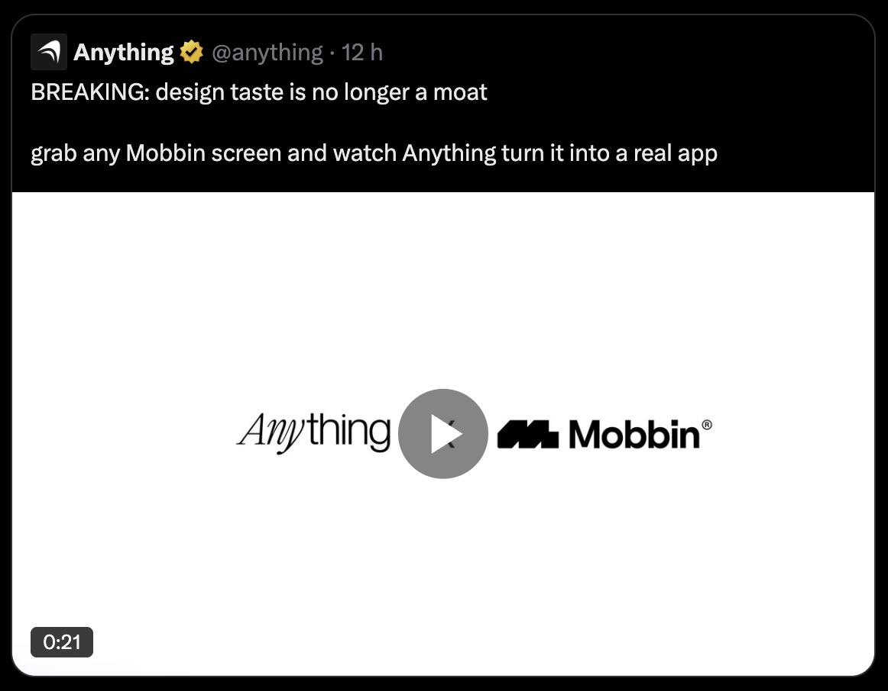
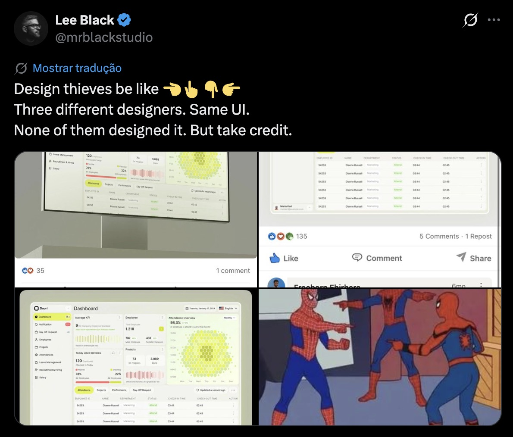

Eu vi no Xwitter uma ferramenta que permite você usar qualquer imagem do Mobbin para tornar essas imagens em apps reais. Parece mágica, mas por trás dessa proposta sedutora e da copy marketeira temos apenas o conceito de plágio sendo vendido como commodity.

Imagine que você passou meses desenhando um app com base em pesquisas, entrevistas, análises de fluxos e toda a sorte de técnicas e ferramentas para criar uma boa experiência do usuário. Aí sem mais nem menos alguém usa todas as telas que você gerou para criar um outro app sabe-se lá para o quê.

Isso soa justo ou ético pra você?

Me parece que a IA, além de escancarar a mediocridade de certos profissionais, também removeu o senso de ética. Talvez eles pensem que ao terceirizar o trabalho para uma desinteligência artificial o ônus de plagiar também é transferido a ela. É uma mistura de burrice com mau-caratismo que é até difícil de acreditar.

> Eu não matei ninguém, a arma que eu usei é que disparou a bala e atingiu a outra pessoa

Eu sinceramente não entendo qual a linha de raciocínio de alguém que decide conscientemente copiar o trabalho de outra pessoa pixel por pixel. Entendo muito menos quem posta isso e acha que está arrasando porque criou um app revolucionário em apenas 2 dias.

E veja bem, não estou falando da pessoa que usa outros trabalhos como inspiração ou referência. Que pega uma paleta de cores aqui, alguns estilos ali e depois mistura tudo e cria algo diferente. Isso não é plágio.

Eu estou falando daquela pessoa que se apropria do trabalho alheio.

> Trouxa é quem perdeu meses fazendo isso. Esperto sou eu que copiei tudo rapidinho.

Existe também o plagiador que ainda não está usando a IA para plagiar. Ele rouba o trabalho dos outros, posta como se fosse seu e quando é elogiado aceita os créditos por algo que não criou.

Esse tipo já está por aí há muitos anos, mas é ainda pior do que o primeiro porque ele nem sequer usou uma ferramenta ou gastou créditos para plagiar. No máximo usou um mockup para disfarçar porcamente o artefato plagiado. Gastou no máximo algum esforço cognitivo se é que existe algum.

Eu sei que esse tipo de gente é a minoria. Mas essa minoria, assim como qualquer vírus, é contagiosa. Quando esse tipo de coisa é normalizada e amplificada com ferramentas generativas, o senso de ética é a última coisa que passa pela cabeça do sujeito.

E poxa, não é difícil fazer a coisa certa. Na verdade, só tem duas maneiras de fazer qualquer coisa: do jeito certo ou do jeito errado. E plagiar não é, nem de longe, o jeito certo.

Às vezes sinto pena, porque esse tipo de pessoa jamais vai sentir a felicidade de materializar algo que estava apenas na mente e agora existe no mundo real (ou digital).

A mensagem que fica é: não seja um cuzão e crie seus próprios designs.  
A outra mensagem que fica é: não relativize esse assunto.  
E se você ainda não entendeu: plágio é crime segundo o artigo nº 184 do Código Penal brasileiro.

Com carinho e sem plagiar,  
Willian Matiola
