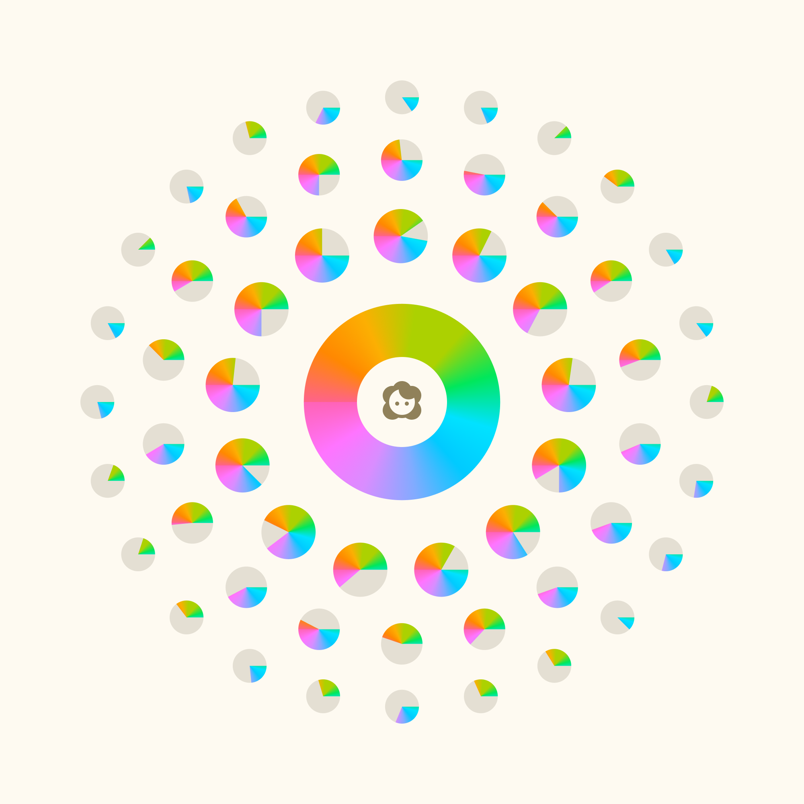

### Você não é sua profissão, muito menos seus hobbies, ou as coisas materiais que possui. Se por um acaso tudo desaparecesse repentinamente, o que sobraria?

Você já parou para pensar que a maneira como você se enxerga é totalmente diferente da maneira como seus amigos, familiares e conhecidos te enxergam? É como se não existisse apenas **você**, mas centenas, milhares ou talvez milhões de outros você. Todos eles vivendo simultaneamente na cabeça de muitas pessoas. Essa é a premissa de um livro que comecei a ler recentemente chamado “**Um, Nenhum e Cem Mil**” do romancista, poeta e dramaturgo italiano **Luigi Pirandello** (1867-1936), que narra as desventuras de Vitangelo Moscarda e sua obsessão em como os outros possivelmente o enxergam.

Você, que é uma das centenas de pessoas que está lendo esse texto agora, provavelmente tem uma visão sobre o Willian Matiola que não chega nem perto da visão que eu tenho de mim mesmo. E sem sombra de dúvidas difere muito de como meus amigos me enxergam. E mais ainda de como minha família me enxerga.

É como se eu fosse um espectro cheio de cores que podem ou não atingir você dependendo da proximidade e convivência que você tem comigo. Quanto mais longe de mim, menos cores, ou partes de quem eu sou, chegarão até você. São aquelas pessoas que acompanham meu trabalho ou ouviram falar de mim em algum lugar. Quanto mais próximo de mim, mais familiaridade você adquire, mais você entende minha maneira de ver o mundo, as coisas que gosto ou desgosto. Contudo, ainda assim, jamais chegará a entender todo o meu espectro cromático.

Também é interessante pensar que a visão que você tem de mim pode ser uma versão desatualizada. Ou pior ainda, que a versão que você tem de mim chegou até você por uma pessoa que carregava uma cópia desatualizada.

## Quem é você?

Você não é sua profissão, muito menos seus hobbies, ou as coisas materiais que possui.

Se por um acaso tudo desaparecesse repentinamente, o que sobraria? Esse é você.

Encarar essa realidade pode ser difícil, especialmente se você não admira quem você é. Mas também pode ser o primeiro passo para desenvolver uma versão melhor de si mesmo.

Você também não é o que as pessoas pensam sobre você. O que elas pensam é apenas um recorte bem pequenininho de uma ou mais interações que elas tiveram com o você do passado e que talvez nem exista mais.

E definitivamente você não é o que você **acha** que as pessoas pensam de você. É bem fácil cair na armadilha de pensar que uma pessoa não gosta de você porque você pensa que ela pensa que você é uma coisa que nem você pensa de si mesmo. Confuso, eu sei.

Mas então, você sabe quem você é?

## Quantos cafés essa edição merece?

Se você gostou muito dessa edição e quiser me fazer feliz é só patrocinar um cafézinho pra mim aqui na Alemanha. Toda edição patrocinada eu faço questão de trazer uma foto e o nome dos bem feitores. ♥️

**Quero patrocinar: **

- **[1 café](https://componentes-de-ui-design.lemonsqueezy.com/buy/57e29feb-5217-4e6f-996c-68242d56dd6d?media=0&discount=0) ☕️**
- **[1 café + 1 croassaint](https://componentes-de-ui-design.lemonsqueezy.com/buy/57e29feb-5217-4e6f-996c-68242d56dd6d?media=0&discount=0&quantity=2) ☕️+🥐**
- **[ 1 café + 1 croassaint + 1 docinho](https://componentes-de-ui-design.lemonsqueezy.com/buy/57e29feb-5217-4e6f-996c-68242d56dd6d?media=0&discount=0&quantity=3) ☕️+🥐+🍩**

## Lista de Coisinhas

1. Já me perguntaram algumas vezes se tem como apoiar a Stoa financeiramente e a resposta é sempre não porque esse nem é meu objetivo por aqui. Maaaas se você quiser muito retribuir de alguma maneira agora tem como **[pagar um cafézinho](https://buymeacoffee.com/stoawm)** pra mim. ☕️
2. Se você quiser espanar seus parafusos mentais com esse assunto, aqui está o livro **[Um, Nenhum e Cem Mil](https://amzn.to/3W8D2ZR)** na Amazon.
3. Fiquei com muita vontade de comprar um jogo de tabuleiro chamado **[Vicious Garden](https://www.kickstarter.com/projects/rossbruggink/vicious-gardens?ref=5oe7fv)**, feito pelo criador do estúdio **[Buddy Buddy](http://buddy-buddy.co/)** e que conta com uma direção de arte tão linda que dá vontade de emoldurar.
4. Essa semana conheci também o projeto **[Visual Journal](https://visualjournal.it/)** do designer italiano Alessandro Scarpellini, que faz uma curadoria visual sensacional.
