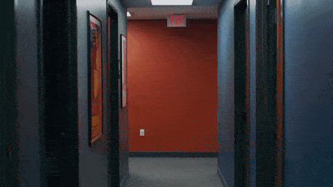
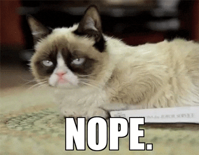
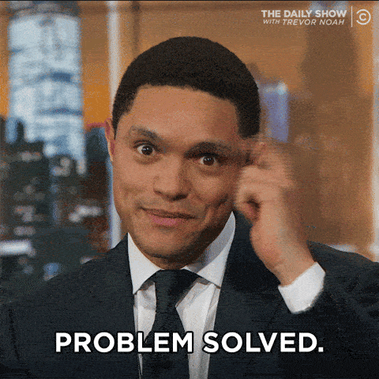

### Um desabafo sobre uma coisa que talvez seja irrelevante para você.

Antes de você pular para o conteúdo, confira o que rolou na minha vida desde a última edição da Stoa:

- Duas aulas novas no Componentes Design: **[Toggle](https://componentes.design/aulas/toggle)** e **[Select/Dropdown](https://componentes.design/aulas/select-dropdown)**
- Estou trabalhando numa página dedicada a **[mentorias](https://componentes.design/mentorias)**. Muitas pessoas me perguntam se dou mentoria e a resposta é sim! Em breve você vai poder agendar mentorias comigo sobre UI e outras coisas.
- Atualizei minha foto de perfil para algo mais profissional. A partir de hoje você vai me ver assim em todos os lugares:Oi!

## Quero ser teu amigo

Imagine que você é novo na área e quer fazer novos amigos.

Você avista algumas pessoas no seu trabalho, bairro ou qualquer outro cenário social e pensa que seria bacana se conectar com elas.

Então, em um belo dia, você cruza o caminho de uma dessas pessoas, se aproxima… e começa a segui-la. Sem dizer uma única palavra. Nenhum “oi”, nenhuma apresentação, absolutamente nada. Apenas passa a acompanhá-la silenciosamente.

Isso é estranho, não é? Bom, eu espero que você ache...

Agora, imagine outra situação: você está no LinkedIn e viu uma postagem super interessante. Então você decide enviar um convite de amizade porque gostaria de acompanhar mais conteúdos daquela pessoa. Mas você não escreve nada. Nenhuma introdução, nenhuma motivação do porque está solicitando amizade. Simplesmente e tão rápido quanto o relâmpago marquinhos você decide clicar no botão “Conectar”.

Conseguiu visualizar esses dois cenários?

Agora me responda: porque o segunda situação parece ser menos estranha do que a primeira? Quando foi que a cordialidade deixou de ser o mínimo esperado nas interações **com quem você não conhece**?

Porque você não dedica 30 segundos do seu tempo para escrever o **porque** de estar adicionando aquela pessoa?

Eu te garanto que, se você fizer isso, a primeira impressão que as pessoas terão de você será muito melhor.

## Eu não aceito mais convites

Peço desculpas se parece ranzinza da minha parte trazer esse assunto para a Stoa, mas acho necessário conversar sobre o que está acontecendo.

E essa é minha visão pessoal sobre o assunto. Que tem grandes chances de você não concordar e de achar que estou exagerando. Super justo.

Mas o fato é que hoje em dia eu não aceito nenhum convite de amizade se a pessoa não deixar um recado no pedido de amizade (alô tempos de Orkut).

Raras são as excessões em que eu aceito alguém ou envio convites de amizade sem alguma mensagem. Geralmente são pessoas que convivem ou interagem comigo de alguma maneira.

Se você tentou se conectar comigo no LinkedIn recentemente, saiba que há **95% de chances de eu ter recusado** o convite, e você ter virado um **seguidor** automaticamente.

Não leve para o pessoal, ok? Eu simplesmente não te conheço e você não se apresentou. Mas entendo que talvez só queira acompanhar meu conteúdo — e, nesse caso, tudo certo, seguimos assim.

Agora, se quiser conversar, é só avisar! A gente se conecta sem problema algum.

[Saiba mais →](https://www.editorabrauer.com.br/livros-de-design/tipografia-e-interface)

## Follow vs Connect

No LinkedIn, especificamente, temos duas formas de começar a interagir com alguém: ***follow*** (seguir) ou ***connect*** (conectar).

Se você não tem interesse de criar uma conexão com a pessoa e quer apenas seguir seus conteúdos, opte pelo botão **Follow**.

Se você quer criar networking, clique em **Connect** e deixe uma mensagem se apresentando.

Simples. Assim. 😮‍💨

Isso vale para qualquer rede social que tenha esse tipo de distinção.

E vou além! Se você quer realmente criar vínculos, experimente interagir ao invés de passivamente seguir alguém.

As vezes basta fazer essa simples gentileza para que novas oportunidades apareçam na sua vida.

## Quantos cafés pedidos de amizade essa edição merece?

Se você gostou muito dessa edição e quiser me fazer feliz é só patrocinar um cafézinho pra mim aqui na Alemanha. Toda edição patrocinada eu faço questão de trazer uma foto e o nome dos bem feitores. ♥️

**Merece: **

- **[1 café](https://componentes-de-ui-design.lemonsqueezy.com/buy/57e29feb-5217-4e6f-996c-68242d56dd6d?media=0&discount=0) ☕️**
- **[1 café + 1 croassaint](https://componentes-de-ui-design.lemonsqueezy.com/buy/57e29feb-5217-4e6f-996c-68242d56dd6d?media=0&discount=0&quantity=2) ☕️ + 🥐**
- **[ 1 café + 1 croassaint + 1 docinho](https://componentes-de-ui-design.lemonsqueezy.com/buy/57e29feb-5217-4e6f-996c-68242d56dd6d?media=0&discount=0&quantity=3) ☕️ + 🥐 + 🍩**

## O que achei por aqui

1. **[Subframe](https://www.subframe.com/)** – uma ferramenta de design e código
2. **[Remini](https://remini.ai/)** – uma IA para melhor qualidade de fotos e vídeos
3. **[Octupus](https://octopus.do/)** – um gerador de sitemap com base em URL sen-sa-cio-nal.
4. **[Biblioteca Conafer](https://biblioteca.conafer.org/colecoes/)** – vários livros muito legais para download
5. **[A sutil arte de projetar controles físicos em carros](https://www.theturnsignalblog.com/the-subtle-art-of-designing-physical-control-for-cars/)**
