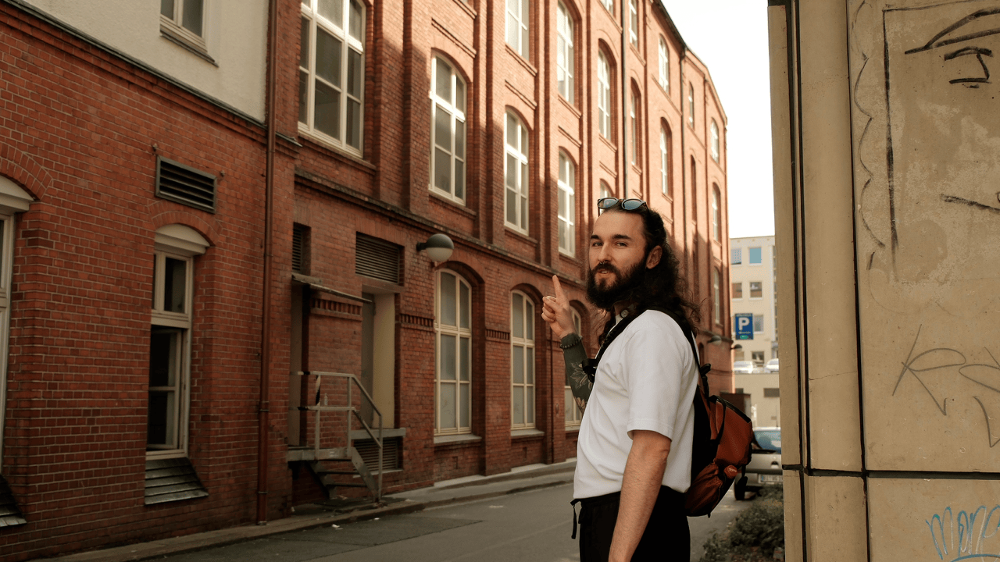

### Fotos são incríveis, mas há algo mais incrível ainda.

O que rolou desde a última edição:

- **[Basculante virou série em vídeo.](https://youtu.be/KG2i0vkmPwQ)**
- Fui promovido a Senior na agência.

Quando comecei a me interessar por fotografia de paisagens e street, lá em 2022, meu foco era me dedicar a um hobby que me tirasse de dentro de casa, afinal, **desde os 16 anos**, sempre passei a maior parte do meu tempo atrás das telas de computador.

Essa ânsia de sair e explorar a vida sempre esteve dentro de mim, mas por conta do trabalho ela foi deixada de lado por bastante tempo.

Com uma câmera na mão não havia mais desculpas. Se eu quisesse registrar coisas interessantes seria necessário explorar o mundo ao meu redor. E foi com esse ímpeto que minha paixão por fotografia floresceu.

Comecei a fazer o que as pessoas chamam de _photowalk_, que é basicamente andar por aí e registrar cenas que despertam sua atenção. Há quem se dedique a fotografar pessoas, outros preferem prédios, mas o que todos tem em comum é o registro da vida cotidiana.

Como alguns sabem, atualmente **moro na Alemanha**, e quase todos os finais de semana eu saio para conhecer alguma cidade ou vilarejo ao redor de onde vivo. E essas andanças já me proporcionaram fotos muito bonitas. Mas a fotografia, embora seja capaz de congelar momentos incríveis no tempo, começou a não ser mais suficiente pra mim.

Senti a necessidade de mostrar o que há por trás das minhas andanças. Quais são os lugares trilhados para registrar aquele momento único. Qual o motivo por trás da foto que estou tirando. Quais curiosidades esse lugar possui. E tantas outras coisas que ficam omitidas quando o único resultado é uma imagem estática.

Foi aí que decidi **registrar em vídeo meus rolês fotográficos**. Dessa forma eu consigo levar você junto comigo para lugares bem diferentes e te mostrar o resultado da minha visão sobre o mundo ao meu redor.

No**[primeiro vídeo publicado no meu canal](https://youtu.be/ENh4mwPGKJo)**, visitei a cidade de **Bielefeld** e, além de registrar fotos incríveis, acabei parando sem querer num **evento medieval**. Sim! Isso mesmo. A falta de atenção e uma fila de pessoas foram as culpadas! 😂

O vídeo tem uma pegada beeem **lo-fi**.

Recomendo assistir enquanto estiver lavando louça ou tomando seu café da manhã/tarde.

Eu espero que você me acompanhe nessas novas aventuras. ♥️

## Gostaria de retribuir com uma gentileza?

Se você gostou muito dessa edição e quiser me fazer feliz é só patrocinar um cafézinho pra mim aqui na Alemanha. Toda edição patrocinada eu faço questão de trazer uma foto e o nome dos bem feitores. ♥️

**[Patrocinar 1 cafézinho](https://componentes-de-ui-design.lemonsqueezy.com/buy/57e29feb-5217-4e6f-996c-68242d56dd6d?media=0&discount=0) ☕️**
