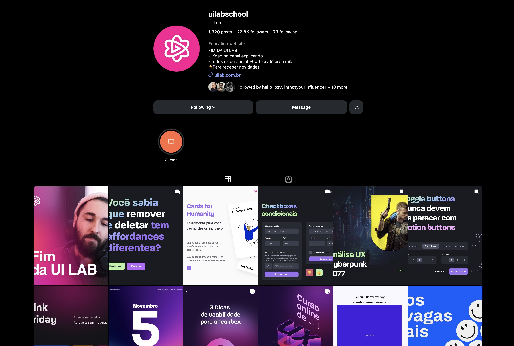
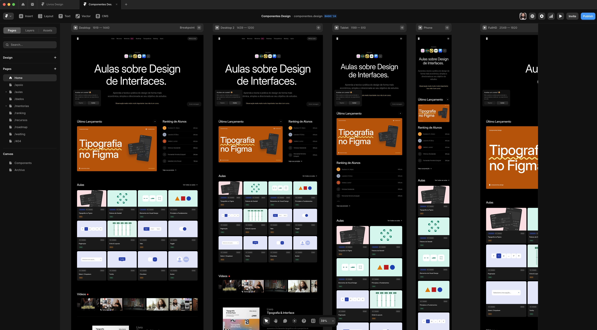
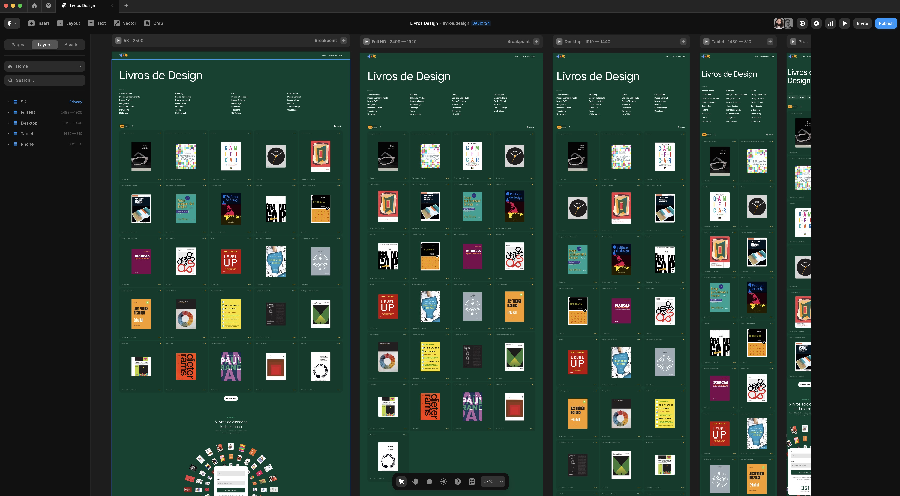

### E porque eu ainda continuo criando coisas que consomem meu tempo e dinheiro.

Olá!

Bem vindo a mais uma edição da Stoa, o pórtico onde meus pensamentos, reflexões e um pouco da minha vida pessoal são compartilhados com você.

Eu sei que demoro muito para escrever novas edições. Juro que não é de propósito! E nem para deixar você ansioso (se é que você fica ansioso pelas próximas edições).

A verdade é que ultimamente tenho pensado mais sobre o tipo de coisas que quero colocar no mundo. Então na falta de algo bom para falar, prefiro ficar em silêncio. E as vezes também acontece de eu não conseguir escrever sobre aquilo que eu gostaria de escrever.

Essa edição, por exemplo, teve uns 10 títulos diferentes antes de chegar nesse que você está vendo. E vários rascunhos enormes deletados sem dó alguma.

Então, nessa edição, você vai ler sobre minha experiência na construção de projetos paralelos desde que eu era penas um pequeno Will, um willzinho.

Espero que goste.

## Quando tudo era mato, eu estava lá no meio da moita. 😏

Tem gente que me conhece por causa dos mais recentes projetos (**[componentes.design](https://componentes.design/)** e **[livros.design](https://livros.design/)**), e não faz ideia de que em 2015 eu já tinha outro projeto relativamente famoso chamado **UI Lab**.

E tem gente que me conhece da UI Lab que não faz ideia de que em 2010 eu tive um dos blogs de design mais acessados da interwebs chamado **Choco La Design**.

Tem no mínimo 4 gerações de designers que passaram a me conhecer nessa história.

Os que me conheceram em 2010 (choco la design), os que me conheceram em 2015 (ui lab), os que me conheceram em 2023 ([componentes.design](https://componentes.design/)) e os que estão me conhecendo agora em 2025 ([livros.design](https://livros.design/)).

São 15 anos construindo projetos paralelos. Isso significa que tem gente que me acompanha há 15 longos anos.

O tempo voa meu caro!

## Porque eu continuo criando esses projetos que só me consomem tempo e dinheiro?

Pra ser sincero, essa é uma pergunta que estou tentando responder há 15 anos.

Eu realmente admiro quem trabalha com design das 9h às 17h e não tem nenhuma outra preocupação além de entregar projetos.

Teve uma época que até entrei em crise existencial e decidi parar por 3 anos e focar somente em mim e na minha carreira de designer. Foi um período ótimo e eu pude me reciclar bastante. Mas aí veio aquela coceirinha, sabe? E eu caí na tentação novamente.

Eu acho que tem 2 motivos pela qual eu ainda continuo criando esses projetos: o primeiro motivo é uma questão interna de querer deixar um certo tipo de legado no cenário de design brasileiro. Me alegra demais quando alguém compartilha que tal coisa que eu fiz teve um impacto positivo na carreira ou na vida dela de alguma maneira. O segundo motivo, que é puramente egocêntrico, é um dia ter minha própria página na Wikipedia.

Além disso, esses projetos me forçam a aprender coisas novas. Talvez isso seja uma das coisas mais interessantes.

## O desafio de aprender coisas novas

Na época do Choco La Design eu era super dependente do meu amigo e sócio **[Filipe Fernandes](https://www.instagram.com/filipesf/)** para fazer qualquer coisa que envolvesse programação. E isso me frustrava bastante porque minhas ideias eram muito maiores do que minha capacidade de executá-las por conta própria.

Na época da UI Lab, já em sociedade com meu irmão, sofremos a mesma coisa porque a não sabíamos programar e o projeto não gerava dinheiro suficiente para rolar um investimento grande em alguém que construísse uma plataforma só nossa.

Mas aí veio o **[Framer](https://framer.link/willianmatiola)**. Que ferramenta sensacional!

Pela primeira vez eu pude construir minhas ideias sem depender de ninguém. Do design à implementação, da gestão à monetização. E aí minha vontade de fazer projetos paralelos explodiu para a casa do sr. carlaio.

O **[componentes.design](https://componentes.design/)** é todinho feito em Framer. Com integrações na **[Lemon Squeezy](https://www.lemonsqueezy.com/)** e **[Loops](https://loops.so/)**. E com o livros.design não é diferente! Tudo feito sem depender de ninguém.

E o avanço da IA também abriu várias portas para o desenvolvimento dos meus projetos. Desde a criação de componentes personalizados que eu jamais saberia escrever uma linha de código até artefatos de design que complementam a identidade visual dos projetos.

Embora eu tenha severas críticas sobre inteligência artificial, não posso ser hipócrita porque seus avanços somados a outras ferramentas facilitaram bastante o desenvolvimento das minhas ideias. Mas isso é papo para outra Stoa.

## Mas como eu arranjo tempo pra fazer tanta coisa?

Essa é uma pergunta que recebo constantemente.

Se você está esperando uma resposta que ilumine sua mente, me desculpa, eu não tenho algo assim. O que eu tenho, na verdade, são as mesmas 24h que todo mundo.

Eu tento gastar o mínimo de tempo possível pra fazer todos esses projetos (é por isso que o componentes tá sem aula nova, me desculpa).

O que percebo de mudança em como faço meus projetos hoje é a organização e planejamento que acontece antes mesmo de eu construir qualquer coisa.

No **[livros.design](https://livros.design/)**, por exemplo, o **[Ton](https://wellitonmatiola.com/)** e eu decidimos os pilares do projeto de maneira super simples:

1. Vai ser uma curadoria de livros de design;
2. Vai ter diversas categorias;
3. Vamos cadastrar um número X para lançar;
4. Semanalmente vamos liberar 5 novos livros;
5. E vamos ver se as pessoas tem interesse em um clube do livro.

Com base nesses pilares, construímos o site no **[Framer](https://framer.link/willianmatiola)** com um CMS bem organizado, montamos uma lista de livros para adicionar usando Google Sheets e criamos o template para a newsletter semanal no Loops.

Fizemos tudo isso em 2 semanas.

Começar simples e evoluir com o tempo é o que eu faço hoje em dia. Se eu pensar demais ou planejar demais, provavelmente deixarei o projeto na gaveta. Gosto de fazer o simples muito bem feito, e a partir daí evoluir o projeto aos poucos.

Talvez seja isso que me deixa tranquilo para começar novos projetos. Porque eu sei que consigo fazer coisas simples e bem feitas ao mesmo tempo que entregam algum tipo de valor para quem estiver acessando.

## Mais projetinhos no futuro?

Eu estaria mentindo se falasse que não.

Tem muita coisa que eu quero fazer ainda. Inclusive diversas coisas que não tem nada a ver com design diretamente.

Desde criança eu sempre gostei de construir coisas e não me vejo parando de materializar as ideias que surgem na minha mente.

Daqui 5, 10 ou 20 anos, haverá novas gerações de pessoas me conhecendo pelos próximos projetos que vou lançar. E se você quiser acompanhar essa longa jornada que tenho pela frente, a Stoa e meu canal no **[Youtube](https://youtube.com/willianmatiola)** são os melhores lugares para isso.

Espero que isso tenha te inspirado a começar a fazer seus próprios projetos.

Com carinho,

Willian Matiola.

## Gostaria de retribuir com uma gentileza?

Se você gostou muito dessa edição e quiser me fazer feliz é só patrocinar um cafézinho pra mim aqui na Alemanha. Toda edição patrocinada eu faço questão de trazer uma foto e o nome dos bem feitores. ♥️

**[Patrocinar 1 cafézinho](https://componentes-de-ui-design.lemonsqueezy.com/buy/57e29feb-5217-4e6f-996c-68242d56dd6d?media=0&discount=0) ☕️**
