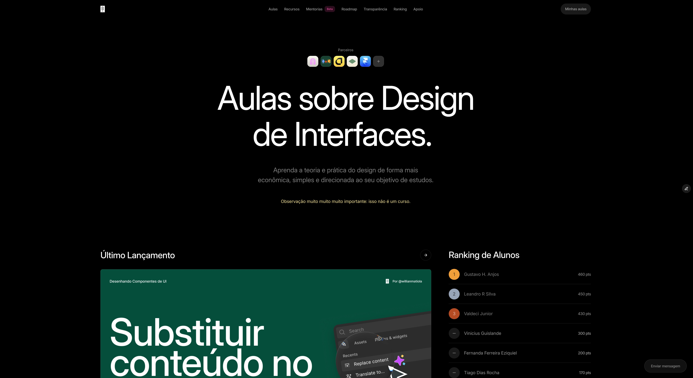
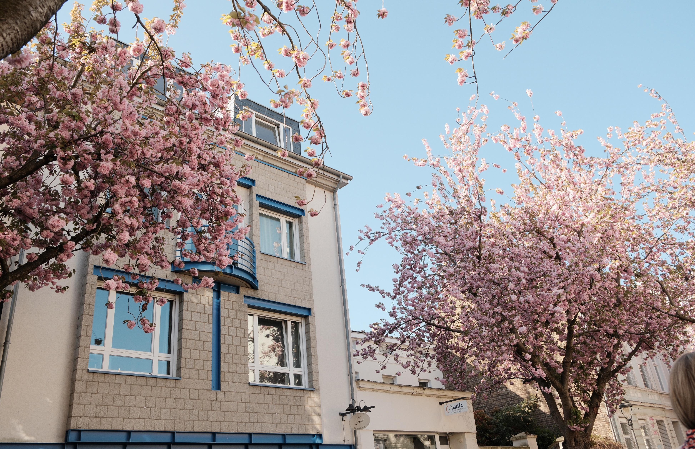
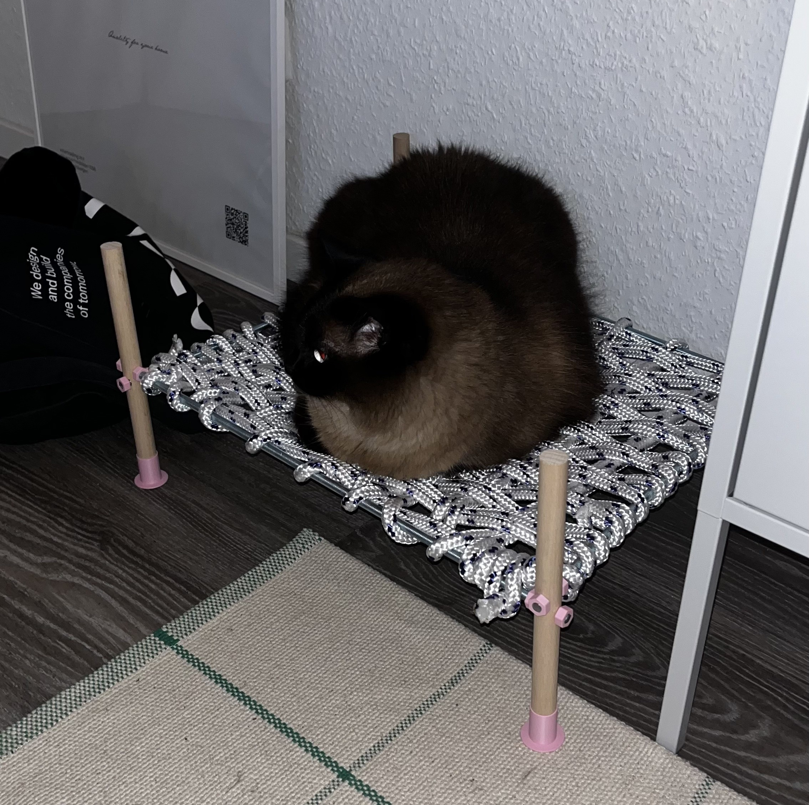
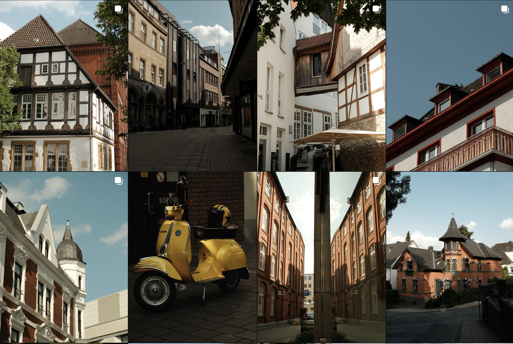
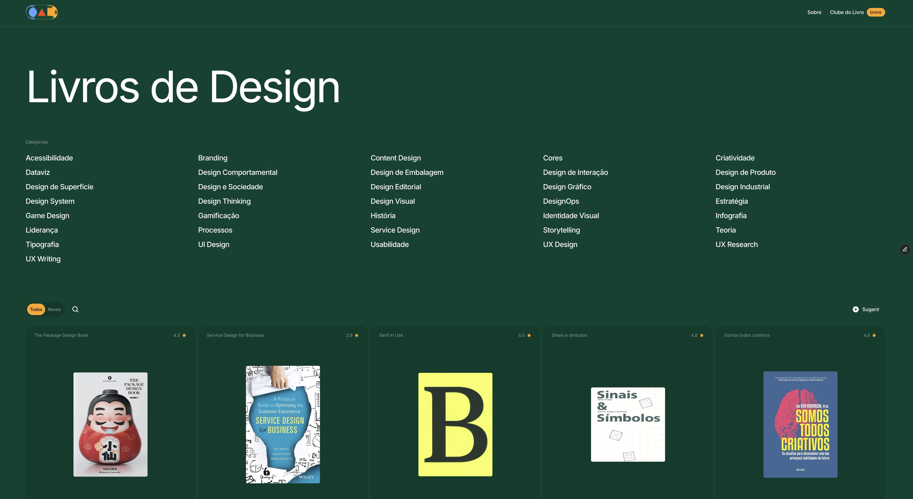

### Tudo o que fiz nesse ano e o que pretendo fazer no ano que vem.

A cada ano eu tenho a sensação de que os dias estão passando mais rápido. Você acorda em uma manhã de Janeiro e quando pisca já está segurando uma taça de espumante na mão assistindo a queima de fogos e brindando um novo ano.

E mesmo sabendo que durante esse ano eu fiz muitas coisas, ainda tenho aquela sensação incômoda de que não fiz tanto assim. Ou que eu deveria ter feito muito mais.

É por essa razão que resolvi rever tudo o que eu fiz — e foram muitas coisas — e compartilhar todas as minhas conquistas durante o ano de 2025 com você. Também quero compartilhar quais meus objetivos e focos para 2026.

Quero aproveitar também para agradecer todas os amigos, colegas e seguidores que de alguma maneira fizeram meu 2025 um ótimo ano!

Eu sou muito grato por ter tanta gente me apoiando nos projetos e me acompanhando desde sei lá quando! Muito obrigado! 😊

## 2025

Depois de analisar tudo o que fiz posso resumir esse ano em: muito conteúdo criado, dezenas de cidades exploradas e milhares de fotos tiradas. Foi um ano de exploração visual e de aprimoramento em design e em fotografia.

**Janeiro**

- Lancei o [componentes.design](https://componentes.design/) 2.0
- Lancei aulas sobre [Tabelas](https://componentes.design/aulas/tabelas), [Accordions](https://componentes.design/aulas/collapse-accordion) e [Alertas/Mensagens](https://componentes.design/aulas/alerta)
- Fiquei em 7º lugar no Pexels Brasil

**Fevereiro**

- Lancei o grupo secreto do componentes.design
- Lancei aulas sobre [Botões](https://componentes.design/aulas/botao), [Avatar](https://componentes.design/aulas/avatar), [Checkbox](https://componentes.design/aulas/checkbox), [Tooltip](https://componentes.design/aulas/tooltip) e [Select/Dropdown](https://componentes.design/aulas/select-dropdown)
- Levei meu irmão para passear nas cidades de Duisburg, Colônia, Wuppertal, e Koblenz aqui na Alemanha.

**Março**

- Lancei aulas sobre [Toggle](https://componentes.design/aulas/toggle) e [Tabs](https://componentes.design/aulas/tabs)
- Lancei o programa de [Mentorias](https://componentes.design/mentorias) no Componentes Design (que será reformulado em 2026)
- Escalei indoor pela primeira vez.

**Abril**

- Lancei aulas sobre [Grids & Layouts](https://componentes.design/aulas/grid-layout) e [Paginação](https://componentes.design/aulas/paginacao).
- Conheci a cidade de [Bonn](https://www.instagram.com/p/DI8p2kDtJzA/?img_index=1) na primavera.

**Maio**

- Lancei o livro [Tipografia & Interface](https://www.editorabrauer.com.br/livros-de-design/tipografia-e-interface) pela Brauer Editora
- Lancei 3 aulas sobre [Princípios de Design](https://componentes.design/aulas/principios-fundamentos-design), [Elementos de Visual Design](https://componentes.design/aulas/elementos-visual-design) e [Gestalt](https://componentes.design/aulas/gestalt).
- Conheci as cidades Ahlen e visitei o [Drachenburg Castle](https://www.instagram.com/p/DKoxMp9M90A/?img_index=1).

**Junho**

- Fui promovido a Senior Product Designer na Cactus.
- Compramos uma impressora 3D para iniciar um novo negócio.
- Construí uma cama de gato.

**Julho**

- Conheci as cidades Müllheim e Bielefeld (e parei num festival medieval) [[1]](https://www.instagram.com/willianmatiola/p/DM2EwHlsVdE/)[[2]](https://www.instagram.com/willianmatiola/p/DM2hLsusG6G/)[[3]](https://www.instagram.com/willianmatiola/p/DM5GAjSMuyA/)[[4]](https://www.instagram.com/willianmatiola/p/DM7qwB5sfxO/)[[5]](https://www.instagram.com/willianmatiola/p/DM-QK1UM-Ts/).
- Decidi focar mais no meu Youtube e lancei a primeira edição do [Basculante](https://www.youtube.com/watch?v=KG2i0vkmPwQ&t=19s) em vídeo.

**Agosto**

- Transformei todo o Componentes Design para dark mode.
- Atualizei o design da página de [transparência](https://componentes.design/dados).
- Tirei as melhores fotos de modelo até então. [[1]](https://www.instagram.com/willianmatiola/p/DNvmfooWCpL/)[[2]](https://www.instagram.com/willianmatiola/p/DNyU-kL2AMR/)[[3]](https://www.instagram.com/willianmatiola/p/DN8k_o8DMLY/)[[4]](https://www.instagram.com/willianmatiola/p/DOyMwp0jPHX/)
- Visitamos Roermond na Holanda. [[1]](https://www.instagram.com/willianmatiola/p/DPBYDpUjO9x/)[[2]](https://www.instagram.com/willianmatiola/p/DO5unoKDJhF/)[[vídeo]](https://youtu.be/auiloOkoA5k?si=TMG4DhMocMcdI0dn)
- Dei uma [entrevista](https://youtu.be/ZqXSARX1no8?si=ECibF6Q5HadagxMS) para o podcast da Brauer Editora.

**Setembro**

- Tirei férias e visitei [Wuppertal](https://youtu.be/0RY8ZqKX-oU?si=joPa_kciEvVkyDBt), um monumento chamado [Tiger & Turtle](https://www.instagram.com/willianmatiola/p/DPwnWG9jLX1/) [[vídeo]](https://youtu.be/xJmrsr111_Q?si=sQxlG5iOW1vL9i1N) e também conheci as ruínas romanas em Xanten. [[1]](https://www.instagram.com/willianmatiola/p/DQEUI99jAHZ/)[[2]](https://www.instagram.com/willianmatiola/p/DQtfM_gDJD8/)[[3]](https://www.instagram.com/willianmatiola/p/DQwElUFDBaD/)[[vídeo]](https://youtu.be/hCmoCnqCX2M?si=HZWzM5Ub89P-Yjh3)

**Outubro**

- Lancei junto com o o projeto [livros.design](https://livros.design/)
- Comprei um curso de IA em Design para me especializar
- Visitei Monschau para registrar a cidade no outono e foi mágico. [[1]](https://www.instagram.com/willianmatiola/p/DRO7G82jDiD/)[[2]](https://www.instagram.com/willianmatiola/p/DRRjcUgjOnO/)[[3]](https://www.instagram.com/willianmatiola/p/DRUIRkCjC2F/)[[4]](https://www.instagram.com/willianmatiola/p/DRWtouMjAN3/)

**Novembro**

- Co-liderei um Pexels Meetup na cidade onde eu moro. [[1]](https://www.instagram.com/p/DRpP12hkcsS/?img_index=1) [[2]](https://www.instagram.com/p/DSEx8KujE1E/?img_index=1)
- Fizemos uma festa Halloween para os amigos.
- Investi em acessórios para minha câmera.
- Dei uma palestra privada sobre fundamentos de design para um grupo só de mulheres
- Virei [Framer Expert](https://www.framer.com/@willianmatiola/).
- Publiquei meu primeiro componente no [Framer Marketplace](https://www.framer.com/marketplace/components/social-share-for-cms/).

**Dezembro**

- Viajei para Innsbruck na Áustria e pratiquei snowboard pela primeira vez.
- De quebra conheci um pouco de Munique também.

**Estatísticas**

- **[YouTube](https://youtube.com/willianmatiola)\*\***+1.2k** inscritos**23.9k** visualizações**32** vídeos publicados**5\*\* Lives
- **+1.2k** inscritos
- **23.9k** visualizações
- **32** vídeos publicados
- **5** Lives
- **[Pexels](https://www.pexels.com/@willianmatiola/)\*\***4.1** milhões de views nas minhas fotos no [Pexels](https://www.pexels.com/@willianmatiola/);**19.5k** downloads;**1k** likes;**171\*\* seguidores.
- **4.1** milhões de views nas minhas fotos no [Pexels](https://www.pexels.com/@willianmatiola/);
- **19.5k** downloads;
- **1k** likes;
- **171** seguidores.
- **[Componentes Design](https://componentes.design/)\*\***12k** de acessos e **25k** visualizações no componentes.design;**R$8.890** de receita;**R$1.776** doados para instituições, ongs e vakinhas;**R$1.820\*\* de despesas.
- **12k** de acessos e **25k** visualizações no componentes.design;
- **R$8.890** de receita;
- **R$1.776** doados para instituições, ongs e vakinhas;
- **R$1.820** de despesas.
- **[Livros Design](https://livros.design/)\*\***7.6k** de acessos e **13k\*\* visualizações no livros.design.
- **7.6k** de acessos e **13k** visualizações no livros.design.
- **Outras** **16** cidades visitadas;**3** projetos de design trabalhados;**2** meetups de design;**3** meetups do Pexel;**10** Stoas publicadas.
- **16** cidades visitadas;
- **3** projetos de design trabalhados;
- **2** meetups de design;
- **3** meetups do Pexel;
- **10** Stoas publicadas.

## 2026

Como você viu, foquei muito na criação de conteúdo em 2025 e mesmo gostando muito de fazer isso, em 2026 eu quero focar mais na criação de produtos.

Ainda pretendo criar vídeos e aulas, mas a frequência será muito menor. Quero poder criar coisas mais longas, melhores e mais devagar.

Sobre os projetos, tem muitas coisas que eu quero fazer em 2026!

- Quero ajudar a Gaia, minha companheira, no desenvolvimento de produtos em 3D.
- Quero criar [micro apps](https://micro.ltda/) com meus amigos.
- Quero explorar e criar mais artefatos de design visual.
- Quero criar mais componentes para Framer.
- Quero estudar mais a língua Alemã até chegar pelo menos no nível B1.
- Loja para vender minhas fotos
- Um programa de mentoria em craft totalmente repaginado.

Agora me conta: quais os seus planos para 2026?

