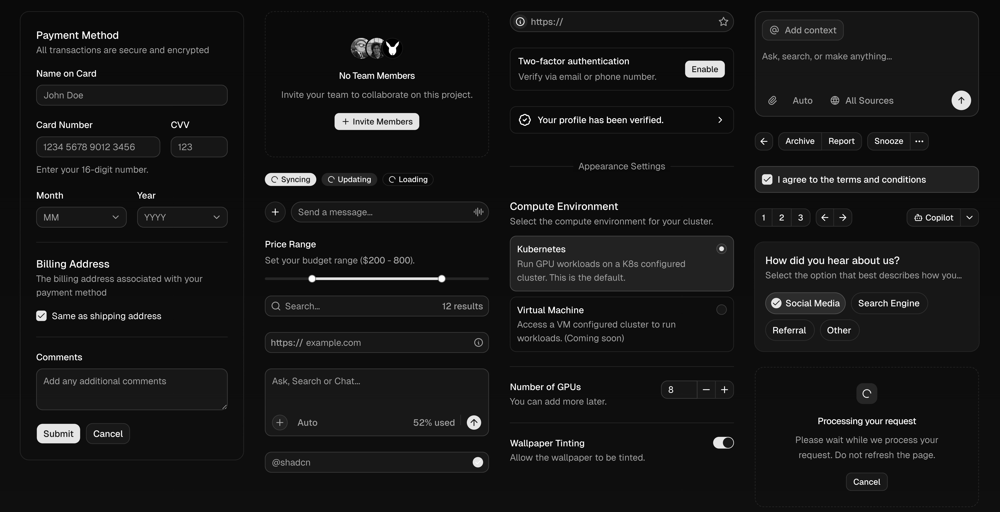
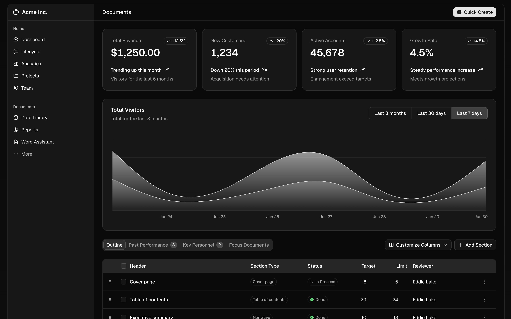
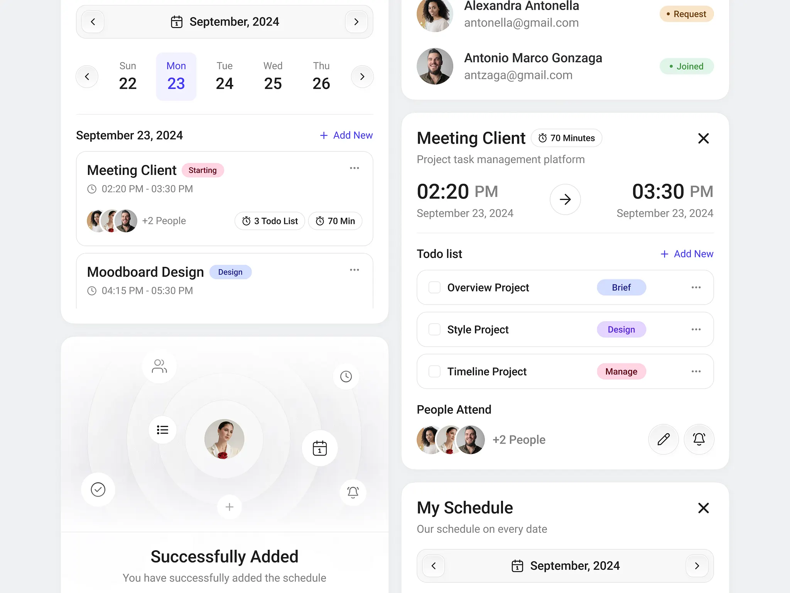

### Uma dica prática de como melhorar seus componentes de interface e evitar o gigantismo.

Componentes de UI precisam de menos variações tipográficas que você imagina.

Vejo muitos designers, especialmente os iniciantes, exagerando nos tamanhos de texto na hora de criar componentes. Na maioria das vezes é necessário apenas 2 ou 3 estilos para criar uma variedade enorme de elementos dentro de uma biblioteca.

No exemplo acima, todos os componentes foram criados utilizando apenas 3 tamanhos de texto: **16px**, **14px** e **12px**.

Os títulos, naturalmente, recebem o tamanho de 16px para enfatizar a hierarquia. Os subtítulos, _labels_, _placeholders_ e outros textos auxiliares recebem o tamanho de 14px. Já os textos das _tags_, botões e outros elementos menores recebem o tamanho de 12px.

## Quando usar tamanhos maiores

Mesmo que os componentes tenham poucas variações de tamanho, ainda é necessário ter uma escala tipográfica com mais tamanhos para que seja possível reforçar a hierarquia em páginas e outras estruturas.

Em um _dashboard_, por exemplo, precisamos de tamanhos maiores para servir de título da seção ou para os números dentro de alguns componentes. No exemplo acima, os números possuem 30px para reforçar a importância desse elemento na página.

No total, o **[shadcn](https://ui.shadcn.com/)** possui **10** **variáveis** de tamanhos para acomodar todas as situações que um design system robusto pode apresentar, mas isso não significa que seu projeto também precisará de todos eles.

Caso você esteja se perguntando como os valores em **rem **funcionam, basta definir um tamanho base e depois multiplicar o fator por ele (16px \* 1.125 = 18px).

## Evite o gigantismo

O exemplo a seguir é um ótimo caso do que não fazer.

Em um mesmo componente podemos contar facilmente 5 ou mais tamanhos diferentes.

Isso torna o componente difícil de ler e, quando pareado com outros componentes, reforça a inconsistência do sistema de design.

Sendo assim, na próxima vez que você for desenhar um app mobile ou desktop, tente usar os tamanhos de maneira intencional sem exagerar na quantidade de variações. Você perceberá que seus componentes ficarão mais consistentes e visualmente melhores.

Outra coisa que influencia a qualidade dos seus componentes é a variação de cores para os textos e outros elementos. Mas isso é assunto para outra edição.

## Precisa de uma ajuda extra?

Se você tem dificuldade de avaliar suas próprias competências ou precisa de alguém para te incentivar/cobrar evolução, talvez um mentor possa te ajudar.

Dê uma olhada na **[minha mentoria](https://componentes.design/mentorias)** para te ajudar nessa jornada.
