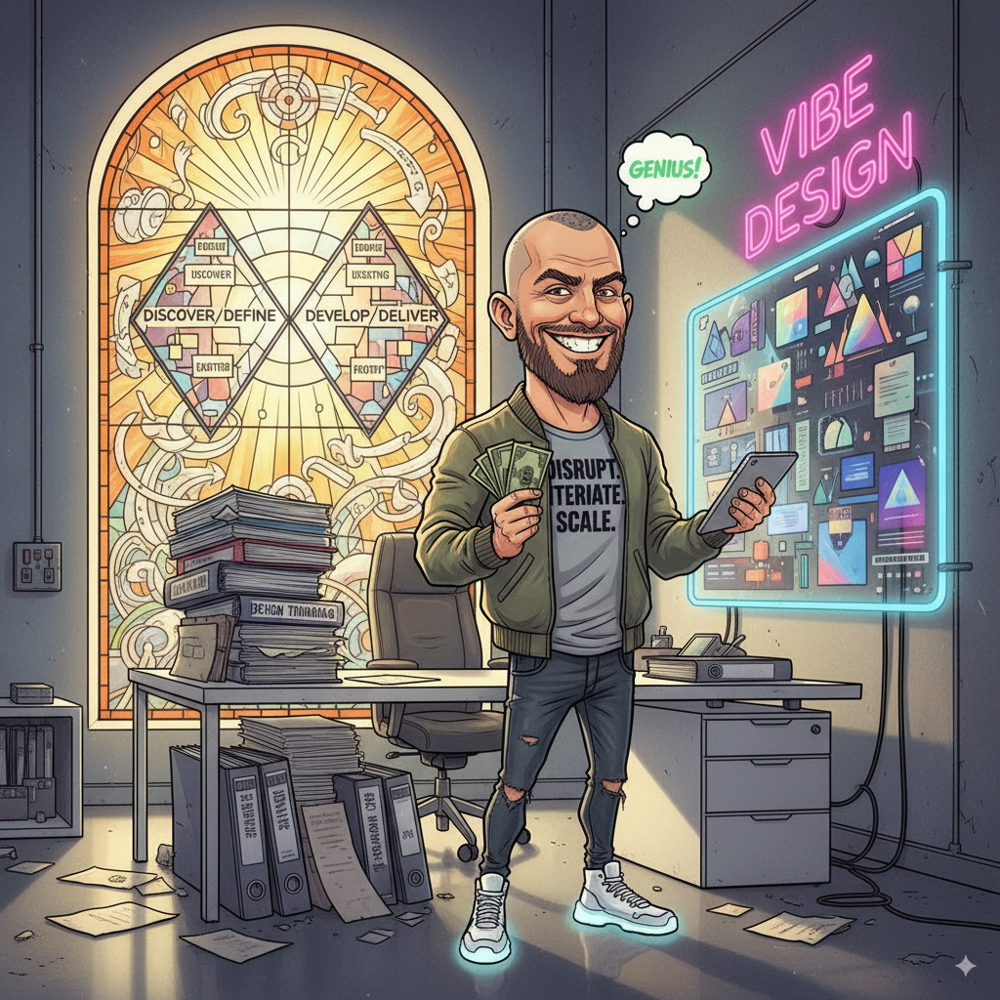

### Decidi listar uma série de características que TALVEZ definam essa espécie de designer que estou chamando de Design Bro.

Esta edição tem como objetivo o entretenimento.

As **10 observações** a seguir sobre o que estou chamando de *Design Bro* não se referem a nenhuma pessoa em específico. São percepções reunidas ao longo de muitos anos de participação na comunidade de design, tanto no Brasil quanto no exterior.

Vale lembrar que um *design bro* não necessariamente reúne todas as características listadas. É mais comum que algumas apareçam de forma mais evidente, enquanto outras se manifestam de maneira sutil.

Aliás, é bem possível que tanto você quanto eu já tenhamos apresentado algumas dessas características — ou ainda apresentemos, ou venhamos a apresentar no futuro.

No fim das contas, ninguém escapa totalmente da **“brotherização do design”**. Mas, pelo menos, seguimos tentando.

## Características

1. Double diamond é seu mantra e design business é sua religião. Para ele, todas as decisões de design precisam, necessariamente, mexer as alavancas do negócio pela qual ele dedica suas 8h diárias (ou mais).
2. Processos e mais processos? Mesmo que inúteis e desnecessários em algumas etapas, eles são seu porto seguro. O produto só vai funcionar se seguir toda a receita do bolo, afinal, precisa gerar lucros e mais lucros para a empresa em que trabalha.
3. Falando em lucros, o design bro acredita de verdade que o sistema financeiro vigente é ótimo para a sociedade e que todos os seus designs ajudam a melhorar a vida das pessoas mesmo que ele trabalhe para grandes corporações.
4. Tem também um tipo de design bro que é aquele que
